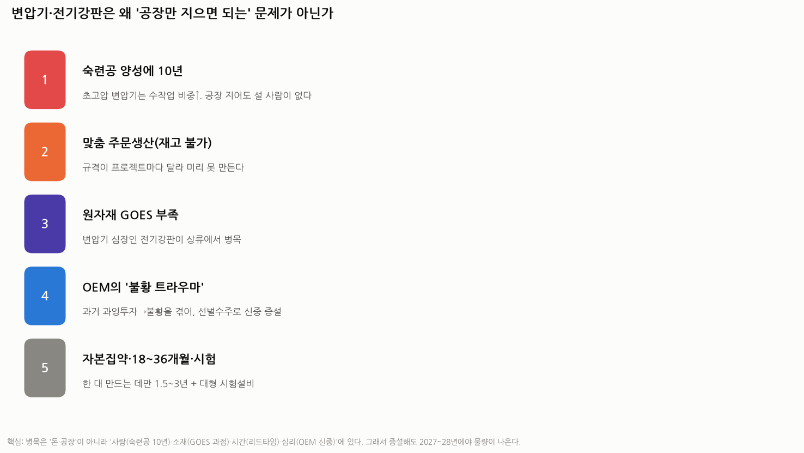
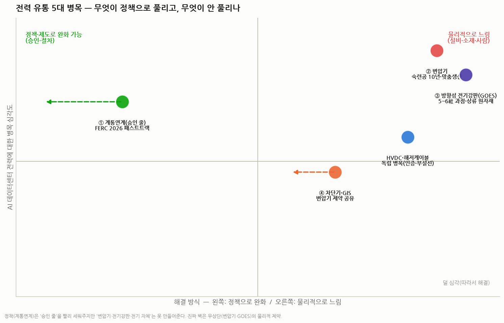

# AI 데이터센터 전력병목 2편 — 유통(송배전)은 왜 안 풀리나: 계통연계·변압기·전기강판·차단기 심화

> 작성일: 2026-07-30 · 카테고리: 거시 및 정책(전력 인프라) · `1편`의 후속 심화
> 성격: 1편에서 "유통이 가장 심각"이라 했는데, **왜 정책을 써도 안 풀리는지**를 계통연계·변압기·방향성 전기강판·차단기/HVDC로 나눠 깊게 본다. 배경지식 0 기준, 줄임말은 풀어 쓴다.
> **검증 메모**: FERC(미국 연방에너지규제위원회) 명령·변압기 업계·포스코 자료로 교차검증. 추정치는 표기.

---

## 0. 네 질문에 대한 한 줄 답

1. **계통연계(승인)는 정책으로 빠르게 풀리고 있다** — 단, '승인'을 빨리 해줄 뿐 '전기·설비'를 만들어주진 못한다.
2. **변압기는 구조적으로 빨리 못 늘린다** — 공장이 아니라 **사람(숙련공 10년)·소재·심리**가 병목이라서.
3. **전기강판(GOES)은 생산 상한이 뚜렷하다** — 5~6개사 과점의 극도로 어려운 야금이고, 과거 저마진 트라우마로 과소투자돼서. 증설 노력은 있으나 물량은 2027~28년에야.
4. **차단기·GIS는 변압기와 함께 완화되는 게 맞다. 그러나 HVDC·해저케이블은 별개의 독립 병목이다.**

---

## 1. [Q1] 계통연계는 정책으로 빠르게 풀리고 있나? — **그렇다, 단 '절반만'**

**계통연계(繫統連繫)** = 발전소·데이터센터를 전력망에 연결해도 되는지 승인받는 절차(1편 참조). 여기엔 실제로 **강력한 정책 드라이브**가 걸렸다.

- **FERC Order 2023(2023~2025 전국 시행)**: 계통연계 심사 방식을 뜯어고침. 하나씩 심사하던 걸 **묶음 심사(cluster study)**, **준비된 프로젝트 우선(first-ready, first-served)** 으로 바꿔 '줄 서기'를 정리.
- **2026년 6월 18일 — 데이터센터 '패스트트랙' 명령**: FERC가 미국 6대 전력망 운영기관(RTO)에 **데이터센터 등 대형 부하를 신속·질서 있게 연결하라**고 명령. 30일 내 신뢰성 보고, 60일 내 요금체계 정당화/개혁 요구. **연결 비용은 일반 가정이 아니라 데이터센터가 부담**하도록 못박음.
- 미국 에너지부(DOE)도 계통연계 가속을 지시. 사실상 **"AI 데이터센터를 위한 정부 지정 고속차선"**.

> **핵심 한계**: 이 정책들은 **'승인 줄'을 빨리 세워주는 것**이지, **변압기를 만들어주거나 전기를 발전해주는 게 아니다.** 승인을 받아도 그 자리에 넣을 **변압기·송전선·전기 자체**가 없으면 소용없다. 그래서 개발사들은 아예 **데이터센터 옆에 발전기를 직접 붙여 전력망을 우회(비하인드-더-미터)** 하는 방향으로도 간다. → 진짜 벽은 2~4번(물리적 병목).

---

## 2. [Q2] 변압기는 왜 빨리 못 늘리나 — '공장만 지으면 되는' 문제가 아니다

지금 초고압 변압기는 **"지금 주문하면 4년 뒤에 받는다"**는 말이 나온다. 돈이 없어서가 아니다. 다섯 가지 구조적 이유다.

1. **숙련공 양성에 10년** — 초고압 변압기는 코일을 감는 등 **수작업 비중이 매우 높다.** 전 공정을 다루는 숙련 기술자를 키우는 데 **10년 가까이** 걸린다. **공장을 증설해도 그 라인에 설 사람이 없어서** 곧바로 생산이 안 는다. (한국 3사도 "일손이 없어 슈퍼사이클 놓칠라" 하며 숙련공을 찾아다니는 상황.)
2. **맞춤 주문생산(재고 불가)** — 변압기는 프로젝트마다 전압·용량·규격이 달라 **미리 만들어 쌓아둘 수 없다.** 주문이 와야 그때부터 설계·제작.
3. **원자재(전기강판) 부족** — 변압기의 '심장'인 철심 재료(방향성 전기강판)가 상류에서 병목(3번).
4. **OEM(제조사)의 '불황 트라우마'** — 과거 변압기 업계는 **과잉투자 → 불황 → 적자**를 겪었다. 그래서 이번 호황에도 제조사들은 **공격적 증설 대신 '선별 수주'**(수익성 낮은 물량은 버리고 고부가만) 로 신중하게 움직인다. 자기들이 **'슈퍼 갑'**이 된 시장을 스스로 깨고 싶어 하지 않는다.
5. **자본집약·긴 리드타임·시험** — 대형 변압기 한 대 만드는 데만 **18~36개월(1.5~3년)**, 여기에 대형 시험설비까지 필요.

> 결론: 병목은 **'돈·공장'이 아니라 '사람·소재·시간·심리'**에 있다. 그래서 글로벌 제조사들의 증설분도 대부분 **2027년 이후**에야 물량이 나온다 → **2026~2027년은 수급 역전이 어렵다.**

---

## 3. [Q3] 전기강판(GOES)은 왜 생산 상한이 뚜렷한가 — 늘리려는 노력은 있다, 다만 느리다

**방향성 전기강판(GOES, Grain-Oriented Electrical Steel)** = 변압기 철심(코어)에 쓰는 특수 강판. 철에 규소를 섞고 **결정 방향(grain)을 한 방향으로 정밀하게 정렬**시켜, 전기를 통과시킬 때 손실을 극도로 줄인 소재. 변압기 효율의 80% 이상을 이 코어가 결정한다.

**왜 생산 상한이 뚜렷한가(4가지):**
1. **야금 난도가 극단적** — '결정 방향 정렬(Goss 조직)'을 맞추려면 열처리·압연을 미크론·수십 단계로 정밀 제어해야 한다. **수십 년의 축적된 노하우(암묵지)** 가 필요해, 돈이 있어도 신규 진입이 어렵다.
2. **5~6개사 과점** — 전 세계에 **포스코·니폰스틸·JFE·티센크루프·클리블랜드클리프스(+중국 바오우)** 정도. 연 생산량이 **약 200만 톤**에 그치는 작은 시장.
3. **과거 저마진 → 과소투자** — 오랫동안 GOES는 '작고 남는 것 없는 니치'였다. 공급과잉·저마진에 데인 업체들이 **증설을 꺼려왔다.** 그 결과가 지금의 뚜렷한 상한.
4. **자본집약 + 긴 램프업** — 새 GOES 라인은 짓고 안정화하는 데 **3~5년**. 환경규제(에너지 다소비)도 부담.

**늘리려는 노력은 있다 — 그러나:**
- **포스코·니폰스틸이 고급 GOES를 증설 중**(포스코 전기강판 총능력 방향성+무방향성 합쳐 연 113만 톤 규모, 광양 고효율 라인 준공 등). 다만 **변압기용 방향성(GOES) 증설 물량은 2027~28년에야** 본격 출하.
- **기술적 개선**: 레이저로 강판 표면을 긁어 손실을 더 줄이는 **레이저 스크라이빙** 등.
- **대체재 아몰퍼스(비정질) 금속**: 손실이 더 적지만 **얇고 부서지기 쉬워 가공이 어렵고**, 주로 **배전용(작은) 변압기**에 한정. 초고압 대형 변압기의 GOES를 당장 대체하진 못한다.

> 투자 시그널(중요): **GOES 증설 물량이 풀리는 2027~28년이 곧 '변압기 병목 해소'의 신호**이고, 이는 역설적으로 **변압기 값(ASP)의 피크아웃 신호**가 될 수 있다.

---

## 4. [Q4] 차단기·GIS·HVDC는 다른 게 풀리면 자연히 해결되나? — **절반만 맞다**

- **차단기·가스절연개폐장치(GIS): 대체로 맞다.** 이들도 부족(차단기 리드타임 77주→125주)하지만, **변압기와 같은 제약(숙련공·구리 등 소재·긴 리드타임)을 공유**한다. 그래서 변압기 병목이 풀리는 흐름(숙련공 확충·소재 완화) 속에서 **상당 부분 함께 완화**된다. 심각도도 변압기·GOES보다는 한 단계 낮다.
- **그러나 HVDC·해저케이블: 별개의 독립 병목이다.** '다른 게 풀리면 자연 해결'이 아니다.
  - **초고압직류송전(HVDC)** 케이블은 **525kV급 인증(PQ 시험)에만 3~5년**, 양산 가능한 회사가 **전 세계 3~4곳**(프리즈미안·NKT·넥상스·스미토모, + 한국 LS전선).
  - **부설선(케이블 까는 특수 선박)이 전 세계 약 30척**뿐이라 만년 풀가동 — **배가 없어서 못 까는** 병목.
  - 다만 **용도가 다르다**: HVDC·해저케이블은 주로 **장거리·해저·해상풍력·국가 간 연결**용이라, 데이터센터의 '국내 지역 배전'엔 덜 직접적이다. 대신 **먼 곳의 재생에너지·발전을 데이터센터로 끌어오는** 큰 그림에선 핵심.

> 정리: **차단기·GIS = 변압기 따라 완화(Q4 premise 맞음). HVDC·해저케이블 = 자체 장벽으로 독립적(Q4 premise 안 맞음, 단 용도가 특수).**

---

## 5. 종합 — 정책으로 풀리는 것과 안 풀리는 것

- **좌측(정책으로 완화): 계통연계.** 승인 줄은 FERC가 빠르게 정리 중.
- **우상단(물리적으로 느림, 진짜 벽): 변압기·전기강판(GOES).** 사람·소재·시간·심리가 병목이라 정책·돈으로 단기 해결이 안 된다.
- **중간: 차단기·GIS(변압기 따라 완화), HVDC·해저케이블(독립 병목이나 용도 특수).**

**투자·트래킹 함의:**
- 병목이 '물리적'인 곳(변압기·GOES)일수록 **공급자 우위(슈퍼 갑)** 가 오래간다 → 한국 3사(HD현대일렉트릭·효성중공업·LS ELECTRIC)·포스코(GOES)의 마진·수주잔고 지속성.
- **해소 신호 = ① GOES 증설 물량(2027~28), ② 숙련공 확충, ③ OEM의 공격적 증설 전환.** 이 셋이 나타나면 변압기 ASP 피크아웃을 의심.
- **정책(계통연계 가속)은 수요를 더 빨리 끌어오므로, 오히려 물리 병목(변압기)을 단기적으로 더 조인다** — 정책이 병목을 '푸는' 게 아니라 '드러내는' 역설.

---

## 참고 출처 (검증)

- [FERC 데이터센터 계통연계 패스트트랙 명령(2026.6.18)·비용 데이터센터 부담 (TechCrunch)](https://techcrunch.com/2026/06/18/ai-data-centers-just-got-a-government-mandated-fast-lane-to-the-grid/)
- [FERC 6개 RTO show-cause·30/60일 (White & Case)](https://www.whitecase.com/insight-alert/ferc-orders-grid-operators-promptly-revise-or-justify-interconnection-rules-data)
- [지금 주문해도 4년 뒤·한국산만 찾는 이유 (아시아경제)](https://view.asiae.co.kr/article/2025111914593492126)
- [공장 있어도 바로 못 만든다·숙련공 10년 (뉴시스)](https://www.newsis.com/view/NISX20260116_0003479969)
- [일손 없어 슈퍼사이클 놓칠라·숙련공 확보난 (아주경제)](https://www.ajunews.com/view/20260204155237128)
- [변압기 품귀 구조적 문제·선별수주 (대한경제)](https://m.dnews.co.kr/m_home/view.jsp?idxno=202607061116424110063)
- [포스코 전기강판 생산확대·Hyper NO (포스코 뉴스룸/스틸데일리)](https://newsroom.posco.com/kr/%ED%8F%AC%EC%8A%A4%EC%BD%94-%EC%B5%9C%EA%B3%A0%EA%B8%89-%EC%A0%84%EA%B8%B0%EA%B0%95%ED%8C%90-%EC%83%9D%EC%82%B0%ED%99%95%EB%8C%80/)
- [LS전선 525kV HVDC 해저케이블 인증·부설선 (헤럴드경제)](https://biz.heraldcorp.com/article/10803217)

**저장소 연계**: `거시및정책/AI데이터센터_전력병목_생산유통사용_1편.md`, `전력기기/*`

> 유의: 리드타임·생산능력·정책 시행 시점은 기관·언론 추정이며 변한다. GOES 대체·증설 효과는 불확실. 확정치는 각 사·규제기관 원문으로 재확인 권장.
