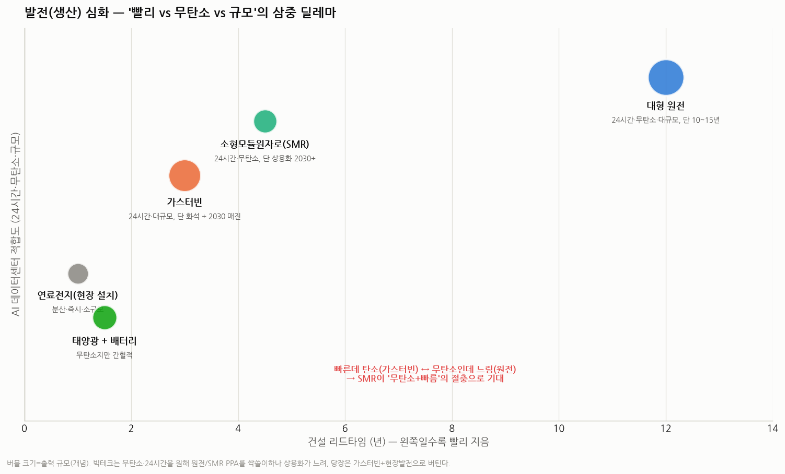
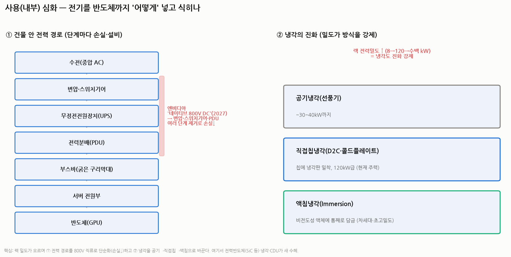

# AI 데이터센터 전력병목 3편 — 발전(생산)과 사용(내부) 심화

> 작성일: 2026-07-30 · 카테고리: 거시 및 정책(전력 인프라) · `1편`(큰 그림)·`2편`(유통 심화)의 후속
> 성격: 유통은 2편에서 깊게 봤으니, 여기선 **발전(전기를 만드는 쪽)** 과 **사용(데이터센터 건물 안)** 을 각각 깊고 쉽게 본다. 배경지식 0 기준, 줄임말 풀어 씀.
> **검증 메모**: IEA·엔비디아·SMR/가스터빈 업계·저장소 전력 리포트로 교차검증. 추정치 표기.

---

## 파트 A — 발전(생산) 심화: '빨리 · 무탄소 · 규모'의 삼중 딜레마

AI 데이터센터가 원하는 전기는 세 가지를 동시에 만족해야 한다: **① 빨리 지어지고, ② 24시간 안 끊기고(가능하면 무탄소), ③ 대규모.** 그런데 **이 셋을 다 만족하는 발전원이 없다.** 그래서 딜레마다.

### 1) 가스터빈 — "빠르고 크지만 화석, 게다가 매진"
- 천연가스를 태워 돌리는 발전기. **2~3년이면 지어** 원전보다 빠르고, 24시간·대규모가 가능해 **AI의 주력·백업 발전**. (☞ 1편)
- 문제: **탄소를 배출**하고, **세계 3사(GE버노바 40%·지멘스에너지 30%·미쓰비시 20%)가 2030년까지 매진**, 가격 +75%. 두산에너빌리티가 신규 진입(세계 5번째 자체 가스터빈국).
- 위치: **가장 현실적인 '지금 당장'의 답**이지만, 무탄소가 아니고 물량이 막혔다.

### 2) 대형 원전 — "24시간·무탄소·대규모, 그러나 10~15년"
- 이상적(무탄소 기저전력)이지만 **짓는 데 10~15년**. AI 속도를 못 맞춘다. 기존 원전 재가동(스리마일 등)이 그나마 빠른 길.

### 3) 소형모듈원자로(SMR) — "무탄소+빠름의 절충 기대주"
- **전기출력 300메가와트 이하의 작은 원자로.** 공장에서 모듈로 찍어 현장 조립 → 건설을 **3~5년**으로 단축, 데이터센터 옆에 설치 가능.
- 비용: 균등화발전원가(LCOE, 발전원별 1메가와트시당 평균 원가) **80~95달러**로 대형 원전보다 약 45% 비싸지만, **빅테크는 무탄소·안정 전력이면 기꺼이 지불**.
- **빅테크가 이미 싹쓸이 계약(전력구매계약, PPA)**: 메타 6.6기가와트, 아마존 5기가와트+, 마이크로소프트 835메가와트(스리마일 재가동), 구글 500메가와트(카이로스파워). — **단 상용화는 대부분 2030년 이후**라 '지금'은 못 푼다.
- 한국: 두산에너빌리티(주단조·SMR 전용공장 8,000억 투자), 한전기술(설계) 등.

### 4) 재생에너지 + 배터리 — "빠르고 무탄소지만 간헐적"
- 태양광·풍력은 1~1.5년이면 짓고 무탄소지만, **해 지고 바람 없으면 멈춘다(간헐성).** 배터리로 보완하나 24시간 대규모엔 한계.

### 5) 현장 발전 & 전력망 우회(비하인드-더-미터)
- 전력망 연결(계통연계)을 기다리다 지쳐, **데이터센터 옆에 발전기(가스·연료전지)를 직접 붙여 전력망을 우회**하는 방식. 개발사들이 **메가와트당 300만~500만 달러**를 더 쓰더라도 대기 위험을 피한다.
- **연료전지**(블룸에너지 등): 가스로 전기를 만드는 분산·즉시 설치형. 현장 보조전력으로 부상.

> **발전 심화 결론**: **당장(2026~28)은 가스터빈 + 현장발전으로 버티고, 중기(2030+)엔 SMR·원전으로 무탄소 기저를 채우는** 그림. 무탄소 압력과 물량 부족이 겹쳐, 빅테크가 발전원을 **선계약으로 확보(PPA)** 하는 경쟁이 벌어진다.

---

## 파트 B — 사용(내부) 심화: 전기를 반도체까지 '어떻게' 넣고 식히나

전기가 데이터센터까지 왔다고 끝이 아니다. **건물 안에서 반도체까지 나눠주고(전력 경로), 그 열을 식히는 것(냉각)** 도 급소다.

### 1) 건물 안 전력 경로 — 단계마다 손실이 샌다
전기 여정: **수전(중압 교류) → 변압·스위치기어 → 무정전전원장치(UPS, 정전 대비 배터리) → 전력분배장치(PDU) → 부스바(굵은 구리막대) → 서버 전원부 → 반도체.**
- 단계마다 조금씩 전기가 새고(손실), 각 장비가 부족·고가.

**해법 — 엔비디아 '네이티브 800볼트 직류(800V DC)' 데이터센터(2027 예정):**
- 중압 교류(AC)를 **한 번에 800볼트 직류로 변환**해 반도체 근처까지 보낸다.
- 그러면 **중간의 교류 스위치기어·변압기·전력분배장치 여러 단계를 통째로 제거** → 전력 경로가 짧아져 **손실↓·공간↓·구리↓.**
- 수혜: 이 고효율 변환을 담당하는 **전력반도체(실리콘카바이드(SiC)·질화갈륨(GaN) 등)**, 고전압 부스바, 전원공급장치.

### 2) 냉각의 진화 — 밀도가 방식을 강제한다
랙(반도체를 꽂는 선반) 1개 전력이 **8 → 120 → 수백 킬로와트**로 뛰면서, 냉각 방식도 강제로 바뀐다.
- **공기냉각(선풍기)**: 랙당 약 30~40킬로와트까지가 한계. 그 이상은 불가능.
- **직접칩냉각(D2C, Direct-to-Chip)**: 반도체 위에 **냉각판(콜드플레이트)을 밀착**시켜 물·냉각액이 직접 열을 빼감. **현재 120킬로와트급 주력**(엔비디아 GB200 등).
- **액침냉각(Immersion)**: 장비를 **전기가 안 통하는 특수 액체에 통째로 담가** 식힘. **차세대·초고밀도**용.
- 냉각의 심장인 **냉각분배장치(CDU, Cooling Distribution Unit)**, 콜드플레이트, 냉각액이 새 필수 인프라로 부상.

### 3) 얼마나 효율적인가 — 전력사용효율(PUE)
- **PUE = 데이터센터 총 전력 ÷ 반도체가 실제 쓴 전력.** 1에 가까울수록 효율(냉각 등 부대전력이 적음). 냉각을 잘하면 같은 전기로 더 많은 계산을 한다.

> **사용 심화 결론**: 랙 밀도가 오르며 ① 전력 경로를 **800볼트 직류로 단순화(손실↓)** 하고 ② 냉각을 **공기→직접칩→액침**으로 바꾼다. 여기서 **전력반도체(SiC/GaN)·액체냉각(CDU·콜드플레이트)·전원장치**가 새로운 수혜 축이다.

---

## 종합 — 3편 전체를 한 장으로

| 구간 | 핵심 병목 | 지금의 답 | 중기(2030+) | 수혜 축 |
|---|---|---|---|---|
| **발전** | 24h·무탄소·대규모 동시 불가 | 가스터빈 + 현장발전 | SMR·원전(PPA) | 가스터빈·SMR·연료전지·원전 소부장 |
| **유통**(2편) | 변압기·전기강판(물리) | — (2027~28 증설 대기) | GOES 증설로 완화 | 변압기 3사·포스코·HVDC |
| **사용** | 랙 밀도·냉각·전력전달 | 직접칩냉각·480V | 액침·800V 직류 | 전력반도체·액체냉각·전원장치 |

**한 줄**: 발전은 '무탄소 vs 속도'의 삼중 딜레마(당장 가스, 중기 SMR), 사용은 '밀도가 강제하는 800V 직류·액체냉각'. 유통(변압기·전기강판)이 셋 중 가장 물리적으로 느린 병목(2편)이다.

---

## 참고 출처 (검증)

- [엔비디아 네이티브 800V DC 데이터센터(2027)·변압/PDU 단계 제거 (KHARN)](https://www.kharn.kr/news/article.html?no=31087)
- [데이터센터 액체냉각·직접칩냉각(D2C)·CDU (KHARN/CEJN)](https://www.kharn.kr/news/article.html?no=31457)
- [액침냉각 현재와 미래 (KT클라우드 기술블로그)](https://tech.ktcloud.com/entry/2025-11-liquid-cooling-datacenter-%EB%83%89%EA%B0%81%EA%B8%B0%EC%88%A0-%EB%B6%84%EC%84%9D)
- [GE Vernova 2030 매진·가스터빈 +75% (Yahoo/Bloomberg)](https://finance.yahoo.com/energy/articles/ge-vernova-gev-sold-turbines-141444518.html)
- [빅테크 SMR PPA(스리마일·카이로스 등)·계통연계 가속 (한국경제)](https://www.hankyung.com/article/2026072036421)

**저장소 연계**: `AI데이터센터_전력병목_1편`·`2편`, `원자력및SMR/*`(SMR·PPA·LCOE), `전력기기/*`

> 유의: LCOE·PPA 규모·상용화 시점·냉각/전력 로드맵은 기관·기업 추정이며 변한다. 확정치는 각 사·기관 원문으로 재확인 권장.
