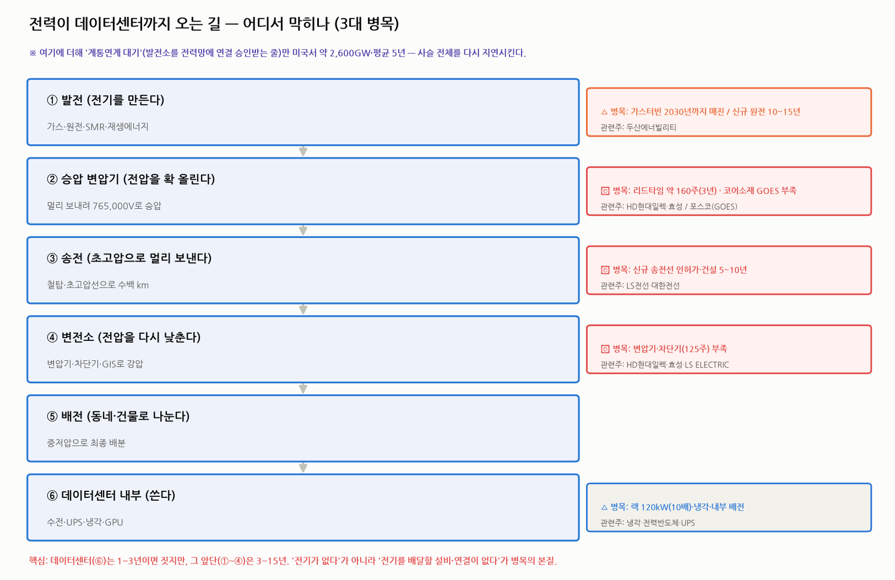
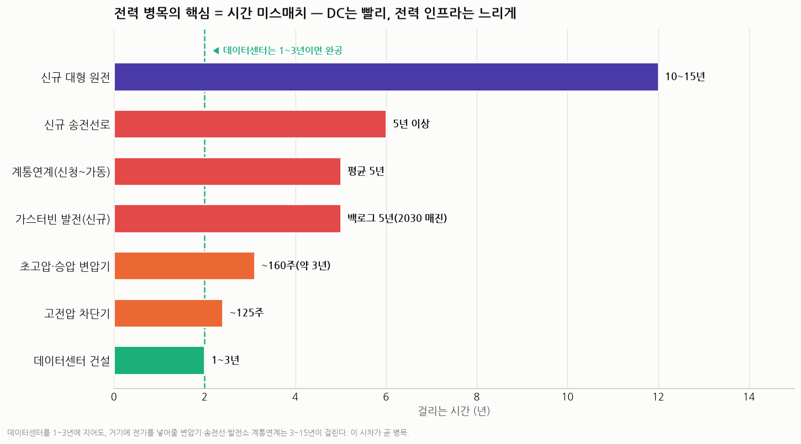
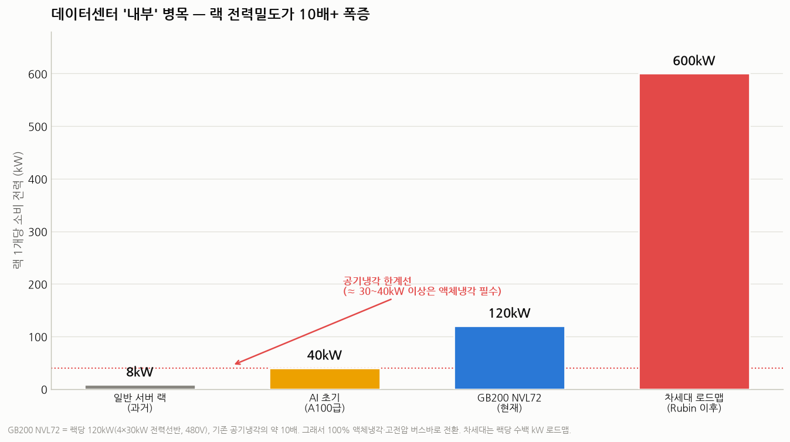

# AI 데이터센터의 진짜 병목은 '전력' — 생산·유통·사용 완전 해부 (1편)

> 작성일: 2026-07-30 · 카테고리: 거시 및 정책(전력 인프라)
> 대상: **배경지식이 전혀 없는 독자.** 모든 용어를 비유로 먼저 풀고, 줄임말은 최대한 풀어 쓴다.
> 성격: AI 데이터센터 전력난을 **생산(발전) → 유통(송배전) → 사용(데이터센터 내부)** 세 구간으로 나눠 "어디서, 왜 막히는지"를 본다. 앞으로 점점 세밀하게 파고들 시리즈의 1편(큰 그림).
> **검증 메모**: 수치는 IEA·Reuters·LBNL(로렌스버클리연구소)·증권사·저장소 리포트로 교차검증. 추정치는 표기.

---

## 0. 한 문장으로

> **"AI를 돌릴 반도체(그래픽처리장치, GPU)는 몇 달이면 더 찍어낸다. 하지만 그 반도체에 전기를 먹여줄 발전소·송전선·변압기는 몇 년이 걸린다."** — 그래서 지금 AI 확장의 진짜 병목은 반도체가 아니라 **전력**이다.

**가장 쉬운 비유(이 글 전체를 관통)**: 전력망은 **도시의 도로망**이다. AI 데이터센터는 갑자기 도시로 몰려든 **수천 대의 대형 트럭**이다. 트럭(반도체)은 공장에서 금방 더 찍어내지만, 그 트럭이 다닐 **고속도로(송전선)와 나들목·요금소(변압기·변전소)**는 몇 년에 걸쳐 콘크리트로 지어야 한다. **트럭이 아니라 도로가 막힌 것이다.**

---

## 1. 먼저, 전기가 데이터센터까지 오는 '길' (밸류체인)

전기는 **만들어지는 곳(발전소)** 과 **쓰는 곳(데이터센터·공장·집)** 이 멀리 떨어져 있다. 그 사이를 여러 단계로 잇는다.

**① 발전** → **② 승압(전압 올리기)** → **③ 송전(멀리 보내기)** → **④ 변전(전압 낮추기)** → **⑤ 배전(동네로 나누기)** → **⑥ 사용(데이터센터)**

각 단어의 쉬운 뜻:
- **발전(發電)**: 전기를 만드는 것. 가스를 태우거나(가스발전), 우라늄을 쪼개거나(원자력), 햇빛·바람(재생에너지)으로.
- **송전(送電)**: 만든 전기를 **아주 높은 전압으로 바꿔 멀리** 보내는 것. = **고속도로.**
- **배전(配電)**: 도착한 전기를 **낮은 전압으로 바꿔 동네·건물에** 나눠주는 것. = **골목길.**
- **변압기(變壓器)**: **전압(전기의 세기)을 올리거나 내리는 기계.** 이 사슬에서 가장 중요한 장치.
- **전력망/그리드(Grid)**: 이 발전~송전~배전 전체 **네트워크(전기 도로망).**

### 왜 전기를 굳이 '높은 전압'으로 바꿔 보낼까? (딱 하나만 이해하면 됨)

- 전력(보내는 전기의 양) = **전압 × 전류.**
- 같은 양을 보낼 때 **전압을 10배 올리면 전류는 1/10**로 줄어든다.
- 그런데 **전기를 보내다 새는 손실은 '전류의 제곱'에 비례**한다. 전류가 1/10이 되면 손실은 **1/100**로 급감.
- 그래서 발전소에서 나온 전기를 **765,000볼트(우리 집 콘센트 220볼트의 약 3,500배!)** 같은 초고압으로 확 올려서 멀리 보낸 뒤, 도착지 근처에서 다시 차근차근 낮춘다.
- **이 "전압을 올리고 내리는" 일을 전부 변압기가 한다.** → 그래서 변압기가 병목의 핵심이 된다(3장).

---

## 2. [생산] 발전 병목 — "전기를 만들 발전소가 부족하다"

### 데이터센터가 먹는 전기의 규모가 상상 이상이다
- 큰 AI 데이터센터 **1곳이 원자력발전소 1기(약 1기가와트) 분량**의 전기를 먹는다. (1기가와트 = 100만 킬로와트 = 웬만한 도시 하나.)
- 세계 데이터센터 전력 소비: **2024년 약 415테라와트시(세계 전력의 약 1.5%) → 2030년 약 945테라와트시로 2배 이상.** 이는 **일본 한 나라가 지금 쓰는 전기 전부**와 맞먹는다.
- 특히 미국은 **2030년까지 늘어나는 전력 수요의 거의 절반**을 데이터센터가 차지한다. 미국 데이터센터 전력 수요만 **2026년 약 24기가와트 → 2030년 약 110기가와트.**

### 그런데 AI는 전기를 '24시간 끊김 없이' 원한다
반도체는 잠깐만 전기가 끊겨도 학습이 날아간다. 그래서 데이터센터는 **해가 지면 멈추는 태양광·바람 없으면 멈추는 풍력(=간헐적 재생에너지)보다, 24시간 일정하게 나오는 전기(기저전력, base-load)** 를 선호한다. 그 24시간 전기의 후보가 **가스발전·원자력**이다.

### 병목 ① 가스터빈(가스발전기)이 매진됐다
- **가스터빈** = 천연가스를 태운 뜨거운 가스로 날개(터빈)를 돌려 전기를 만드는 대형 기계. **비행기 엔진을 발전소에 놓은 셈.** 원전보다 빨리(2~3년) 짓고 출력 조절이 쉬워 **AI 시대의 주력·백업 발전**으로 떠올랐다.
- 문제: **세계 최대 제조사 GE버노바(GE Vernova)의 물량이 2030년까지 이미 다 팔렸다.** GE·지멘스에너지·미쓰비시 3사 모두 주문 대기(백로그)가 약 5년.
- **GE버노바 예약의 약 3분의 1이 AI·하이퍼스케일러(대형 클라우드 기업)와 직접 관련.** 가격은 **2030~31년 가동분 기준 75% 폭등.**
- 왜 빨리 못 만드나: 초정밀 대형 기계라 부품·숙련공이 한정. (세계 4강: GE버노바 약 40%, 지멘스에너지 30%, 미쓰비시 20%, 안살도 5%. 한국 두산에너빌리티가 5% 미만으로 신규 진입 — 자체 가스터빈 보유 세계 5번째 국가.)

### 병목 ② 원자력·소형모듈원자로(SMR)는 무탄소지만 느리다
- 원자력은 24시간 무탄소 전기의 이상적 후보지만, **신규 대형 원전은 짓는 데 10~15년.** AI 속도를 못 맞춘다.
- 그래서 뜨는 게 **소형모듈원자로(SMR, Small Modular Reactor)** = **전기출력 300메가와트 이하의 작은 원자로.** 공장에서 모듈로 찍어 현장 조립 → 건설 기간을 **3~5년**으로 단축, 데이터센터 옆에 붙일 수 있다는 기대.
- **빅테크가 이미 원전·SMR을 장기 선계약(전력구매계약, PPA = Power Purchase Agreement)으로 싹쓸이 중**: 마이크로소프트(스리마일섬 원전 재가동 835메가와트), 아마존(5기가와트+), 구글(카이로스파워 500메가와트), 메타(오클로+테라파워 등 6.6기가와트). — 다만 SMR 상용화는 대부분 2030년 이후라 **당장의 병목은 못 푼다.**
- 한국 연결: **두산에너빌리티**가 원자로 주단조(대형 쇳덩이 성형)·SMR 전용공장(8,000억원 투자)·가스터빈을 모두 함.

> 발전 병목 요약: **전기를 만들 설비(가스터빈·원전)를 새로 들이는 데 5~15년.** 그래서 일부 데이터센터는 아예 **발전기를 옆에 직접 붙여 전력망을 우회(비하인드-더-미터, behind-the-meter)** 하기 시작했다.

---

## 3. [유통] 송배전 병목 — 여기가 '가장 심각'하다

전문가들이 입을 모으는 진짜 병목은 발전이 아니라 **"만든 전기를 데이터센터까지 배달할 설비·연결"** 이다.

### 근본 원인 = '시간 미스매치'
- **데이터센터를 짓는 데는 1~3년.** 그런데 거기에 전기를 넣어줄 인프라는:
  - 초고압·승압 변압기: **약 160주(3년), 일부 4년**
  - 고전압 차단기: **약 125주**
  - 신규 송전선로: **인허가+건설 5~10년**
  - 신규 발전소: 5~15년
- **데이터센터는 다 지었는데 전기를 못 넣어 가동을 못 하는 상황**이 실제로 벌어진다.

### 병목 ① 계통연계 대기 줄이 어마어마하다
- **계통연계(繫統連繫)** = 발전소·데이터센터를 전력망(그리드)에 **연결해도 되는지 승인받는 절차.** 이 승인 대기 줄이:
- 미국에서 전력망 연결을 기다리는 물량이 **약 2,600기가와트(원전 2,600기 분량!)**, 승인까지 **평균 5년.** (신청→상업가동은 2008년 2년 미만 → 2015년 3년 → 2023년 약 5년으로 계속 길어짐.)
- 버지니아주 북부(세계 최대 데이터센터 밀집지) 한 전력회사(도미니언)만 **47기가와트**의 데이터센터가 연결을 대기 중.

### 병목 ② 변압기 — 이 사슬의 '수리선(數理船)' 격 급소
- **변압기가 하는 일(다시)**: 전압을 올리고(승압) 내리는(강압) 것. 전기를 멀리 보내고(고압) 최종적으로 쓸 수 있게(저압) 바꾸는 필수 관문.
- 왜 병목인가: **① 만드는 회사가 소수(과점), ② 맞춤 주문 생산이라 재고로 못 쌓음, ③ 대형은 완성에 18~36개월, ④ AI 데이터센터 + 노후 전력망 교체 + 재생에너지 연결 + 전기차 충전 수요가 한꺼번에 폭발.**
- 수치: 대형 변압기 리드타임 **2020년 약 50주 → 2026년 초 약 160주(3년, 일부 4년).** 발전소용 승압변압기는 더 길다. 공급 부족률 약 30%, 가격은 2019년 대비 **+77%.** (미국은 변압기의 60% 이상이 설치 30~40년 넘은 노후품이라 교체 수요까지 겹침.)

### 병목 ③ 변압기의 '심장 재료'까지 부족하다 — 방향성 전기강판(GOES)
- **변압기 효율의 80% 이상을 '철심(코어)'이 결정**하는데, 그 코어의 재료가 **방향성 전기강판(GOES, Grain-Oriented Electrical Steel)** — 철에 규소를 2~3.5% 섞은 특수 강판(일반 철강보다 10배 이상 비쌈).
- 이걸 만드는 회사가 **전 세계에 포스코(한국)·니폰스틸·JFE(일본)·티센크루프(독일)·클리블랜드클리프스(미국) 5~6개뿐**, 연 생산 200만 톤에 그침. **변압기를 늘리고 싶어도 강판이 부족**한 이중 병목.
- 한국 연결: **포스코**의 전기강판은 코어 손실이 경쟁사 대비 20% 낮다고 주장 → 한국 변압기 3사의 최대 무기.

### 병목 ④ 차단기·가스절연개폐장치(GIS)·초고압직류송전(HVDC)
- **차단기**: 사고(합선 등) 때 **전류를 끊어 설비를 보호하는 대형 스위치.** 리드타임 **2023년 77주 → 2025년 말 125주.**
- **가스절연개폐장치(GIS, Gas-Insulated Switchgear)**: 변전소의 스위치들을 특수 가스로 절연해 크기를 1/10로 줄인 장비. 변전소 값의 절반을 차지.
- **초고압직류송전(HVDC, High-Voltage Direct Current)**: 아주 먼 거리(또는 해저)로 전기를 보낼 때 쓰는 직류 방식. 신재생·데이터센터 연결에 중요. (엔비디아가 2025년 데이터센터 **내부**를 800볼트 직류로 배전하는 구조를 발표하며 이 분야가 더 커짐.)

> 유통 병목 요약: **전기는 만들어도 배달이 안 된다.** 변압기(3년)·차단기·송전선(5~10년)·계통연계(5년)가 줄줄이 막혀 있고, 변압기의 재료(전기강판)까지 부족하다.
> **한국 수혜**: 초고압 변압기의 **HD현대일렉트릭·효성중공업**, 중저압·배전의 **LS ELECTRIC**, 전기강판의 **포스코**, 송전·해저케이블의 **LS전선·대한전선.** (한국 3사는 납기가 95~110주로 글로벌 140~180주보다 30~40% 빨라 미국 수출 급증 중.)

---

## 4. [사용] 데이터센터 '내부' 병목 — 전기가 들어와도 문제

전기가 데이터센터까지 무사히 왔다고 끝이 아니다. **건물 안에서 반도체까지 전기를 나눠주고, 그 열을 식히는 것**도 병목이다.

### 병목 ① 한 칸(랙)이 먹는 전기가 10배로 폭증
- **랙(Rack)** = 서버·반도체를 꽂아 넣는 **책장 같은 금속 선반.**
- 과거 일반 서버 랙은 1개당 약 5~10킬로와트를 먹었다. 그런데 엔비디아 최신 **GB200 NVL72 랙은 1개가 120킬로와트** — 기존의 **약 10배.** (4개의 30킬로와트 전력 선반으로 공급, 480볼트 입력.)
- 이렇게 밀도가 높아지면 **선풍기(공기냉각)로는 절대 못 식힌다.** 그래서 **100% 액체냉각**(물·특수 냉각액을 반도체에 직접 흘림)으로 넘어갔다. 차세대(루빈 이후)는 랙당 수백 킬로와트 로드맵 → 냉각·전력공급이 더 큰 숙제.

### 병목 ② 건물 안에서 반도체까지 가는 길에도 '관문'이 많다
데이터센터 안의 전기 여정: **수전설비(전기 받기) → 무정전전원장치(UPS, 정전 대비 배터리) → 전력분배장치(PDU) → 부스바(굵은 구리 막대) → 서버 전원공급장치 → 반도체.** 이 단계마다 조금씩 전기가 새고(손실), 각 장비가 다 부족·고가다.
- 그래서 손실을 줄이려 **고전압 직류(HVDC) 버스바**(굵은 구리 막대로 한 번에 배분)로 바꾸는 중.
- **무정전전원장치·비상발전기(디젤·가스)** 도 필수인데 이 역시 공급이 빡빡.

### 병목 ③ 얼마나 효율적으로 쓰나(PUE)
- **전력사용효율(PUE, Power Usage Effectiveness)** = 데이터센터 전체 전력 ÷ 반도체가 실제 쓴 전력. **1에 가까울수록 효율적**(1.1이면 반도체 100 쓰는데 냉각 등에 10 더 씀). 냉각을 잘하면 이 값이 낮아져 같은 전기로 더 많은 계산을 한다.

> 사용 병목 요약: **랙 전력밀도가 10배로 뛰며 냉각이 공기→액체로 바뀌었고, 건물 내부의 전력 분배·백업·효율 장비도 전부 새로 깔아야 한다.**

---

## 5. 종합 — 어디가 제일 심각하고, 누가 수혜인가

**세 병목의 심각도 순위(대체적 견해):**
1. **가장 심각 = 유통(송배전)** — 특히 **변압기(3년)와 계통연계(5년, 2,600기가와트 대기).** 전기를 만들어도 배달·연결이 안 된다.
2. **그다음 = 생산(발전)** — 가스터빈 2030년 매진, 원전·SMR은 2030년 이후. 그래서 전력망 우회(현장 발전)까지 등장.
3. **국지적 = 사용(내부)** — 냉각·내부배전. 기술로 풀리는 중이나 랙 밀도가 계속 올라 숙제도 커짐.

**한국 관련주 지도(밸류체인 단계별)**:
| 단계 | 병목 | 한국 관련주 |
|---|---|---|
| 발전 | 가스터빈·원전·SMR | 두산에너빌리티 |
| 승압·변전(변압기) | 리드타임 3년·부족률 30% | HD현대일렉트릭·효성중공업 |
| 변압기 소재 | 전기강판(GOES) 5~6사 과점 | 포스코(포스코홀딩스) |
| 송전·해저케이블 | 송전선 5~10년·HVDC | LS전선(LS)·대한전선·LS마린솔루션 |
| 배전·차단기 | 차단기 125주 | LS ELECTRIC·산일전기 |
| 사용(내부) | 냉각·전력공급 | 액체냉각·전력반도체·무정전전원장치 업체 |

**⚠️ 균형추(꼭 기억)**: 이 "부족" 서사에는 **자기실현적 함정**이 있다. 부족 공포가 **사재기·중복(이중·삼중) 예약**을 부르고, 그게 부족을 더 키운다. **수주잔고의 '질'** — 어디까지가 진짜 수요이고 어디부터가 공포로 인한 중복 주문인지 — 를 늘 의심해야 한다. AI 투자(CAPEX)가 꺾이면(2027~28 피크아웃 시나리오) 이 병목 수혜도 함께 식는다.

---

## 6. 다음 편 예고 (점점 세밀하게)

이번 1편은 **큰 그림(생산·유통·사용 3구간)**이었다. 다음 편부터 한 구간씩 현미경으로 본다. 예:
- **2편(유통 심화)**: 변압기 종류별(승압/강압/발전기용) 병목·GOES 공급·한국 3사 제품·수주잔고의 질 검증.
- **3편(발전 심화)**: 가스터빈 vs 원전 vs SMR 경제성(균등화발전원가), 빅테크 전력구매계약 실체.
- **4편(사용 심화)**: 데이터센터 내부 전력·냉각(액체냉각·800볼트 직류·전력반도체) 밸류체인.

---

## 참고 출처 (검증)

- [데이터센터 변압기 리드타임 160주 돌파·차단기 125주 (Reuters)](https://www.reuters.com/business/energy/)
- [세계 DC 전력 2024 415TWh→2030 945TWh (IEA Electricity 2025)](https://www.iea.org/reports/electricity-2025)
- [GE Vernova 2030년까지 가스터빈 매진·가격 +75% (Yahoo Finance/Bloomberg)](https://finance.yahoo.com/energy/articles/ge-vernova-gev-sold-turbines-141444518.html)
- [미국 계통연계 대기 2,600GW·평균 5년 (LBNL Queued Up 2026)](https://emp.lbl.gov/queues)
- [GB200 NVL72 랙 120kW·100% 액체냉각·480V (NVIDIA/Introl)](https://introl.com/blog/gb200-nvl72-deployment-72-gpu-liquid-cooled)
- [스리마일 원전 계통연계 가속(FERC) (한국경제)](https://www.hankyung.com/article/2026072036421)

**저장소 연계 리포트**
- `전력기기/배경지식/전력기기_산업배경지식.md` (밸류체인·변압기·GOES·GIS·HVDC 쉬운 정의)
- `전력기기/산업·테마분석/전력기기_산업분석리포트_v2.md` (리드타임·부족률·한국 3사)
- `전력기기/산업·테마분석/해저케이블_산업분석.md` (HVDC·해저케이블)
- `원자력및SMR/산업·테마분석/SMR_산업분석리포트.md`·`종목분석/두산에너빌리티_심층분석리포트.md` (발전·PPA)
- `일일공부/상시공부/2026-08-02_C10_산업_전력과데이터센터_그리드의경제학.md`

> 유의: 전력수요 전망·리드타임·계통연계 수치는 기관·언론 추정이며 시점·기준에 따라 달라진다(예: DC 전력수요는 IEA 415→945TWh를 대표값으로, 두산 리포트의 350→1,000TWh는 부연). 확정치는 각 기관 원문으로 재확인 권장.
