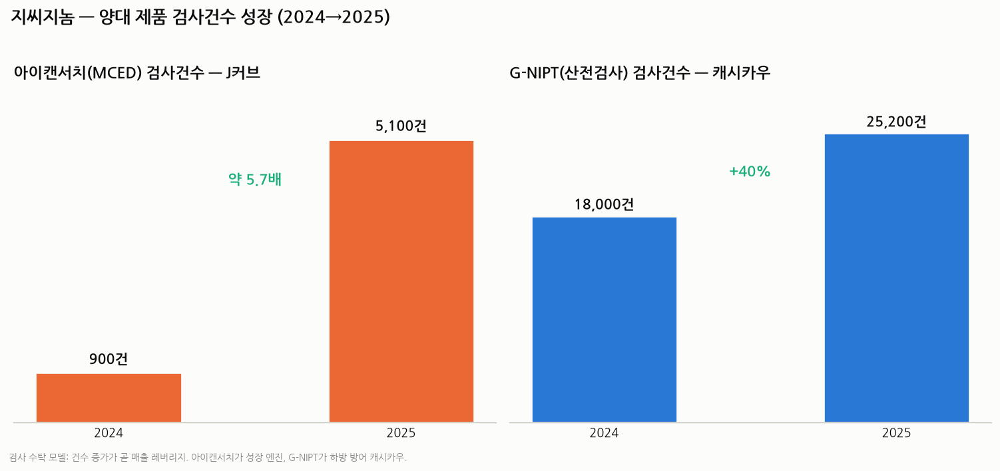
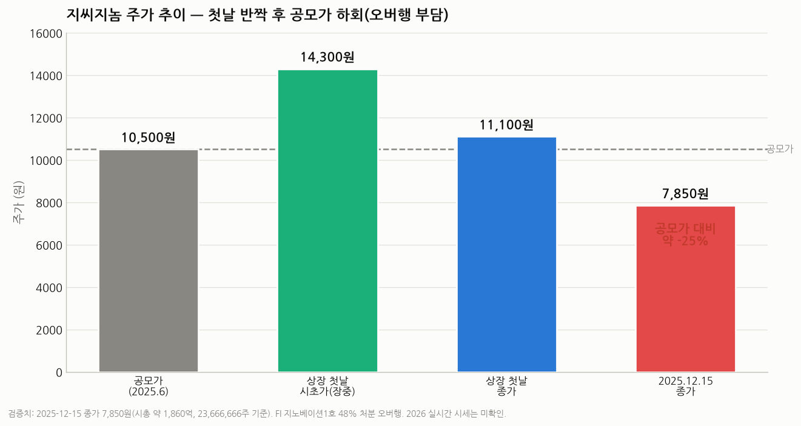

# 지씨지놈(GC Genome, KOSDAQ 340450) 심층 분석 리포트

> 작성일: 2026-07-30 (2026-07-30 수치 재검증·정정판) · 카테고리: 바이오 및 제약(진단·액체생검)
> 대상: GC(녹십자) 그룹 계열 임상유전체·액체생검 진단 기업
> **검증 메모**: 주가·시총·실적·지분·상장 수치를 복수 언론·공시 기반으로 교차검증함. 단 **2026년 실시간 시세는 검색으로 확보 불가 → "미확인"으로 표기**. 확정 마지막 검증 시세는 **2025-12-15 종가 7,850원**.

---

## 0. 한 문장 요약

> **지씨지놈은 "비침습 산전검사(G-NIPT) 국내 1위 캐시카우 + 혈액 한 통으로 여러 암을 조기 선별하는 다중암 검진(MCED) '아이캔서치' 성장 옵션"을 결합한 GC그룹 계열 진단기업**으로, 2025년 6월 코스닥 상장 첫해에 흑자 전환했다. **다만 주가는 상장 첫날 반짝 상승 후 공모가(10,500원)를 하회**했고, FI(재무적투자자) 매각에 따른 **오버행**과 MCED 급여화 불확실성이 핵심 부담이다.

---

## 1. 기본 정보 (검증)

| 항목 | 내용 |
|---|---|
| 종목코드 | KOSDAQ **340450** |
| 설립 | **2013년** (GC녹십자 자회사, 구 'GC녹십자지놈') |
| 상장 | **2025년 6월 11일** 거래개시 (기술특례, 녹십자그룹 7번째 상장사) |
| 공모가 | **10,500원** (희망밴드 9,000~10,500 상단) |
| 공모주식수 / 공모금액 | **400만주 / 약 420억원** |
| 총 발행주식수 | **23,666,666주** |
| 청약 | 수요예측 547:1, 일반청약 484:1 |
| 최대주주 | **GC녹십자 25.57%** (녹십자홀딩스 12.44%, 지노베이션1호PEF 11.76%, 우리사주 1.96% 등) |
| 최근 검증 시세 | **2025-12-15 종가 7,850원** (공모가 대비 −25%) → 시총 약 **1,860억원** |
| 2026 실시간 시세 | **미확인**(검색 불가, DART·거래소 확인 필요) |

---

## 2. 사업 구조 — 생애 전주기 유전자검사 4대 축

수익모델은 **검사 수탁(B2B2C)**: 병의원·검진센터가 검체를 보내면 지씨지놈이 분석·리포팅한다. **검사 건수 × 단가** 구조라 건수 증가가 곧 매출 레버리지다. 유전자검사 300종+, 병의원 900곳+ 공급.

1. **산전·신생아** — 핵심 **G-NIPT(지니프트)**. 국내 산과 유전자검사 **유통 1위**.
2. **암 정밀 진단** — 핵심 **아이캔서치(MCED)** + 조직·혈액 암 유전자 프로파일링.
3. **건강검진** — 검진센터 채널로 확산.
4. **유전 희귀질환 정밀진단** — WGS/WES 기반.

---

## 3. 양대 핵심 제품 (검사건수 검증)

### ① G-NIPT(지니프트) — 캐시카우
- 2015년 국내 첫 출시, AI 기반 비침습 산전검사. 산모 혈액 속 태아 DNA로 다운·에드워드·파타우 증후군 등 염색체 이상 선별. **국내 산과 유통 1위.**
- 검사 건수 **2024년 18,000건 → 2025년 25,200건(+40%)**.

### ② 아이캔서치(ai-CANCERCH) — 성장 엔진 ⭐
- **혈액 한 통(10mL)으로 여러 암을 동시 조기 선별하는 MCED**. 2023년 9월 국내 출시. 독자 **AI + 전장유전체분석(WGS)** 기반.
- **성능**: 특이도 **95.5%**, 전체 민감도 79.7%(병기 가중 80.2%). 표준 선별검사가 없던 **췌장암·간담도암 80%+ 민감도**.
- 검출 암종 **6종 → 10종**으로 확장.
- 검사 건수 **2024년 900건 → 2025년 5,100건(약 5.7배)** — 실적 재평가의 핵심 동력.

---

## 4. 파이프라인 · R&D

- **대장암 비침습 혈액검사**: 서울아산병원 변정식 교수팀과 공동연구, **미국소화기내과저널(AJG)** 게재.
- 동반진단(CDx)·단일암 특화 제품 확장, MCED 성능·암종 고도화.

---

## 5. 글로벌 확장

- **미국 Genece Health(지니스 헬스)에 기술수출 완료** → 상업화 추진.
- 로드맵: **단기 단일암 제품 출시 → 장기 FDA 인증 + 미국 보험청(CMS) 가이드라인 등재.**
- 일본 액체생검 학회 등 해외 학회서 아이캔서치 성능 발표.

---

## 6. 실적 — 상장 첫해 흑자전환 (검증)

| 구분 | 매출 | 영업이익 | 비고 |
|---|---|---|---|
| 2024 | 258.9억 | **−12억(적자)** | |
| 2025 3Q 누적 | 235억 (+26%) | +10억 | 흑전 |
| **2025 (연간)** | **315억 (+22%)** | **+12억(흑전)** | 2026-01-19 잠정공시 |
| 2026 1Q | 74억 (+9.1%) | 흑자 | |

- 산과·검진 부문이 30%+ 성장 견인. 바이오 신규 상장사가 상장 첫해에 **매출 성장 + 흑자**를 동시 달성한 건 이례적 — **이익 나는 진단 실적주.**

---

## 7. 지배구조 · 수급 (오버행이 핵심)

- 최대주주 **GC녹십자 25.57%**, 2대주주 **녹십자홀딩스 12.44%**, **지노베이션1호 PEF 11.76%**(FI), 우리사주 1.96% 등. 최대주주+특수관계인 합산 약 **45%**가 1년 보호예수 → **2026년 6월 해제**.
- **⚠️ 오버행이 실제로 진행 중**: FI **지노베이션1호가 상장 후 취득주식의 약 48%를 처분(약 76억 확보, 2025.12)** → 이것이 하반기 주가 약세·공모가 하회의 주요 원인. 잔여 FI 지분 + 최대주주 보호예수 해제 물량이 지속 부담.

---

## 8. 주가 · 밸류에이션 (정정)

| 시점 | 주가 |
|---|---|
| 공모가(2025.6) | 10,500원 |
| 상장 첫날 시초가(장중) | 14,300원 (장중 +36%) |
| 상장 첫날 종가 | 11,100원 |
| **2025-12-15 종가** | **7,850원 (공모가 대비 −25%)** |
| 2026 실시간 | **미확인** |

- **정정 사항**: 이전 버전에서 기재했던 "현재가 34,950원·키움 목표주가 44,000원·공모가 대비 3.3배 급등"은 **근거 없는 오류로 삭제·정정**했다. 실제로는 **첫날 반짝 상승 후 공모가를 하회**했고, FI 오버행으로 약세다.
- **시가총액**: 2025-12-15 기준 약 **1,860억원**(23,666,666주 × 7,850원). 2025 매출 315억 기준 **P/S 약 5.9배**.
- NH투자증권이 커버리지 개시("아이캔서치 확대로 실적 고성장·기업가치 재평가" 전망)했으나 **목표주가는 미제시**. (검증된 증권사 목표주가 없음.)
- **밸류 성격**: 실이익이 작아(2025 영업익 12억) 전통 PER로는 의미가 약하고, **MCED 옵션 가치 + 검사건수 J커브 + 흑자 체력**을 반영하는 성장주 프레임으로 보되, **공모가 하회·오버행이라는 수급 현실**을 함께 봐야 한다.

---

## 9. 경쟁 구도

- **국내 유전체/진단**: 마크로젠·테라젠바이오·디엔에이링크(NGS 1세대), EDGC·랩지노믹스(액체생검·NGS). 지씨지놈 차별점 = **GC그룹 병원·검진 채널 + NIPT 1위 캐시카우 + 흑자 체력 + MCED 임상 데이터.**
- **글로벌 MCED 벤치마크**: Grail(Galleri), Guardant Health(Shield), Exact Sciences(Cancerguard). 지씨지놈은 "한국판 MCED" 포지션 + 미국 진출 옵션.

---

## 10. 투자포인트 vs 리스크

**투자포인트**
- 아이캔서치 검사건수 J커브(900→5,100건)로 매출 고성장 + 흑자 체력
- MCED = 조기암 진단 패러다임 전환 → 대형 옵션가치
- G-NIPT 캐시카우 하방 방어, GC그룹 채널·신뢰도
- 미국 기술수출(Genece Health) + FDA/CMS 로드맵

**리스크**
- **수급/오버행**: FI(지노베이션1호) 매각 진행 + 최대주주 보호예수 해제(2026.6) → **주가 공모가 하회의 직접 원인**
- MCED **보험수가·신의료기술평가** 불확실성
- 소형주 유동성·변동성, 검사단가 인하 압력, 글로벌 경쟁(Grail 등)
- 저출산 구조(G-NIPT 물량 상단 제약)

---

## 11. 종합

지씨지놈은 **"이익 나는 진단 캐시카우(G-NIPT) + 폭발 성장 중인 MCED 옵션(아이캔서치)"** 의 조합이며, 상장 첫해 흑자로 여느 적자 바이오와 차별화된다. **다만 상장 후 주가는 공모가를 하회**했고, FI 매각·보호예수 해제 오버행이 수급을 누르고 있다. 사업 펀더멘털(검사건수 성장·흑자)과 수급(오버행)이 엇갈리는 국면으로, 관전 포인트는 **① 아이캔서치 검사건수·급여화, ② 미국 진출 진전, ③ 오버행 물량 소화**다.

---

## 12. 트래킹 체크리스트

- [ ] 아이캔서치 분기 검사건수 + 신의료기술평가·급여화
- [ ] G-NIPT 검사건수·NIPT 침투율
- [ ] 미국 Genece Health 상업화·FDA·CMS 마일스톤
- [ ] 분기 매출 성장률·영업이익률(흑자 지속)
- [ ] **FI 잔여 지분·최대주주 보호예수 물량 소화(오버행)**
- [ ] **실시간 주가·시가총액**(현재 미확인 → DART·거래소 확인)

---

## 참고 출처 (검증)

- [공모가 10,500원 확정 (바이오스펙테이터)](https://www.biospectator.com/news/view/25230)
- [총 발행 2366만6666주·공모 400만주·지분구조 (뉴스웰)](https://www.newswell.co.kr/news/articleView.html?idxno=11565)
- [상장 첫날 시초가 14,300·종가 흐름 (한국경제)](https://www.hankyung.com/article/2025061170206)
- [공모가 문턱 못 넘은 지씨지놈 (뉴스드림)](http://www.newsdream.kr/news/articleView.html?idxno=87800)
- [상장 6개월 오버행·FI 지노베이션1호 48% 처분·12/15 종가 7,850원 (데일리팜)](https://dailypharm.com/user/news/333994)
- [2025 연간 매출 315억·영업익 12억 흑전, 전년 -12억 (파이낸셜뉴스)](https://www.fnnews.com/news/202601191709217143)
- [2024 매출 258.9억 (사람인 기업정보/DART)](https://www.saramin.co.kr/zf_user/company-info/view-inner-finance/csn/T2pOODlnTWc2ODhUMXhiemQ0QTFsdz09)
- [2026 1Q 매출 74억·영업익 흑자 (PRESS9)](https://www.press9.kr/news/articleView.html?idxno=76613)
- [아이캔서치 특이도 95.5%·민감도 79.7%·10종 (청년일보)](https://www.youthdaily.co.kr/news/article.html?no=212526)
- [대장암 비침습 검사 AJG 게재 (팜뉴스)](https://www.pharmnews.com/news/articleView.html?idxno=264909)
- [미국 Genece Health 기술수출·조기암 확장 (의약뉴스)](https://www.newsmp.com/news/articleView.html?idxno=252316)

> 유의: 위 수치는 복수 언론·공시로 교차검증했으나 **2026년 실시간 주가·시가총액은 미확인**이다. 최신 시세·분기 실적은 DART 공시·한국거래소로 반드시 재확인할 것.
