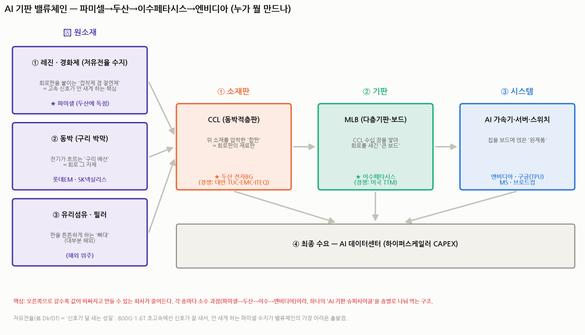

# 이수페타시스 III — AI 기판 밸류체인 완전 해부 (배경지식 0 기준)

> 작성일: 2026-07-30 · 카테고리: IT 부품 및 소재(반도체 기판·소부장)
> 성격: `이수페타시스_심층리서치II`의 밸류체인 한 줄(**파미셀 → 두산 전자BG → 이수페타시스 → 엔비디아·구글**)을 **아무 배경지식 없이도 이해되게** 층별로 해부. 모든 용어를 비유로 먼저 푼다.
> **검증 메모**: 파미셀·두산·이수 관계와 수치는 디일렉·서울경제·하나증권 등으로 교차검증. 주가·시총은 시점 변동 있으니 실시간 재확인 권장.

---

## 0. 30초 그림

AI 반도체(엔비디아 GPU·구글 TPU)는 혼자 못 돈다. **칩이 올라앉을 "회로판"**이 있어야 하고, 그 회로판은 **여러 재료를 쌓아 만든다.** 이 "재료 → 판재 → 큰 보드 → 완제품"의 사슬이 밸류체인이고, **각 단계를 서로 다른 소수 회사가 과점**한다.

**한 줄 흐름**: 파미셀(수지) → 두산 전자BG(CCL) → 이수페타시스(MLB) → 엔비디아·구글(완제품) → AI 데이터센터.

---

## 1. 먼저 "회로판"이 뭔지부터 — 합판 비유

전자제품 속 초록색 판(회로판, PCB)은 사실 **합판(플라이우드)과 똑같은 원리**로 만든다. 세 가지 재료를 쌓아 압착한다.

| 재료 | 쉬운 정체 | 하는 일 |
|---|---|---|
| **유리섬유(글라스 클로스)** | 판의 **'뼈대'** (유리로 짠 천) | 판을 튼튼하게·안 휘게 |
| **레진(수지) + 경화제** | **'접착제 겸 절연체'** (굳는 플라스틱 풀) | 뼈대를 적셔 붙이고, 전기가 새지 않게 절연 |
| **동박(구리 박막)** | **'구리 배선'** (얇은 구리 포일) | 실제로 전기가 흐르는 회로 |

이 세 가지를 **"유리섬유를 레진에 적셔 말린 뒤, 위아래에 구리를 붙이고 열·압력으로 압착"** 하면 한 장의 **CCL(동박적층판, Copper Clad Laminate)** 이 된다. **CCL = 회로판을 만들기 위한 '재료판(합판)'** 이다.

그 CCL을 **수십 장 쌓아 구멍 뚫고 회로를 새긴 게 MLB(다층기판)** — 이수페타시스가 만드는 그 "큰 보드"다. (☞ MLB 자체는 `II` 리포트 참조.)

> 정리하면: **동박·유리섬유·레진 → (압착) → CCL → (수십 장 적층) → MLB → (칩 얹기) → 완제품.**

---

## 2. "저유전율"이 왜 이 사슬의 가장 어려운 출발점인가

밸류체인에서 **가장 위(상류)이자 가장 어려운 게 파미셀이 만드는 레진**이다. 이유는 딱 하나, **"저유전율(低 Dk/Df)"** 때문이다. 용어가 어렵지만 개념은 쉽다.

- **신호가 "샌다"는 개념**: 회로판 위로 데이터(전기 신호)가 지나갈 때, 판의 재료가 신호 에너지를 조금씩 빨아먹는다(누설·감쇠). 이걸 좌우하는 재료 성질이 **유전율(Dk)·유전손실(Df)** 이다.
- **비유**: 신호가 "달리기 선수"라면, **유전손실이 높은(나쁜) 판 = 진흙탕 길**(선수가 느려지고 넘어짐), **저유전율(좋은) 판 = 매끄러운 트랙**(빠르고 깨끗하게 완주).
- **왜 지금 중요**: AI는 800G·1.6T처럼 **극도로 빠른 신호**를 쓴다. 속도가 빠를수록 신호가 더 잘 샌다. 그래서 **"안 새는 저유전율 재료"** 가 필수가 됐고, 이걸 만드는 게 극도로 어렵다.
- **그래서 파미셀**: 이 **저유전율 레진·경화제**를 두산과 **약 10년간 공동개발**해 2024년부터 공급 중이다. 10년이 걸렸다는 것 자체가 진입장벽이다.

> 즉 파미셀은 밸류체인의 **"가장 안 보이지만 가장 어려운 씨앗"** 이다. 그 위에 두산(CCL)·이수(MLB)가 얹힌다.

---

## 3. 층별 심층 — 누가, 뭘, 얼마나

### ⓪ 원소재 층

**● 레진·경화제 (저유전율 수지) — ★ 파미셀**
- 두산 전자BG에 **AI 서버용 CCL 원료(레진·경화제 등 저유전율 소재)를 독점 공급.** 두산과 ~10년 공동개발, **2024년부터 납품 시작.** 최종 적용처는 **엔비디아 블랙웰(Blackwell) CCL.**
- 파미셀은 원래 **줄기세포 치료제(바이오)** 회사로 알려졌지만, **바이오케미컬 사업부**가 전자재료를 한다. **2026년 1분기 저유전율 전자소재 매출 260억(전체 매출 367억의 71%)** — 이제 사실상 **"AI 소재 회사"** 로 재평가되는 중. (두산과 117억 규모 계약 공시 등.)
- 포인트: **"숨은 젠슨황 수혜주"** 로 불리며, 밸류체인 최상류에서 高마진 소재를 소량 독점하는 구조.

**● 동박 (구리 박막) — 롯데에너지머티리얼즈 등**
- 전기가 흐르는 구리 회로 그 자체. 고속용은 표면이 매끄러운 특수 동박이 필요.
- **두산이 롯데에너지머티리얼즈와 AI 데이터센터·네트워크용 동박을 공동개발** 중. (전통 강자는 일본 미쓰이 등.)

**● 유리섬유·필러 — 대부분 해외**
- 판의 뼈대(유리천)·충전재. 저유전율 특수 유리는 대만·일본 위주라 국내 비중 작음.

### ① CCL(동박적층판) 층 — ★ 두산 전자BG

- **두산(주)의 전자BG(전자 비즈니스그룹) = 두산이 말하는 '두산전자'.** 별도 상장사가 아니라 **㈜두산(코스피 000150) 안의 사업부.**
- **서버·네트워크용 고속·고다층·저손실 하이엔드 CCL의 최강자.** **엔비디아 차세대 AI 플랫폼향 CCL을 사실상 수주 독점**, 아마존 등 빅테크에도 공급. 고내열·저손실 CCL을 개발해 2026년 1분기부터 샘플 공급.
- **경쟁사**: 대만 **TUC(타이광전)·EMC(타이야오)·ITEQ(롄마오)**, 일본 파나소닉. 최근 **CCL 가격 급등**(수요 초과)으로 대만 업체들이 10~40% 인상 — 공급 타이트의 증거.
- 두산에게 파미셀은 **핵심 소재 공급사(상류)**, 이수페타시스는 **주요 고객(하류)** 이다.

### ② MLB(다층기판) 층 — ★ 이수페타시스

- CCL을 수십 장 쌓아 만든 초고다층 보드. **40층+ 95% 수율은 TTM·이수 듀오폴리.** 엔비디아 42%·구글 TPU. (상세는 `II` 리포트.)
- **두산 CCL을 사다가** 자기 보드에 쓴다 → **두산의 고객.**

### ③ 시스템 & ④ 최종수요

- 엔비디아·구글·MS·브로드컴이 칩을 이 보드에 얹어 AI 가속기·서버·스위치를 만들고, 그걸 **AI 데이터센터(하이퍼스케일러 CAPEX)** 가 사들인다. **이 CAPEX가 사슬 전체의 진짜 엔진.**

---

## 4. 이 밸류체인의 투자적 함의 (핵심)

**① 같은 파도, 층별로 나눠 먹는다.**
파미셀(소재)·두산(CCL)·이수(MLB)는 **모두 "AI 기판 슈퍼사이클"이라는 한 파도**를 탄다. 층마다 소수 과점이라, 어느 층에 투자하든 같은 테마 노출을 얻되 **성격이 다르다:**

| 층 | 대표주 | 성격 | 강점 | 약점 |
|---|---|---|---|---|
| 소재(수지) | **파미셀** | 독점 소재·高마진·소규모 | 10년 개발 해자, 재평가 초기 | 매출 규모 작음, 두산 의존 |
| CCL | **㈜두산(전자BG)** | 하이엔드 독점 | 엔비디아 독점·가격 급등 수혜 | 지주사(다른 사업 혼재) |
| MLB | **이수페타시스** | 듀오폴리·풀캐파 | 40층+ 수율, 국내 유일 | 엔비디아 42% 집중 |
| 완제품 | 엔비디아·구글 | 최종 수요원 | 생태계 지배 | 밸류 고평가 |

**② 원가 전가 관계.**
CCL 가격이 오르면 → **두산엔 호재**, **이수엔 원가 부담**. 단 이수는 초고다층 과점이라 단가에 전가할 힘이 있고, 두산 CCL 없이는 이수 보드도 못 만드니 **상호 의존(공생)**. 파미셀 수지가 없으면 두산 CCL이 안 나오는 것도 마찬가지.

**③ 국내 관련주 지도(같은 사슬).**
- 소재: **파미셀**(수지), **롯데에너지머티리얼즈**(동박)
- CCL: **㈜두산**(전자BG)
- 기판: **이수페타시스**(MLB), (참고: 대덕전자·심텍은 다른 제품인 substrate — `II` 리포트 참조)

**④ 공통 리스크 = 같은 하방.**
사슬 전체가 **엔비디아·구글 물량과 AI CAPEX**에 종속된다. AI capex가 꺾이면(2027~28 피크아웃 시나리오) **파미셀부터 이수까지 동반 타격**. 즉 분산 투자처럼 보여도 **밑단의 리스크는 하나**다.

---

## 5. 한 줄 정리

> **파미셀(안 새는 수지) → 두산(그 수지로 만든 고급 합판 CCL) → 이수페타시스(합판을 수십 장 쌓은 큰 보드 MLB) → 엔비디아·구글(보드에 칩 얹은 완제품).** 각 층은 소수가 과점하고, 오른쪽으로 갈수록 비싸지지만, **뿌리(수요)는 AI 데이터센터 투자 하나**다. 그래서 이 종목들은 "같이 오르고 같이 빠지되, 층마다 마진·해자·리스크가 다른" 한 몸 사슬이다.

---

## 참고 출처 (검증)

- [파미셀, 엔비디아 AI서버용 CCL 핵심소재(레진·경화제) 두산에 독점공급 (디일렉)](https://www.thelec.kr/news/articleView.html?idxno=57879)
- [파미셀, 두산 통해 엔비디아 AI 소재 공급망 편입·10년 공동개발·2024 공급 (다음/뉴스)](https://v.daum.net/v/20260611082335597)
- [파미셀-두산 전자BG 117억 소재계약·저유전율 매출 71% (디지털투데이)](https://www.digitaltoday.co.kr/news/articleView.html?idxno=544667)
- [두산 하이엔드 CCL 시장 장악·엔비디아 독점 (핀포인트뉴스)](https://www.pinpointnews.co.kr/news/articleView.html?idxno=444280)
- [두산, AI 가속기용 저손실 CCL·대만 경쟁사 가격인상 (더퍼블릭)](https://www.thepublic.kr/news/articleView.html?idxno=297176)
- [두산·롯데에너지머티리얼즈 AI 동박 공동개발 / CCL 가격 급등 (더구루·인베스팅)](https://kr.investing.com/news/stock-market-news/article-1901138)
- [하나증권 "두산, 엔비디아 효과 CCL 독점 유지" (시장경제)](https://www.meconomynews.com/news/articleView.html?idxno=127359)

> 유의: 매출·점유·독점 여부는 언론·증권사 자료 기준이며 시점에 따라 변할 수 있다. "독점"은 현재 공급구도 서술로, 향후 경쟁사 진입 가능성은 별개다. 주가·시총은 실시간 재확인 권장.
