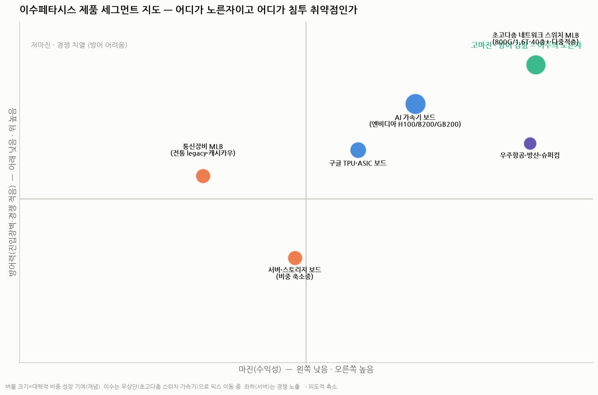
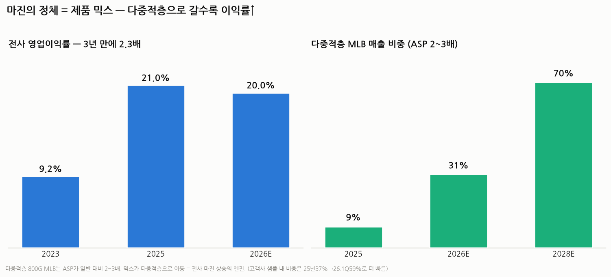

# 이수페타시스 IV — 'MLB'를 쪼개서 본다: 제품별 매출·경쟁자·마진·침투 가능성

> 작성일: 2026-07-30 · 카테고리: IT 부품 및 소재(반도체 기판)
> 성격: 그동안 'MLB'를 하나로 뭉뚱그렸는데, 실제로는 **용도·공법 세대별로 매출·경쟁자·마진이 전혀 다르다.** 이걸 쪼개서 "어디가 노른자이고 어디가 침투에 취약한가"를 분석한다.
> **검증 메모**: NH·데일리인베스트·제네시스리포트·테크월드 등 교차검증. 세그먼트별 정확한 매출 %는 회사가 상세 공개하지 않아 **일부는 방향성(정성) 추정**임을 명시.

---

## 0. 핵심 요약

이수의 MLB는 **두 개의 축**으로 쪼개야 한다.
- **축 A. 용도별**: 초고다층 네트워크 스위치 / AI 가속기 보드 / 서버·스토리지 / 통신(legacy) / 우주항공·방산.
- **축 B. 공법 세대별**: VIPPO(22~30층) → **다중적층(40층, ASP 2~3배)**. ← 마진의 진짜 엔진.

결론: **노른자는 "초고다층 네트워크 스위치 MLB + AI 가속기 보드"(고마진·과점), 취약점은 "서버·통신"(저마진·경쟁 多, 그래서 이수가 의도적으로 비중 축소 중).** 침투 위협은 **생각보다 낮다** — 오히려 경쟁사들이 이 분야에서 철수하는 중이다.

---

## 1. 용도별 매출 세그먼트 — 경쟁자와 마진이 다 다르다

| 세그먼트 | 고객 | 마진 | 경쟁자 | 성격 |
|---|---|---|---|---|
| **초고다층 네트워크 스위치 MLB**(800G/1.6T·40층+·다중적층) | Cisco·Arista·Juniper·Broadcom | **최고** | **TTM (사실상 듀오폴리)** | 노른자·고성장 |
| **AI 가속기 보드**(H100/B200/GB200) | **엔비디아(매출 42%)** | 高 | 과점(대만 일부) | 대형·집중 리스크 |
| **구글 TPU·ASIC 보드** | 구글·MS·메타·아마존 | 高 | 이수 우위, 대만 일부 | 고성장 |
| 서버·스토리지 보드 | 다수 빅테크 | **中·低** | **중국·대만 다수** | **비중 축소중** |
| 통신장비 MLB(legacy) | 통신장비사 | 中 | 성숙·다수 | 캐시카우(안정) |
| 우주항공·방산·슈퍼컴 | 방산·연구 | 高 | 인증장벽 高 | 니치·소규모 |

**믹스 이동의 방향(중요)**: 이수는 **수익성 낮은 '서버' 비중을 일부러 줄이고, '가속기·AI 스위치' 비중을 늘린다.** 실제로 북미 빅테크 수주 내 **네트워크 스위치 비중이 2024년 1분기 19% → 4분기 63%**로 급등했다. 즉 "같은 MLB 회사"가 아니라 **매 분기 더 비싸고 어려운 쪽으로 이동하는 회사**다.

> 신규 고객도 붙는 중: **엔비디아·구글·MS·메타·아마존**에 더해, 국내 AI 칩 스타트업 **리벨리온·퓨리오사AI**의 가속기 PCB 양산을 준비 중.

---

## 2. 공법 세대별 — 마진의 진짜 엔진 (VIPPO vs 다중적층)

용도보다 **더 중요한 마진 변수는 '공법 세대'** 다. 같은 스위치용이라도 세대가 다르면 단가가 2~3배 차이 난다.

| 구분 | VIPPO(기존) | **다중적층(신형)** |
|---|---|---|
| 층수 | 22~30층 | **40층** |
| 두께 | ~3.2mm | **5.0mm** |
| 종횡비 | ~13:1 | **22:1+** |
| ㎡당 단가(ASP) | 기준 | **약 2~3배** |
| 공정 부하 | 기준 | 약 2.5배 |

**다중적층**은 여러 서브패널을 각각 만든 뒤 다시 적층해 붙이는 초고난도 공법이다. **비중이 커질수록 전사 마진이 오른다.**

- **전사 영업이익률: 9.21%(2023) → 20.97%(2025)** — 3년 만에 2.3배. (2026E도 약 20%, 영업이익 약 2,859억)
- **다중적층 매출 비중: 2025년 9% → 2026E 31% → 2028E 70%+.** (고객사 '샘플 내' 비중은 25년 37% → 26년 1분기 59%로 더 빠르게 전환 중 = 미래 매출 선행지표)
- 즉 **"매출 성장(캐파)"과 "마진 개선(다중적층 믹스)"이 동시에** 일어난다. 이게 실적 레버리지의 핵심.

---

## 3. 제품별 경쟁자 매핑 — "누가 어디서 싸우나"

경쟁은 **세그먼트마다 완전히 다르다.** 하나로 "TTM vs 이수"라고 하면 틀린다.

| 세그먼트 | 1위/강자 | 이수 위치 | 대만 | 중국 |
|---|---|---|---|---|
| **초고다층 스위치 MLB(40층+·95% 수율)** | TTM | **공동 최상단(듀오폴리)** | (진입 어려움) | (지정학 배제) |
| 18층+ 고다층 MLB(전체) | TTM(~30%) | **2위권(15~18%)** | GCE | Shennan·WUS |
| AI 가속기 컴퓨트 보드·백플레인 | **WUS(중국, 78층 백플레인 독점)** | 참여 | Unimicron·GCE | WUS·Shennan |
| 서버·스토리지 보드 | 분산 | 축소중 | 다수 | 다수 |
| 통신 MLB(legacy) | 분산 | 안정 | 다수 | 다수 |

**핵심 통찰**:
- **이수가 가장 강한 곳은 "네트워크 스위치용 초고다층 MLB + 구글 TPU"** 다. 여기선 TTM과 둘뿐.
- **이수가 상대적으로 약한 곳은 "엔비디아 컴퓨트 보드·백플레인"** — 여기선 **대만 WUS·Unimicron이 강하다**(WUS가 엔비디아 78층 백플레인을 사실상 독점). 그래서 이수는 엔비디아향에서도 "가속기 보드"에 집중하고, 백플레인은 대만과 분업한다.
- 즉 **"엔비디아 42%"**라는 숫자도 뜯어보면 **컴퓨트/백플레인은 대만, 가속기 보드·스위치는 이수**로 갈린다.

---

## 4. 침투 가능성 — 경쟁사가 이수의 노른자에 들어올 수 있나? (핵심 질문)

결론부터: **단기 침투 위협은 낮다. 방향은 오히려 반대(경쟁사 이탈)다.** 5가지 각도로 본다.

**① 오히려 경쟁사가 나가고 있다 🟢**
초고다층 MLB는 **물량이 작고 난도가 높아** 많은 업체에 매력이 없다. 실제로 **일본 교세라·히타치 등이 MLB 사업에서 철수**하며 **이수의 점유율이 확대**됐다. 신규 진입이 아니라 **퇴출**이 트렌드.

**② 대만·중국의 '상향 침투' 가능성 🟡 (있으나 시간이 걸림)**
WUS·Unimicron·GCE는 이미 고다층을 하지만 주력이 **컴퓨트 보드·substrate**다. 이수의 노른자인 **네트워크 스위치 40층+ 다중적층으로 올라오려면 수율 곡선(60%→95%)을 다시 올라야 한다.** 가능은 하지만 **수년 + 고객 재인증**이 필요. 즉 "기술이 없다"가 아니라 "**수율·인증·시간**"의 벽.

**③ 중국의 침투는 지정학이 막는다 🟢**
Shennan·WUS는 기술이 근접하나, **미·중 규제로 미국 빅테크(엔비디아·구글·시스코)가 AI 핵심 부품을 중국산에 의존하기 어렵다.** 한국 생산인 이수가 **"China+1" 반사수혜.**

**④ 국내 substrate 업체(삼성전기·대덕)의 진입 🟢 (거의 불가)**
이들은 **완전히 다른 제품(FC-BGA 패키지기판)** 을 만든다(☞ `II` 리포트). MLB는 설비·공정·노하우가 달라 **근시일 진입은 사실상 불가.** 대덕전자가 통신용 MLB는 하지만 **초고다층 AI 스위치급은 아니다.**

**⑤ 진짜 위협은 따로 있다 🔴 (이게 핵심)**
- **고객의 의도적 vendor 다변화**: 엔비디아·구글이 **2nd source(예: TTM·이수 외 대만사)를 전략적으로 키우면** 이수 점유율이 눌린다. (한미반도체가 SK하이닉스의 한화 이원화로 겪은 것과 같은 리스크.)
- **TTM의 증설·공격**: 듀오폴리 상대의 캐파 확대.
- **AI capex 둔화**: 2027~28 피크아웃 시 세그먼트 무관 동반 타격(공통 하방).

**이수의 방어막**:
1. **수율 곡선**(40층+ 95%를 내는 곳은 TTM·이수뿐) — 후발 진입에 수년.
2. **20년 고객 인증**(Cisco·항공 AS9100 등) — 재퀄 비용·리스크로 교체 어려움.
3. **풀캐파 + 선제 증설** — 캐파 자체가 진입장벽. 신규 진입자는 캐파 확보에 2~3년, 그동안 이수가 선점(6공장 2027 1Q·태국).
4. **지정학(China+1)** — 중국 배제로 무경쟁 구간 확보.

> 요약: **"노른자(초고다층 스위치·가속기)는 수율·인증·지정학·캐파로 이중삼중 방어. 취약점(서버)은 이수 스스로 버리는 중." 침투 위협은 낮으나, 진짜 리스크는 경쟁사 침투가 아니라 '고객의 vendor 다변화'와 'AI capex 사이클'이다.**

---

## 5. 종합 + 리스크

- **실적**: 2025 매출 1조 880억 → 2026E 약 1.44조(OPM 20%, 영업익 ~2,859억) → 캐파 증설로 2조+ 지향.
- **한 줄**: 이수는 "MLB 회사"가 아니라 **"매 분기 더 비싸고 어려운(다중적층·스위치·가속기) 쪽으로 믹스를 옮기며 마진을 끌어올리는 과점 기업"**이다. 노른자는 두텁게 방어되고, 저마진 세그먼트는 스스로 덜어낸다.
- **리스크**: ① 엔비디아 42% 집중, ② 고객의 2nd source 육성, ③ 대만의 상향 침투(수년 뒤), ④ AI capex 피크아웃(2027~28), ⑤ CCL 등 원가·환율.

---

## 참고 출처 (검증)

- [엔비디아 42%·전 제품군 고른 성장·2026E 매출 1.44조/OPM 20% (마켓인 이데일리)](https://marketin.edaily.co.kr/News/ReadE?newsId=02968406642367688)
- [800G 스위치 수주 급증·다중적층 9→31%·스위치 19→63% (데일리인베스트)](https://www.dailyinvest.kr/news/articleView.html?idxno=65144)
- [다중적층 샘플비중 37→59%·NH 수익성 개선·ASP 2~3배 (제네시스리포트)](https://genesis-report.com/analysis/2026-05-27-isu-petasys)
- [전사 OPM 9.21→20.97%·수익성 낮은 서버 축소·가속기/스위치 확대 (제네시스리포트)](https://genesis-report.com/analysis/2026-05-27-isu-petasys)
- [18층+ TTM 30%·이수 2위권·Shennan/WUS/GCE (한경 기판 사이클)](https://www.hankyung.com/koreamarket/consensus/pdf/2026-01-acea612bee1b2a88d65bec67113cadf6)
- [경쟁사(교세라·히타치) MLB 철수로 이수 점유율 확대 (테크월드)](https://www.epnc.co.kr/news/articleView.html?idxno=224991)
- [리벨리온·퓨리오사AI 가속기 PCB 양산 준비 (이코노미사이언스)](https://www.e-science.co.kr/news/articleView.html?idxno=108139)
- [WUS 엔비디아 78층 백플레인 사실상 독점 (pandaily)](https://pandaily.com/nvidia-ai-server-78-layer-backplane-china-supply-chain)
- [캐파 증설로 매출 2조 확대 전망 (데일리인베스트)](http://www.dailyinvest.kr/news/articleView.html?idxno=70769)

> 유의: 세그먼트별 매출 %·마진은 회사 미공개분이 많아 방향성 추정이 포함된다. 경쟁 구도·침투 판단은 현재 시점 서술이며, 고객의 vendor 정책·기술 발전으로 바뀔 수 있다. 확정치는 사업보고서·증권사 리포트로 재확인 권장.
