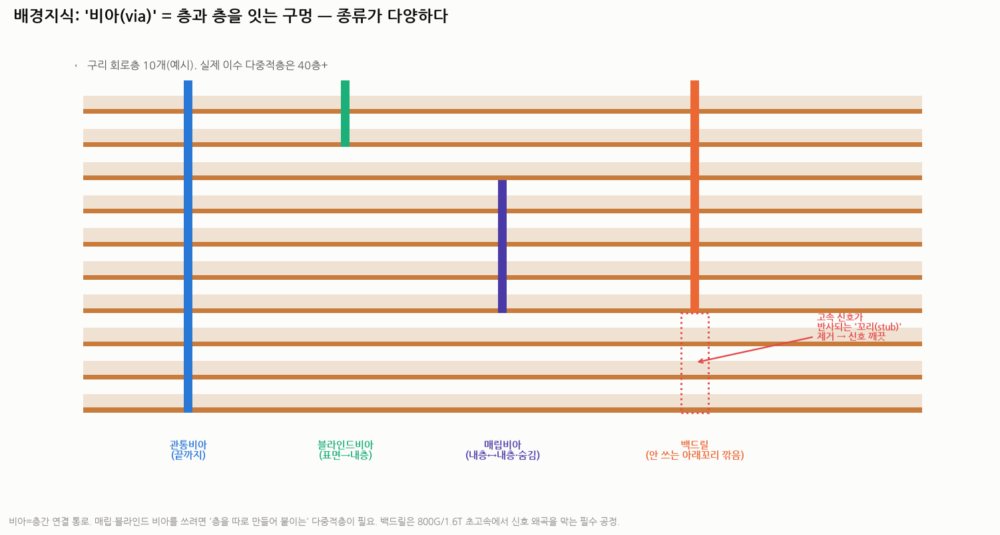
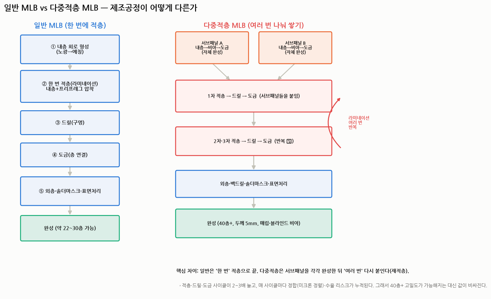
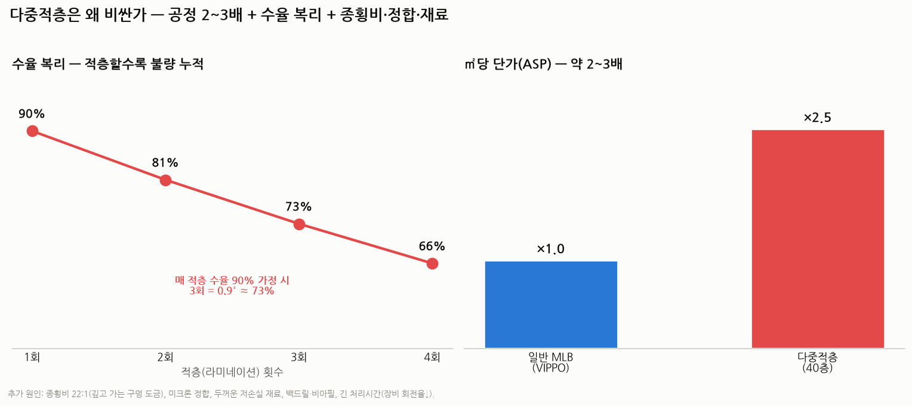

# 이수페타시스 V — MLB 제조공정 완전 해부: 일반 vs 다중적층 (배경지식 0)

> 작성일: 2026-07-30 · 카테고리: IT 부품 및 소재(반도체 기판)
> 성격: `II`(사업)·`IV`(세그먼트)에서 "다중적층이 비싸고 어렵다"고만 했는데, **실제로 어떻게 만들길래** 그런지를 배경지식 0 기준으로 공정 단위까지 뜯어본다. 모든 용어를 비유로 먼저 푼다.
> **검증 메모**: 공정 개념(순차적층·VIPPO·백드릴·비아)은 미국 특허·PCB 기술자료로 교차검증. 이수 수치(40층·5mm·22:1·ASP 2~3배·다중적층 비중)는 앞선 리포트에서 검증된 값 재사용.

---

## 0. 왜 '공정'을 알아야 하나

이수페타시스의 실적·마진·해자는 전부 **"다중적층을 만들 수 있느냐"** 한 문장으로 요약된다. 그런데 다중적층이 왜 어렵고 왜 비싼지는 **만드는 과정**을 봐야 이해된다. 이 글을 읽고 나면 "다중적층 비중 9%→70%가 왜 마진 폭발인지"가 몸으로 이해된다.

---

## 1. 배경지식 ① — 회로판(MLB)은 뭘로 되어 있나

(☞ 밸류체인은 `III` 참조. 여기선 '판 한 장'의 구조만.)

회로판은 **합판(플라이우드)**과 같다. 세 재료가 번갈아 쌓인다.
- **구리층(동박)** = 전기가 흐르는 '회로(배선)'. 얇은 구리 포일.
- **절연층(프리프레그·코어)** = 층과 층 사이를 떼어놓는 '절연 접착제'. **프리프레그(prepreg)** 는 유리섬유를 수지에 반쯤 적셔 말린 '반경화 접착 시트'로, 열을 가하면 녹아 붙으며 굳는다.
- **비아(via)** = 층과 층을 위아래로 잇는 '구멍(엘리베이터)'. 다음 장에서 자세히.

**다층기판(MLB, Multi-Layer Board)** = 이 구리층을 여러 겹(수십 층) 쌓아 하나로 만든 판. 층이 많을수록 더 많은 배선을 담아 더 많은 데이터를 처리한다.

---

## 2. 배경지식 ② — '비아(via)': 층을 잇는 구멍의 종류

층이 아무리 많아도 **층끼리 전기를 주고받으려면 위아래를 잇는 통로**가 필요하다. 그게 **비아(via)** = 판에 뚫은 구멍의 안쪽 벽에 구리를 입혀 만든 '전기 엘리베이터'다. 종류가 다양하고, **이게 일반 vs 다중적층을 가르는 핵심**이다.

- **관통비아(through-hole)**: 판을 **처음부터 끝까지** 관통. 만들기 쉽지만 공간을 많이 먹고, 안 쓰는 아래쪽 '꼬리'가 고속 신호를 방해.
- **블라인드비아(blind via)**: **표면에서 특정 내층까지만** 뚫음(반대편으로 안 나감).
- **매립비아(buried via)**: **내층과 내층 사이에만** 있고 겉에선 안 보임(숨겨짐). → **이걸 만들려면 '층을 따로 만들어 붙이는' 방식이 반드시 필요** = 다중적층의 존재 이유.
- **마이크로비아(micro via)**: 레이저로 뚫는 초미세 비아(주로 초고밀도용).
- **백드릴(back-drilling)**: 관통비아를 뚫은 뒤, **안 쓰는 아래쪽 '꼬리(스터브, stub)'를 반대편에서 다시 깎아내는** 공정. 800기가·1.6테라 같은 초고속에서 이 꼬리가 신호를 반사·왜곡시키기 때문에 잘라낸다 → **신호무결성(signal integrity, 신호가 안 깨지고 도착하는 성질)** 확보.

> 핵심: **매립·블라인드 비아를 자유롭게 쓰려면 "층을 따로 완성해 붙이는" 다중적층이 필요**하다. 관통비아만 쓰면 일반 방식으로 충분하다.

---

## 3. 일반 MLB는 이렇게 만든다 (기본 공정)

먼저 '한 번에 쌓는' 일반 방식부터. 크게 7단계다.

1. **내층 회로 만들기** — 원판(CCL) 위 구리에 감광 필름을 씌우고, **노광(露光, 빛으로 회로 그림을 전사)** → **현상** → **에칭(etching, 필요 없는 구리를 화학약품으로 녹여냄)** → 구리 배선만 남긴다. (도장을 찍고 나머지를 지우는 것과 비슷.)
2. **검사(AOI, 자동광학검사)** — 카메라로 내층 회로 불량 확인.
3. **적층(라미네이션, lamination)** — 회로가 그려진 내층 여러 장 + 프리프레그(접착시트) + 바깥 동박을 겹쳐, **뜨거운 프레스로 한 번에 압착**해 한 덩어리로 만든다.
4. **드릴(drilling)** — 층을 이을 구멍(관통비아)을 뚫는다.
5. **도금(PTH, Plated Through Hole)** — 구멍 안쪽 벽에 구리를 입혀 위아래 층을 전기적으로 연결.
6. **외층 회로** — 바깥 면도 노광·에칭으로 회로 형성.
7. **마감** — **솔더마스크(solder mask, 회로를 덮는 초록색 절연·보호막)** → **표면처리(금도금 등)** → 잘라내고 최종 검사.

→ 이 방식으로 대략 **22~30층**까지 만든다. 요점은 **"적층을 딱 한 번"** 한다는 것.

---

## 4. 다중적층 MLB는 뭐가 다른가 — '여러 번 나눠 쌓기'

다중적층(순차적층, Sequential Lamination)은 **한 번에 안 쌓는다.** 대신:

1. **서브패널(sub-panel)을 여러 개 따로 만든다.** 각각을 위 3장의 공정으로 **자체 완성**한다 — 즉 각 서브패널 안에 이미 **비아를 뚫고 도금까지 끝낸다(→ 그래서 '매립비아'가 생긴다).**
2. 완성된 서브패널들을 **프리프레그로 다시 붙여(1차 재적층)**, 또 드릴·도금.
3. 필요하면 이 **"적층 → 드릴 → 도금"을 2차·3차로 반복**한다.
4. 마지막에 바깥층·백드릴·솔더마스크·표면처리로 마감.

**한 문장 차이**: 일반은 "한 번" 적층으로 끝, 다중적층은 **서브패널을 각각 완성한 뒤 "여러 번" 다시 붙인다.**

이렇게 하면 얻는 것:
- **40층 이상**의 초고다층, 두께 5mm.
- **매립·블라인드 비아**로 배선을 3차원으로 촘촘히 → 초고속 신호를 더 많이 담음.
- 신호 경로 최적화(층을 나눠 담으니 간섭↓).

잃는 것(대가):
- 적층·드릴·도금 사이클이 **2~3배**로 늘어난다.
- 붙일 때마다 **미크론(1,000분의 1밀리미터) 단위 정합(registration, 층 정렬)** 을 맞춰야 한다. 여러 번 붙일수록 오차가 누적.
- → 이게 곧 '왜 비싼가'(7장)로 이어진다.

---

## 5. 다중적층 '안에서'의 종류 — 공법별로 다르다

'다중적층'이라고 다 같은 게 아니다. 목적별로 공법이 갈린다.

| 공법 | 한 줄 정의 | 목적 | 주 적용 |
|---|---|---|---|
| **VIPPO** (Via-in-Pad Plated Over) | 부품이 앉는 **패드 바로 밑에 비아를 뚫고 구리로 채운 뒤 평탄화**해 그 위에 부품을 얹음 | 공간 절약 + 방열 + 전력·신호 경로 단축 | 22~30층 고다층(AI 가속기 보드 등) |
| **순차적층** (Sequential/Multi-lamination) | **서브패널을 따로 만들어 여러 번 재적층** | 40층+ 초고다층·고밀도 구현 | 800G/1.6T 스위치, 차세대 가속기 |
| **백드릴** (Back-drilling) | 관통비아의 **안 쓰는 꼬리(스터브)를 깎아냄** | 초고속 신호무결성(반사 제거) | 800G/1.6T 고속 보드 전반 |
| (참고) **HDI·빌드업** | 마이크로비아를 **한 층씩 쌓아 올림**(레이저) | 초고밀도·소형화 | 주로 패키지기판·모바일(MLB와는 결이 다름) |

- **VIPPO**: '비아를 채워 평탄하게 만든다'가 핵심. 채우기(fill)→평탄화(planarize)→위에 도금(plate over). 부품(특히 볼그리드어레이, BGA)을 안정적으로 얹고, 열을 안쪽 구리판으로 빼주며, 전력을 짧고 굵게 공급.
- **순차적층**: '층을 나눠 만들어 붙인다'가 핵심. **이수의 신형 40층 다중적층이 여기 해당.** 공정 부하가 일반 대비 약 **2.5배.**
- **백드릴**: '꼬리를 잘라 신호를 깨끗하게'. 위 두 공법과 **함께** 쓰인다(경쟁 관계가 아니라 보완).

> 실무에선 이 공법들이 **한 보드 안에 섞여** 들어간다. 예: 40층 순차적층 보드에 VIPPO로 부품을 얹고 백드릴로 고속 배선을 정리.

---

## 6. 어디에 공급되고, 목적이 무엇인가

| 제품 | 공법·층수 | 공급처 | 목적(왜 이 스펙이 필요한가) |
|---|---|---|---|
| **AI 가속기 보드** | VIPPO, 22~30층 | 엔비디아(H100/B200/GB200) | 그래픽처리장치와 고대역폭메모리를 좁은 공간에 촘촘히, 전력·방열 확보 |
| **800G/1.6T 네트워크 스위치 보드** | **순차적층 40층 + 백드릴** | Cisco·Arista·Broadcom | 수천 가닥 초고속 신호를 층으로 나눠 담고, 신호가 안 새게 |
| **차세대 AI 가속기·구글 TPU** | **순차적층(Sequential 확정)** | 구글(TPU 8세대)·MS·메타·아마존 | 세대가 오를수록 층수·속도 폭발 → 다중적층 필수 |
| **우주항공·방산·슈퍼컴** | 고신뢰 고다층 | 방산·연구기관 | 극한 환경 신뢰성(인증 장벽) |

**목적을 한 줄로**: 반도체가 빨라질수록(800기가→1.6테라) **① 배선 가닥 수가 폭발**(→ 층을 더 쌓아야), **② 신호가 잘 샘**(→ 저손실 재료·백드릴), **③ 열·전력이 커짐**(→ VIPPO·두꺼운 구리). 다중적층은 이 세 요구를 동시에 푸는 유일한 방법이라, 세대가 갈수록 채택이 늘 수밖에 없다(다중적층 비중 2025년 9% → 2028년 70%+).

---

## 7. 왜 단가가 2~3배 비싼가 — 7대 원인

1. **적층 횟수 2~3배** — 라미네이션은 매번 프레스·가열·냉각의 긴 사이클. 횟수가 곧 비용·시간.
2. **수율 복리(compounding)** — 각 적층 수율이 90%여도, 3번 겹치면 0.9×0.9×0.9 ≈ **73%**. 공정이 많을수록 **불량이 곱해져** 누적된다. (40층+에서 95% 수율을 내는 곳이 TTM·이수뿐인 이유.)
3. **종횡비(aspect ratio) 22:1** — 판이 두꺼워지면(5mm) 가늘고 깊은 구멍을 뚫고 그 안쪽까지 균일하게 도금해야 함. 깊을수록 도금 불량·단선 위험.
4. **정합(registration) 난도** — 여러 번 붙일 때 미크론 단위로 정렬. 조금만 어긋나도 단선(open)·합선(short).
5. **재료비** — 두껍고(5mm) 층이 많아 프리프레그·구리를 더 씀 + **저손실(저유전율) 특수 재료**(비싼 CCL, ☞ `III` 파미셀·두산).
6. **추가 공정** — 백드릴·비아필(비아 채우기)·평탄화 등 일반엔 없는 단계.
7. **긴 처리시간 → 장비 회전율 저하** — 한 장 만드는 데 오래 걸려, 같은 설비로 만들 수 있는 물량이 줄어든다(기회비용).

→ 종합하면 **㎡당 단가(ASP)가 약 2~3배**, 공정 부하는 약 2.5배. 그래서 **다중적층 비중이 늘면 전사 영업이익률이 뛴다**(9.21%→20.97%, ☞ `IV`).

---

## 8. 종합 + 투자 함의

- **일반 MLB = "한 번에 쌓기"(22~30층), 다중적층 = "따로 만들어 여러 번 붙이기"(40층+).** 이 차이가 매립비아·초고속·고밀도를 가능케 하지만, 적층 횟수·수율 복리·정합·재료 때문에 **값이 2~3배**가 된다.
- **공법은 VIPPO·순차적층·백드릴이 한 보드에 섞여** 목적(공간·신호·방열)을 나눠 푼다.
- **투자 관점**: 다중적층은 **"만들 수 있는 곳이 극소수(TTM·이수) + 세대마다 채택 증가 + ASP 2~3배"** 라는 3박자라, 이수 실적의 마진·성장 엔진이다. 반대로 리스크는 **수율(공정 난도)·엔비디아 집중·AI capex 사이클**(☞ `IV`).

---

## 참고 출처 (검증)

- [순차적층(Sequential Lamination) 공정 개념 (AllPCB 기술자료)](https://www.allpcb.com/allelectrohub/sequential-lamination-a-deep-dive-into-multi-layer-pcb-fabrication)
- [Sequential build circuit board (미국 특허 US6759596 등)](https://patents.google.com/patent/US6759596B1)
- [VIPPO(Via-in-Pad Plated Over) 정의·공정·장점 (Viasion/Shipco)](https://www.viasion.com/blog/understanding-via-in-pad-plated-over-vippo/)
- [Via-in-Pad 공정·설계규칙·리스크 (FastTurnPCBs)](https://www.fastturnpcbs.com/blog/what-is-via-in-pad/)
- 이수 스펙(40층·5mm·22:1·ASP 2~3배·다중적층 9→31→70%): 본 저장소 `이수페타시스_심층분석리포트.md`·`_IV_제품세그먼트` (증권사·언론 교차검증분)

> 유의: 공정 세부는 업체·제품마다 변형이 있고, 층수·수율·ASP는 추정·평균치다. '수율 복리 90%→73%'는 개념 예시이며 실제 수율은 제품·성숙도에 따라 다르다(성숙 40층+는 95%+). 확정치는 회사 자료로 재확인 권장.
