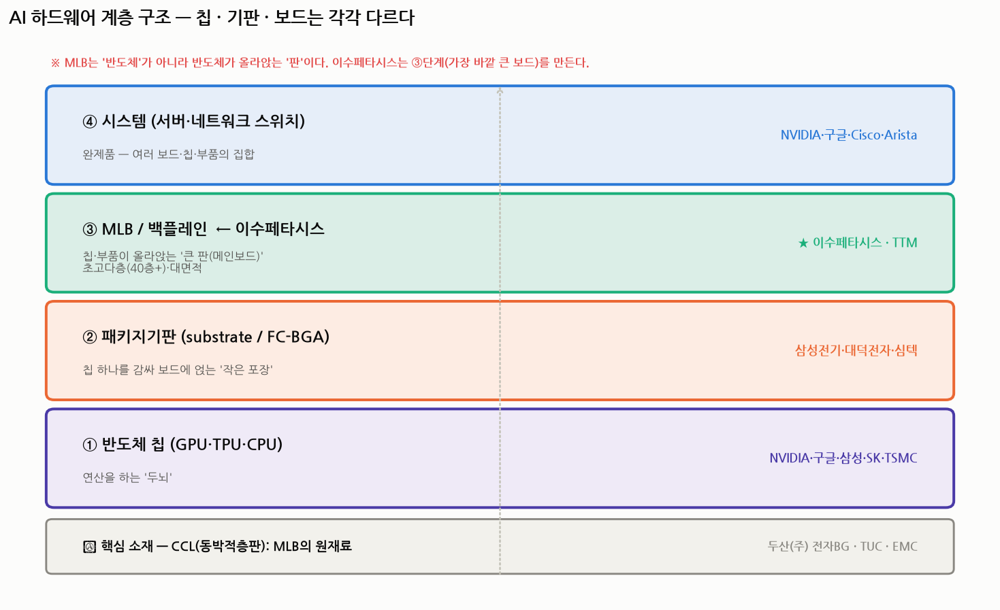
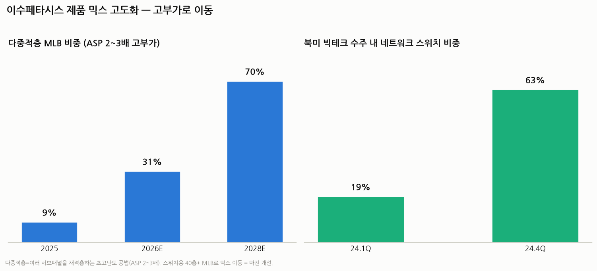
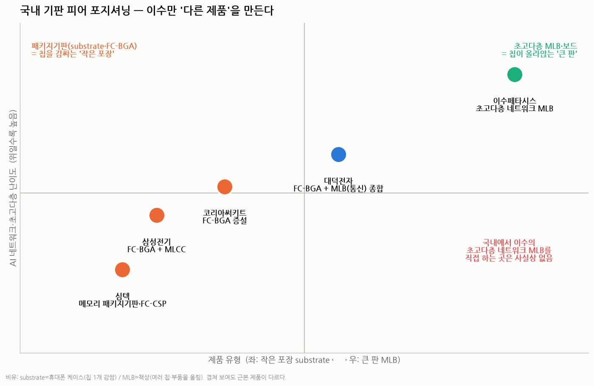

# 이수페타시스 심층 리서치 II — 기판 산업 구조로 이해하기 (딥다이브)

> 작성일: 2026-07-30 · 카테고리: IT 부품 및 소재(반도체 기판·PCB)
> 성격: 기존 `이수페타시스_심층분석리포트.md`를 보완하는 **기술·밸류체인·경쟁·수주구조 심화편.** 8개 질문(MLB 개념·고객·수율·가동률·수주구조·CCL/두산·경쟁사·국내피어)을 **산업 구조 속에서** 다룬다.
> **검증 메모**: 수치는 증권사·언론·회사 IR로 교차검증. 주가는 2026-06-22 117,900원(52주 45,000~164,400) 확인 후 **7/28~29 코스피 이틀 연속 서킷브레이커 급락**으로 하락 — 실시간가는 미확인.

---

## 1. 먼저 계층부터 — 'MLB'가 뭔지, 반도체와 뭐가 다른지

가장 큰 오해부터 풀자. **MLB는 반도체가 아니다.** AI 하드웨어는 4~5개 층으로 쌓인 구조이고, 각 층은 **전혀 다른 회사가 만드는 다른 제품**이다.

| 층 | 이름 | 쉬운 비유 | 하는 일 | 만드는 곳 |
|---|---|---|---|---|
| ④ | 시스템(서버·스위치) | 건물 | 완제품 | NVIDIA·구글·Cisco |
| ③ | **MLB / 백플레인** | **여러 물건을 올리는 '큰 책상'** | 칩·부품을 붙들고 신호·전력을 흘림 | **★ 이수페타시스·TTM** |
| ② | 패키지기판(substrate/FC-BGA) | **칩 하나를 감싸는 '작은 케이스'** | 칩을 보드에 얹는 징검다리 | 삼성전기·대덕전자·심텍 |
| ① | 반도체 칩(GPU·TPU) | 두뇌 | 연산 | NVIDIA·구글·TSMC |
| ⓪ | 소재 CCL(동박적층판) | 책상의 '원목' | MLB의 원재료 | 두산(주) 전자BG·TUC·EMC |

**핵심 구분 (질문 1·8의 뿌리):**
- **반도체(칩)** = 연산하는 두뇌. 삼성·SK·엔비디아·TSMC 영역.
- **패키지기판(substrate, FC-BGA)** = 칩 **하나**를 감싸 보드에 얹는 **작은 포장**. 회로 밀집도가 극도로 높다. 삼성전기·대덕전자·심텍이 만든다.
- **MLB(Multi-Layer Board)** = 그 포장된 칩들과 부품이 **함께 올라앉는 큰 판(메인보드·백플레인)**. 여러 층의 구리 회로를 절연층 사이에 쌓아 만든다. **이수페타시스가 만드는 건 바로 이 ③단계.**

> **"메인보드"**란 PC를 열면 나오는 그 큰 초록색 판이다. 칩·메모리·커넥터가 다 그 위에 꽂힌다. **"백플레인(backplane)"**은 여러 보드를 뒤에서 이어주는 더 큰 판. AI 서버·스위치는 이 판이 40층 넘게 쌓인 초고난도 버전을 요구한다. → 그게 이수의 제품.

---

## 2. 왜 어렵나 — 수율 '곡선'이 곧 진입장벽 (질문 3)

당신이 "수율이 높아 보이지 않는다"고 느낀 건 **신제품 램프 초기 숫자**를 봤기 때문이다. 수율은 하나의 숫자가 아니라 **제품 성숙도에 따른 곡선**이다.

- **신제품(800G 스위치용 MLB)**: 양산 초기 **수율 60%** → 2026년 1월 **80%** → 최근 **80% 중반**. (지금 램프 중)
- **성숙 제품(40층 이상 MLB)**: **95% 이상 수율**을 안정적으로 내는 회사는 **전 세계에 TTM과 이수페타시스 단 2곳뿐.**

즉 **"어려운 신제품을 60%에서 시작해 80% 중반까지 끌어올리고, 결국 40층+에서 95%를 내는 능력" 자체가 해자**다. 후발주자는 이 수율 곡선을 오르는 데 수년~수십 년이 걸린다.

**벽(진입장벽)의 구성:**
1. **물리적 난이도** — 40층·두께 5mm·종횡비 22:1(구멍 깊이/지름). 종이 40장을 미크론 오차 없이 정렬해 붙이고, 5mm를 관통하는 머리카락 굵기 구멍을 정확히 뚫어야 함.
2. **수율 노하우** — 200여 개 공정, 라미네이션·드릴이 병목. 수율이 곧 원가·납기.
3. **고객 인증(퀄)** — Cisco '올해의 협력사'(2008), 항공 AS9100(2007) 등 20년 누적. 한 번 승인되면 교체가 어렵다.
4. **자본** — 대구 드릴 전용 신공장 503억 등 고난도 설비 투자.

---

## 3. 고객과 매출 구조 (질문 2)

**고객사**: 엔비디아·구글(TPU)·마이크로소프트·인텔·브로드컴 + 네트워크 스위치(Cisco·Arista·Juniper).

- **엔비디아가 매출의 약 42%** — AI 가속기 보드(H100·B200·GB200)용. **단일 고객 집중이 최대 리스크이자 강점.**
- **구글 TPU** — 7세대 양산, 8세대는 다중적층 구조 확정. 구글 TPU 생산계획 **2026년 300만개 → 2027년 500만개+.**
- 매출 **약 95%가 수출, 사실상 100% 수주생산(made-to-order).**

**믹스가 고부가로 이동 중 (성장의 핵심):**

- **다중적층 MLB 비중**: 2025년 9% → 2026년 **31%** → 2028년 **70%+** 전망. 다중적층은 ASP가 **2~3배**라 매출·마진을 함께 끌어올린다.
- **북미 빅테크 수주 내 네트워크 스위치 비중**: 2024년 1분기 19% → 4분기 **63%**. 400G→800G→1.6T 스위치가 층수를 폭발시킨다.

---

## 4. 가동률 — 정말 풀캐파다 (질문 4)

당신의 직관이 맞다. **이수는 사실상 최대 가동률(풀캐파)로 돌고 있고, 증권사들은 "MLB 쇼티지(공급부족)"를 얘기한다.** 그래서 공격적으로 증설한다.

- **3단계 캐파 확장**: 5공장(1단계 완료, 램프업) → 6공장(2027년 1분기 완공 목표, 설비 선행반입으로 앞당김) → 구지(달성2차산단) → **태국 신규 거점(6개 고객 확보, 2027년 1분기 양산).**
- **다중적층 캐파**: 2H26 6→8(월) → 1H27 **10.5**로 확대. VIPPO 캐파 일부를 다중적층으로 전환.
- **의미**: 풀캐파인데도 계속 증설한다는 건 **수요가 캐파를 초과**한다는 뜻 = 만드는 쪽이 '을'이 아니라 '갑'에 가까운 공급자 우위 국면.

---

## 5. "수주 없으면 매출 없는 아쉬운 구조" 아닌가? (질문 5) — 가장 중요한 논점

절반은 맞고 절반은 틀리다. 이건 앞서 쓴 [메모리 수요 구조 분석](../시장브리핑/메모리수요_구조적인가_사이클인가_PERvsPBR_2026-07.md)과 **똑같은 프레임**으로 봐야 한다.

**맞는 부분 (리스크):**
- MLB는 수주생산이라 **엔비디아·구글이 GPU/TPU 물량을 줄이면 매출이 직접 타격**을 받는다. **엔비디아 42% 집중**이 그래서 최대 약점이다.
- AI capex가 꺾이면(2027~28 공급과잉·피크아웃 시나리오) 이수도 사이클을 피할 수 없다.

**틀린 부분 (일회성이 아니다):**
수요를 세 갈래로 쪼개면 "재주문 구조"가 보인다.
1. **신규(greenfield)** — 새 AI 클러스터·신규 프로그램 수주. (사이클성)
2. **세대교체 재설계(재주문)** — GPU/TPU가 18~24개월마다 신세대로 바뀌면 **보드를 새로 설계·재인증**해야 한다. H100용 보드 ≠ B200용 보드 ≠ Rubin용 보드. 세대가 바뀔 때마다 **새 수주가 반복**된다.
3. **탑재량·난이도 증가(content)** — 세대마다 층수↑·면적↑·다중적층 비중↑ → **같은 대수라도 ASP가 올라간다**(다중적층 2~3배).

즉 **"AI 가속기가 계속 만들어지는 한, 세대교체·고사양화로 수주가 반복·확대되는 구조"**다. 게다가 최상단은 TTM·이수 **듀오폴리**라 고객이 벤더를 바꾸기 어렵다(재퀄 비용·리스크). **"돌이킬 수 없는 피해"는 벤더 교체가 아니라 AI capex 전체가 꺾일 때** 온다 — 그건 이수 고유 문제가 아니라 산업 전체 문제다. 실제로 **분기 수주잔고는 지속 증가** 중이다.

> 요약: 일회성 스팟이 아니라 **"프로그램 단위로 반복되는 수주 + 세대마다 커지는 단가"** 구조. 단 **고객 집중(엔비디아 42%)과 AI 사이클**이라는 두 개의 큰 변수에 종속된다.

---

## 6. CCL·두산전자와의 관계 (질문 6)

**CCL(Copper Clad Laminate, 동박적층판)** = 구리(동박) + 유리섬유 + 에폭시 레진을 압착한 판으로, **MLB의 원재료**다. 계층도의 ⓪단계.

- **두산(주)의 전자BG(=흔히 '두산전자')는 고속(AI용) CCL의 강자**로, **엔비디아 블랙웰용 CCL 공급망을 사실상 독점**하고, **이수페타시스를 포함한 국내외 기판사에 CCL을 납품**한다. (경쟁사 미국 EMC가 엔비디아 품질검증에서 탈락하며 두산이 반사이익.)
- 즉 **두산전자는 이수페타시스의 '상류(원재료) 공급사'**다. 두 회사는 **지분관계가 없는 별개 그룹(두산 vs 이수)**이고, 순수한 **밸류체인 상하 관계**다.
- 밸류체인: **파미셀(핵심 소재) → 두산 전자BG(CCL) → 이수페타시스(MLB) → 엔비디아·구글(칩+보드)**.
- 참고로 **이수는 CCL을 내재화하지 않는다**(외부 조달: 두산·대만 TUC·미국 EMC 등). 과거 자회사 '이수엑사보드'를 CCL 업체로 오해하는 경우가 있으나 사실이 아니다(이수엑사보드는 HDI/RF-PCB였고 2021년 PCB 사업 정리). **이수의 해자는 원소재 내재화가 아니라 초고다층 양산 노하우.**

> 투자 관점: 두산(CCL)과 이수(MLB)는 **같은 AI 기판 슈퍼사이클의 다른 층에 베팅**하는 관계다. CCL 가격이 오르면 두산엔 호재·이수엔 원가 부담이지만, 둘 다 "AI 기판 수요 폭증"이라는 같은 파도를 탄다.

---

## 7. 경쟁자는 정말 TTM 하나뿐인가? (질문 7) — 당신 가정의 교정

큰 그림은 맞지만 **"대만은 이런 기술이 없다"는 부분은 정확하지 않다.** 층수·용도별로 나눠 봐야 한다.

| 구분 | 강자 | 지정학 | 이수와의 관계 |
|---|---|---|---|
| **18층+ 고다층 MLB(매출)** | TTM(미국, ~30% 1위), **이수(2위권, 10~15%)** | — | 이수가 글로벌 2~3위 |
| **40층+ · 95%+ 수율(최상단)** | **TTM · 이수 (사실상 듀오폴리)** | — | 진짜 직접 경쟁은 여기 |
| **엔비디아 컴퓨트 보드·백플레인** | **WUS(중국 쿤산), Unimicron·GCE(대만)** | 대만은 우호 | 용도 분업(이수는 스위치·구글TPU 강) |
| **중국 내수·일부 하이엔드** | Shennan(선전써키트)·WUS(중국) | **미·중 디커플링** | 미국 빅테크가 회피 → 이수 반사수혜 |

**정확한 그림:**
- **최상단(초고다층 네트워크 스위치 MLB, 40층+, 95% 수율)**: TTM과 이수의 **듀오폴리**. 여기선 당신 이해가 맞다.
- **하지만 대만·중국도 고다층 기술은 있다.** 예컨대 **WUS(중국 쿤산)는 엔비디아 78층 백플레인의 사실상 유일 공급사**이고, Unimicron·GCE(대만)도 고다층을 한다. 다만 이들의 주력은 **엔비디아 컴퓨트 보드·substrate**여서, 이수가 강한 **네트워크 스위치 MLB + 구글 TPU MLB**와는 **용도가 갈린다(상호 보완)**.
- **중국(WUS·Shennan)**: 기술은 있으나 **미·중 규제로 미국 빅테크가 AI 핵심 부품을 중국산에 의존하기 어렵다** → 한국 생산(대구)인 이수가 **"China+1" 반사수혜**. 이 부분은 당신 이해가 정확하다.

> 결론: "TTM만 경쟁자"라기보다 **"용도별로 나뉜 과점 + 최상단은 TTM·이수 듀오폴리 + 중국은 지정학으로 배제"**. 이수의 자리는 좁고 단단하다.

---

## 8. 국내 유사 종목과의 차이 — 쉽게, 그러나 정확히 (질문 8)

한 문장으로: **이수만 "칩이 올라앉는 큰 판(MLB)"을 만들고, 나머지는 "칩을 감싸는 작은 포장(substrate/FC-BGA)"을 만든다.** 주가가 같이 움직여 묶여 보일 뿐, **근본 제품이 다르다.**

| 회사 | 주력 제품 | 쉬운 비유 |
|---|---|---|
| **이수페타시스** | **초고다층 네트워크·AI 가속기 MLB(보드)** | **책상**(여러 칩·부품을 올림) |
| 대덕전자 | FC-BGA + MLB(통신) 종합 | 케이스+책상 겸업 |
| 코리아써키트 | FC-BGA(패키지기판) | 휴대폰 케이스 |
| 삼성전기 | FC-BGA + MLCC | 케이스 + 콘덴서 |
| 심텍 | 메모리 패키지기판·FC-CSP | 메모리용 작은 케이스 |

**왜 헷갈리나**: 넷 다 "반도체 기판"이라 불리고 AI 수혜주로 묶인다. 하지만 **substrate(FC-BGA)는 칩 1개를 감싸는 밀집 회로 포장**이고, **MLB는 그 포장된 칩들이 함께 얹히는 큰 다층 보드**다. **국내에서 이수의 초고다층 네트워크 MLB를 직접 만드는 회사는 사실상 없다** — 그래서 이수는 "국내 유일" 포지션이다.

---

## 9. 종합 · 실적 · 리스크 · 밸류에이션 (검증)

**실적**: 2025년 매출 **1조 880억(+30%)** → 2026E **약 1조 5,303억(+41%)**. 다중적층 고부가 전환으로 마진 개선.

**주가(검증)**: 2026-06-22 **117,900원**(52주 45,000~164,400). 이후 **7월 코스피 −33% 폭락(28·29일 이틀 연속 서킷브레이커, 사상 최초)** + 이수 7/30 −16%대 급락. **현재 실시간가는 미확인**(급락 국면). 증권사 컨센서스 목표가(급락 전 기준)는 평균 약 166,000원(메리츠 170,000·한투 180,000·SK 165,000·신한 160,000).

**핵심 리스크**:
1. **엔비디아 42% 집중** — 단일 고객·단일 산업(AI capex) 종속.
2. **2027~28 AI capex 피크아웃·MLB 공급과잉** 가능성(캐파 증설 완공분).
3. **CCL 등 원가**(두산·대만·미국 CCL 가격), 환율(수출 95%).
4. **밸류에이션 변동성** — AI 사이클에 주가 동조, 급락기 낙폭 큼(7월 사례).

**한 줄 결론**: 이수페타시스는 **"AI 반도체가 올라앉는 초고다층 판을 세계 최상단(TTM과 듀오폴리)에서 만드는 국내 유일 기업"**이다. 수율 곡선·고객 인증·과점이 해자이고, 세대교체·고사양화로 수주가 반복·확대되는 구조다. 다만 **엔비디아 집중과 AI capex 사이클**이라는 두 변수에 실적·주가가 크게 좌우된다.

---

## 참고 출처 (검증)

- [엔비디아 매출 42%·구글TPU·MLB 3社 과점 (59초 경제)](https://59sececonomy.com/isupetasys-stock-2026/)
- [40층+ 95% 수율 TTM·이수 2곳·800G ASP 2~3배 (한국금융신문 THE COMPASS)](https://www.fntimes.com/html/view.php?ud=2026051517004288259bdb80fab5_18)
- [800G 수율 60%→80%중반·다중적층 9→31%·스위치 19→63% (디일렉/데일리인베스트)](https://www.dailyinvest.kr/news/articleView.html?idxno=65144)
- [구글TPU 2026 300만·2027 500만개·브로드컴 (다음/뉴스)](https://v.daum.net/v/20251208161509419)
- [캐파 3단계 증설·다중적층 6→8→10.5·6공장 2027 1Q·태국 6고객 (금융소비자뉴스)](https://www.newsfc.co.kr/news/articleView.html?idxno=79796)
- [대구 5·6공장 503억 신규투자 (노컷뉴스)](https://www.nocutnews.co.kr/news/6434893)
- [두산 전자BG CCL, 엔비디아 블랙웰 독점·이수 등 납품 (서울경제)](https://www.sedaily.com/NewsView/2DI6ZHVR49)
- [두산 CCL이 이수페타시스 등에 공급 (뉴스토마토)](https://www.newstomato.com/ReadNews.aspx?no=1196353)
- [이수, 구글 이어 엔비디아·MS·인텔 고객사 확보 (디일렉)](https://www.thelec.kr/news/articleView.html?idxno=19527)
- [국내 기판 3사(코리아써키트·대덕·이수) 빅테크 수혜 (시사저널e)](https://www.sisajournal-e.com/news/articleView.html?idxno=417076)
- [주가 6/22 117,900원·52주 45,000~164,400·컨센 목표 (한국경제 컨센서스)](https://markets.hankyung.com/stock/007660/consensus)
- [코스피 이틀 연속 서킷브레이커·7월 -33% (YTN)](https://www.ytn.co.kr/_ln/0102_202607300738105634)
- [이수페타시스 16%대 급락 마감 (재경일보)](https://news.jkn.co.kr/post/949507)

> 유의: 매출 비중·수율·캐파·목표주가·전망치는 증권사·언론 추정이며 시점에 따라 달라진다. **주가는 2026-06-22 기준 확인치이며 7월 말 급락으로 하락 — 실시간가·시가총액은 DART·거래소로 재확인 필요.**
