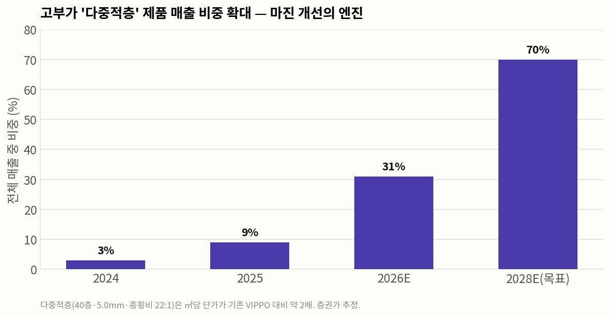
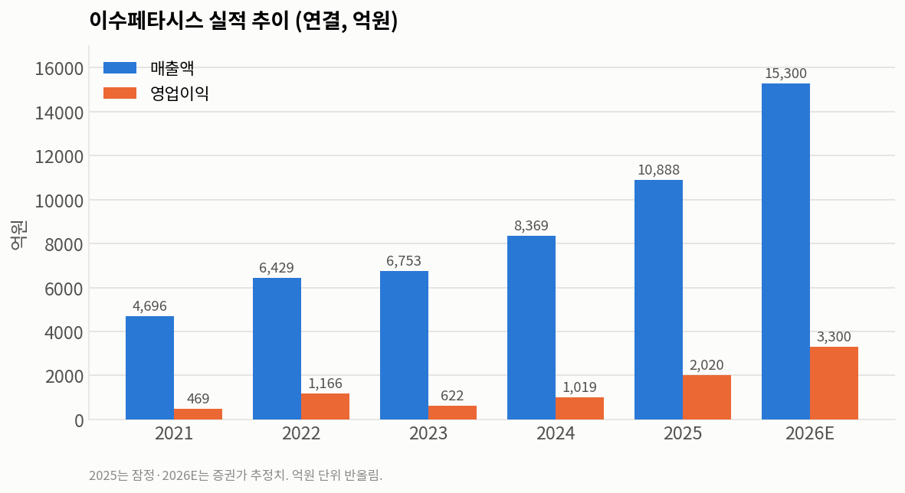
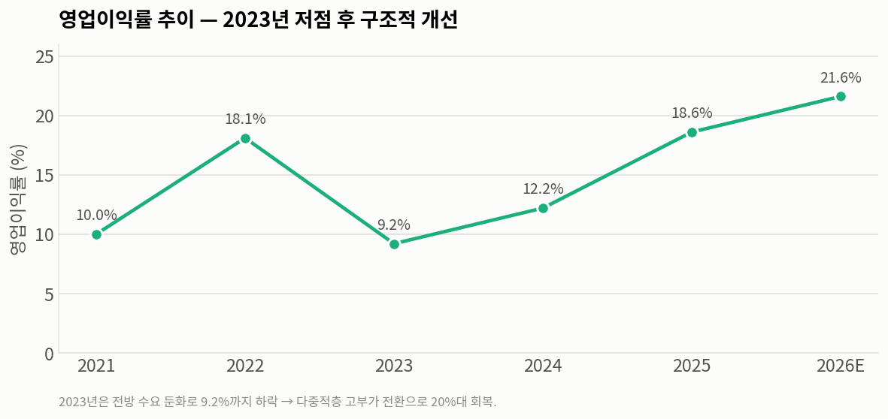
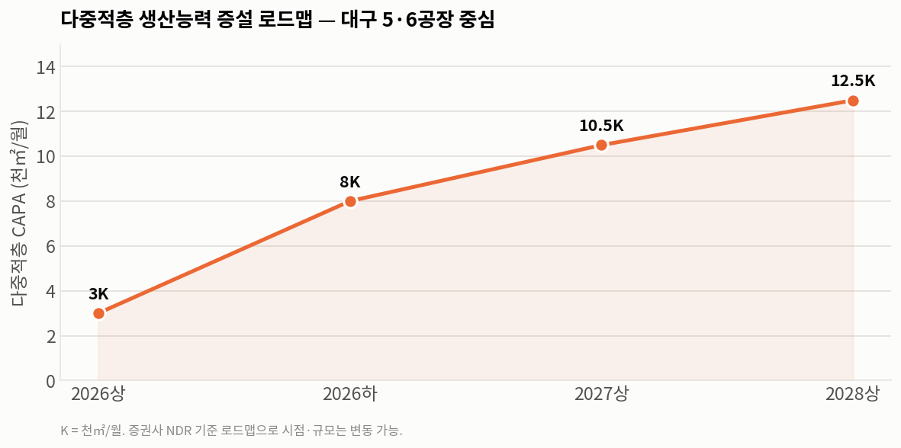
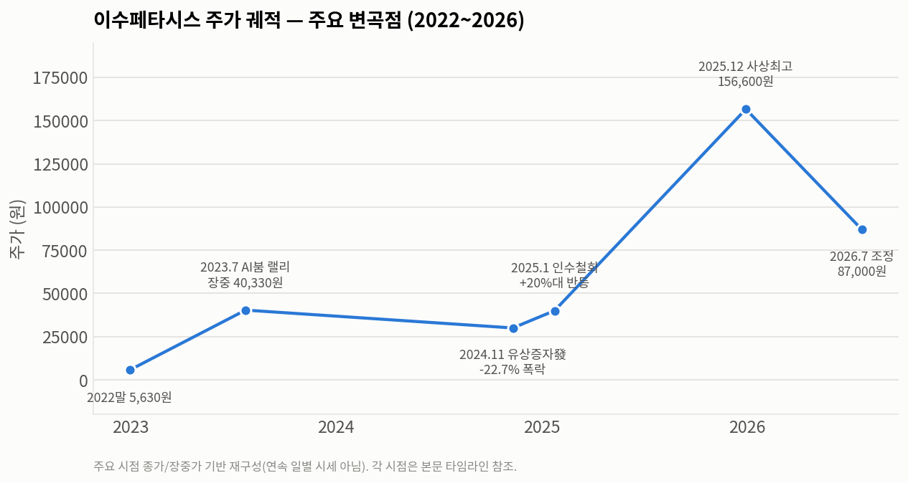
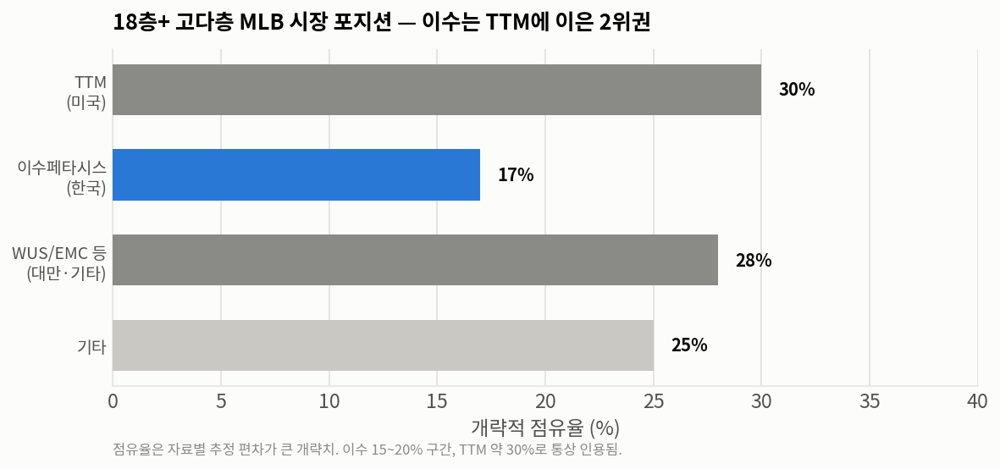

# 이수페타시스(ISU Petasys, 007660) 심층 분석 리포트

> 작성일: 2026-07-26 · 카테고리: IT 부품 및 소재(반도체 기판·PCB)
> 대상: 이수페타시스(주) — AI 서버·네트워크용 초고다층 MLB(다층 인쇄회로기판) 제조사
> 성격: 시장 흐름·투자 관점 종합. 수치는 회사 IR·증권사 리포트·언론 추정치이며 시점에 따라 달라질 수 있어 출처·시점을 병기함.

---

## 한 문장 요약

이수페타시스는 **30층을 넘는 초고다층·대면적 MLB를 양산할 수 있는 세계 소수(TTM·이수 등) 업체 중 하나**로, 엔비디아 GPU 서버·구글 TPU·800G/1.6T 네트워크 스위치가 올라앉는 "판(기판)"을 공급한다. 층수·난이도가 오를수록 값이 비싸지고 만들 수 있는 회사가 줄어드는 구조라 AI 데이터센터 투자의 직접 수혜를 받는다. 주가는 사실상 **엔비디아·빅테크 AI CAPEX 사이클에 동조**해 움직여 왔고, 특정 대형 고객 의존도와 2024년 유상증자로 드러난 지배구조 리스크, 급등 후 조정된 밸류에이션이 핵심 변수다.

---

## 1. 아주 쉽게: 이 회사는 뭘 하나

전자제품을 열어 보면 칩과 부품이 촘촘히 박힌 초록색(혹은 검은색) 판이 있다. 이 판이 **PCB(인쇄회로기판)**이고, 칩·메모리·통신부품을 물리적으로 붙들면서 그 사이로 전기 신호와 전력을 흘려보내는 "도로망 겸 토대"다. 아무리 좋은 반도체라도 이 판이 부실하면 성능을 내지 못한다.

이수페타시스는 그중에서도 **여러 층을 겹겹이 쌓은 고급 PCB(MLB, Multi-Layer Board)**를 만든다. 고성능 칩은 연결선이 수천~수만 가닥이라 한두 층 판에는 다 담기지 않아 회로를 여러 층으로 나눠 3차원으로 쌓는데, 이수페타시스는 이 "층 쌓기"를 세계에서 가장 높고(30층 초과, 최대 40층 이상) 어렵게 해내는 극소수 회사다.

이 초고다층 판이 지금 가장 많이 필요한 곳이 **AI 데이터센터**다. AI 가속기(GPU) 서버 메인보드와 수천 개 GPU를 초고속으로 잇는 네트워크 스위치가 모두 층수가 폭발한 고급 MLB를 요구하기 때문이다. "AI 하면 엔비디아·HBM"만 떠올리기 쉽지만, 그 칩들이 올라앉는 판을 만드는 이수페타시스도 AI 밸류체인의 한 축이다.

---

## 2. 회사 개요와 지배구조

**기본 정보**

- 정식 명칭: 주식회사 이수페타시스 (ISU Petasys Co., Ltd.) · KOSPI 007660
- 상장주식수: 약 7,341만 주(73,409,219주)
- 본사·주력 생산기지: 대구광역시 달성군 논공읍(제1~4공장)
- 주력 사업: 산업용 PCB 중 **고다층·초고다층(18층 이상) MLB** 전문 제조
- 임직원: 약 1,186명(2024년 연결 기준), AI 증설로 채용 확대 중
- 매출 구조: **약 95%가 수출, 사실상 100% 수주생산(made-to-order)**

**설립·상장 이력 참고**: 뿌리 법인은 1972년 '대양상선'으로 설립됐으나 **PCB 사업 개시는 1989년**이라 자료마다 창업 기준 연도가 다르다. 2000년 코스닥 등록 후 2003년 유가증권시장으로 이전 상장했다.

**이수그룹과 지배구조**

1995년 이수그룹에 편입된 계열사로, 지배구조는 "**김상범 회장 → ㈜이수(지주) → 이수페타시스**"로 이어진다. 최대주주는 지주회사 ㈜이수(지분 약 21.19%), 특수관계인 합산 약 26.6%다. 이 구조가 뒤에 나오는 2024년 유상증자 논란의 배경이 된다.

**주요 생산 거점**

| 거점 | 위치 | 역할 |
|---|---|---|
| 국내 대구(달성·논공) | 제1~4공장 | 본사·주력. 초고다층·AI 가속기·네트워크용 최고난도 제품 |
| 중국 후난법인 | 후난성 샹탄시 | 12층 이상 중고층 MLB 중심, 북미향 비중 상승 |
| 미국법인 | 캘리포니아 산호세 | 생산보다 북미 고객 영업·판매 기능 |
| 태국 신규 거점 | - | 중저층·VIPPO 대체 생산기지(2027년 1분기 양산 목표) |

최고 스펙 물량은 한국(대구)에서, 중고층은 중국에서 소화하는 **이원화 구조**다.

---

## 3. 제품: 무엇을 만드나

### 3-1. MLB(고다층 인쇄회로기판)

여러 층의 동박(구리) 회로를 절연층을 사이에 두고 쌓아 하나로 만든 기판이다. 이수의 강점은 **층수가 매우 많고 면적이 큰 초고다층·대면적 기판**에 있다.

- **18층 이상 고다층 MLB에서 글로벌 매출 선두권**(TTM에 이은 2위권)
- **30층 초과 양산이 가능한 국내 유일 업체**, 최대 **36~40층 이상** 구현
- 이 급을 양산할 수 있는 회사는 전 세계 극소수(과점)

### 3-2. VIPPO vs 다중적층(Multi-lamination) — 실적의 핵심

이수페타시스 스토리를 이해하는 가장 중요한 포인트가 이 제품 세대 전환이다.

| 구분 | 기존 VIPPO 기판 | 신형 다중적층 기판 |
|---|---|---|
| 층수 | 약 22~30층 | **40층** |
| 두께 | 약 3.2mm | **5.0mm** |
| 종횡비(구멍 깊이/지름) | 약 13:1 | **22:1 이상** |
| ㎡당 단가 | 기준 | 약 **2배** |
| 공정 부하 | 기준 | 약 **2.5배** |

**다중적층**은 여러 개의 서브패널을 각각 만든 뒤 다시 한 번 적층해 붙이는 초고난도 공정이다. 단가가 약 2배라 판매단가(ASP)와 마진을 함께 끌어올린다. 이 제품 비중 확대가 실적과 마진 개선의 뼈대다.

한 가지 확정 호재로, **구글 TPU 8세대가 이 다중적층(Sequential) 구조로 확정**되면서 이수의 물량·기술 경쟁력이 뒷받침됐다(7세대는 이미 양산 개시).

### 3-3. 응용 분야

AI 가속기·GPU 서버 메인보드(엔비디아 H100/H200/B200, 구글 TPU, MS Azure), 800G/1.6T 네트워크 스위치(Cisco·Arista·Juniper), 통신 장비(전통 주력), 자동차/전장(IATF 16949 인증), 우주항공/방산(AS9100 인증), 슈퍼컴퓨터/HPC 등이다.

---

## 4. 작동 원리: 왜 층을 많이 쌓는 게 어려운가

**왜 다층인가** — 고성능 칩 하나가 연결할 신호선은 수천~수만 개다. 평면 한두 층에는 다 못 넣어 회로를 여러 층으로 나눠 위로 쌓는다. 층이 많을수록 더 많은 데이터를 더 빠르게 처리한다.

**왜 어려워지나** — 비유하자면 40층 MLB는 "정밀 인쇄된 종이 40장을 접착제(프리프레그)로 미크론 오차 없이 정렬해 붙인 뒤, 5mm 두께를 관통하는 머리카락 굵기 구멍을 정확히 뚫어 각 층을 잇는" 초정밀 제본이다. 구체적 난관은 다음과 같다.

- **신호 무결성**: 800G/1.6T 초고속 전송에서 신호가 층·비아를 지나며 왜곡·감쇠 → 저손실 소재·정밀 설계 필수
- **임피던스 제어**: 신호층과 기준층 간 거리가 조금만 어긋나도 신호 반사·손상 → 수지 흐름의 균일성이 관건
- **층간 정합(Registration)**: 40개 층을 미크론 단위로 정확히 겹쳐야 하며, 어긋나면 단선(open)·합선(short)
- **종횡비**: 판이 두꺼워질수록(5.0mm) 가늘고 깊은 구멍을 뚫어야 해 22:1까지 상승 → 도금 불량·단선 위험
- **휨(Warpage)**: 층 구성이 비대칭이면 가열 시 판이 휨 → 상하 대칭 적층 필수

**제조 공정과 수율** — 고다층 PCB는 약 200여 개 공정을 거치며, 핵심 병목은 **라미네이션(적층)**과 **드릴링**이다. 이수는 2025년 11월 대구에 **503억원을 들여 고난도 드릴 전용 신공장** 설립을 발표했다. **수율이 곧 경쟁력**으로, 800G 스위치용 기판 수율은 양산 초기 60% 중반에서 80% 중반까지 개선됐다. 40층 이상에서 95% 이상 수율을 안정적으로 내는 회사가 극소수라는 점이 진입장벽의 핵심이다.

---

## 5. 실적과 재무

2023년은 전방 수요 둔화로 영업이익률이 9.2%까지 눌렸다가, 2024년부터 AI 수요로 회복해 **2025년 사상 첫 매출 1조원(1조 888억원)을 돌파**했다. 다중적층 고부가 전환으로 영업이익률은 20%대를 향해 개선 중이다.

| 연도 | 매출액 | 영업이익 | 영업이익률 | 순이익 |
|---|---|---|---|---|
| 2021 | 4,696억 | 469억 | 10.0% | -36억(적자) |
| 2022 | 6,429억 | 1,166억 | 18.1% | 1,025억 |
| 2023 | 6,753억 | 622억 | 9.2% | 477억 |
| 2024 | 8,369억 | 1,019억 | 12.2% | 740억 |
| **2025** | **1조 888억** | **약 2,000억** | **약 18%대** | 약 1,545~1,605억 |
| 2026(E) | 약 1.44조~1.59조 | 약 3,229억~3,361억 | - | - |

**성장 동력**: ① 다중적층 제품 믹스 고도화(ASP 상승), ② CAPA 증설, ③ 수요가 확보 CAPA를 초과하는 공급자 우위(2027년까지 지속 전망).

증설 로드맵(다중적층, ㎡/월): 2026 상반기 3K → 하반기 8K → 2027 상반기 10.5K → 2028 상반기 12.5K+α. 여기에 드릴 전용 신공장(대구, 503억원), 태국 신규 거점(고객 6곳 확보, 2027년 1분기 양산)이 더해진다.

---

## 6. 주가는 무엇 때문에 움직였나 (촉매 타임라인)

이수페타시스 주가는 사실상 **엔비디아 및 빅테크 AI CAPEX 사이클에 동조**해 움직였고, 여기에 **자본 이벤트(유상증자)**가 큰 변동성을 더했다.

**① 2023년 — AI 붐 초기, 코스피 상승률 1위 랠리**
2022년 말 5,630원 → 2023년 6월 말 28,200원으로 상반기에만 약 +401%(코스피 상반기 상승률 1위). 챗GPT·생성형 AI 열풍과 엔비디아 어닝 서프라이즈, 미·중 갈등에 따른 미국 빅테크의 "중국 대신 이수" 주문 집중이 계기. 2023년 7월 25일 장중 40,330원으로 당시 최고가를 찍은 뒤 엔비디아 조정과 함께 3만원대로 후퇴.

**② 2024년 — 실적·수주 모멘텀**
북미 빅테크·800G 스위치용 기판 수주 확대로 실적 우상향, 주가는 3만~4만원대에서 견조.

**③ 2024년 11월 — 유상증자(제이오 인수) 발표 → -22.68% 폭락**
11월 8일 5,500억원 규모 주주배정 유상증자 결정, 자금 용도에 2차전지 소재(CNT) 회사 **제이오 인수**가 포함. 11월 11일 전일 대비 **-22.68% 폭락**. "AI 본업과 무관한 2차전지 투자 + 대규모 지분 희석"에 소액주주·증권가 강력 반발.

**④ 2024년 12월~2025년 1월 — 제동·철회 → 급반등**
금감원이 증권신고서에 정정 요구·반려를 반복하며 사실상 제동. 12월 3일 철회 기대에 **+26.78%** 급등. 2025년 1월 23일 **제이오 인수계약 해지**, 유상증자 규모 5,500억 → 2,500억원 축소. 1월 24일 희석 우려 해소로 장중 +27.7%(4만원 돌파), 증권사 목표주가 대거 상향(한국투자 100% 상향 등).

**⑤ 2025년 — 다중적층·AI 모멘텀 재부각, 사상 최고가**
2월 한 달 +63.81%(엔비디아 동조). 딥시크 쇼크로 잠시 흔들렸으나 곧 회복. 4공장 풀가동·매출 1조 전망·다중적층 비중 확대·구글 TPU 양산이 어닝을 밀어올리며 목표주가 16만원대까지 연쇄 상향. **2025년 12월 30일 156,600원으로 상장 이래 최고가**(2021년 8월 저점 2,858원 대비 약 54.8배).

**⑥ 2026년 상반기 — 고점 후 조정, 7월 8만원대**
고 PER 밸류에이션 부담·AI CAPEX 피크아웃 우려·외국인 매도로 조정. 4월 20일 +12.13%(134,900원) 반등도 있었으나 하향 추세가 이어져 **7월 24일 87,000원(-6.85%), 시가총액 약 6.4조원**. 사상 최고가 대비 약 **-44%**. 당시 PER 36.7배로 업종 평균(18.4배)의 2배 수준이라는 밸류 부담이 배경.

**주가를 크게 움직인 개별 촉매 요약**: 엔비디아 주가/실적(최대 동조 변수) · 빅테크 수주 공시(구글 TPU, 800G 스위치) · 증설 발표 · 유상증자 악재/철회 · 금감원 규제(반등 촉매) · 목표주가 상향 · 외국인·기관 수급.

---

## 7. 고객은 왜 이수페타시스를 쓰나

핵심은 "값이 싸서"가 아니라 **① 만들 수 있는 곳이 세계에 몇 곳 없고, ② 한 번 승인받으면 바꾸기 어렵고, ③ 불량이 나면 값비싼 AI 서버 전체가 멈추기 때문**이다.

**품질 인증(퀄)과 스위칭 코스트** — 이수의 고객 관계는 장기 인증 기반이다. Cisco '올해의 협력사'(2008), 항공용 AS9100(2007), Juniper·Palo Alto Networks 어워드(2019) 등 20년 가까이 누적된 승인 이력이 그 자체로 진입장벽이다. 초고다층 MLB는 수십 개 층을 나노미터 단위로 적층하는 공정 기술 습득에만 오랜 시간이 걸려, 신규 벤더가 동일 스펙을 재현·양산 검증받기 어렵다. 따라서 **한 번 승인되면 교체가 어렵다**. (단, "승인에 정확히 몇 개월"이라는 수치화된 기간은 공개 자료로 확인되지 않으며, 인증 이력·난이도로부터의 정성적 추론이다.)

**공급 제약 = 협상력** — 수요는 800G 스위치용 40층+ MLB로 이동 중이고, JPMorgan 추정 이 세그먼트 비중은 네트워크 믹스에서 2025년 22% → 2026년 43%로 확대된다. 다중적층은 공정 부하가 2.5배라 만들 수 있는 곳이 더 줄어 공급 부족이 심화된다. 월 수주는 950억원대에서 안정적으로 유지되고, 2026년 물량이 2배 이상으로 전망되는데도 **CAPA 제약으로 수급 불균형이 장기화**될 것으로 본다. 만드는 쪽이 '을'이 아니라 사실상 '갑'에 가까운 국면이다.

**수율·신뢰성이 결정적** — AI 서버는 일반 서버 대비 반도체가 5~6배 탑재된다. 40층+ 보드는 층 하나만 어긋나도 전량 폐기되고, MLB 한 장의 불량이 값비싼 GPU/스위치 전체를 무력화한다. 그래서 고객은 다운타임·폐기 리스크를 줄이려 **검증된 소수 벤더에 물량을 몰아준다**.

**세대 전환기 공동개발** — 이수는 구글 7세대 TPU 양산을 개시하며 VIPPO 공법·회로밀도를 고객 신제품에 맞춰 최적화해 왔다. 고객의 신제품 세대 전환에 개발 단계부터 맞물려 들어가는 관계로, 이는 다음 세대 물량으로 이어진다.

**지정학(China+N)** — 미·중 갈등으로 미국 빅테크는 AI 핵심 부품에서 중국 리스크를 회피한다. 한국 생산(대구)이라는 지정학적 중립성 덕분에 "중국 기판 업체가 받던 물량이 통째로 넘어온다"는 서술이 반복된다.

---

## 8. 경쟁사 제품은 어디에 어떻게 쓰이나 (분업 구조)

중요한 점은, AI 서버·네트워크 PCB 시장이 한 회사가 다 먹는 구조가 아니라 **제품 카테고리별 분업 + 고객의 듀얼소싱**으로 짜여 있다는 것이다.

**미국 TTM Technologies — 방산 본진 + 데이터센터 급성장**
고다층 MLB 글로벌 1위(18층+ 점유율 30% 초반). 다만 매출의 약 41%가 항공·방산(A&D)으로, 미국 방산 프라임·OEM향 복잡 보드가 본진이다. 데이터센터·네트워킹은 약 36%이며 데이터센터가 YoY +57% 급증 중. 미국 소재·방산 기밀 대응력이 강점이라 네트워크/데이터센터에서는 "선별된 하이퍼스케일러 프로그램"에 집중한다. 시스코 등 미국 OEM과 방산 고객이 **미국 내 공급망 확보용**으로 TTM을 쓴다 → 이수와는 **지역·용도 분업 + 듀얼소싱** 관계.

**대만 WUS / EMC / Compeq / Unimicron / ZDT — 컴퓨트 보드·백플레인 주력**
WUS는 **엔비디아 78층 AI 서버 백플레인의 사실상 유일 공급사**로, 엔비디아 CCL 퀄 리드 테스트 파트너이기도 하다. Unimicron·WUS·ZDT·Compeq는 엔비디아 컴퓨트 보드·미드플레인·모듈의 주력 팹이다. 즉 대만 진영은 **엔비디아 GPU 서버의 컴퓨트/백플레인 보드**에 강하고, 이수는 **네트워크 스위치 MLB + 구글 TPU/일부 가속기 MLB**에 강하다. 서로 다른 부위를 맡는 **상호 보완** 구조에 가깝다.

**중국 Shennan(선전써키트)·Victory Giant 등 — 주로 중국 내수**
중국 하이퍼스케일러·컴퓨팅 파워 체인 공급이 중심이다. 미·중 규제·공급망 리스크로 미국 빅테크는 AI 핵심 부품을 중국산에 의존하기 어려워 제한적으로만 쓴다. Shennan 자체도 일부 라인을 반도체 패키지기판 중심으로 재편해 초고다층 MLB에서는 상대적으로 후퇴했다.

**왜 복수 공급사를 두나** — 40층+ MLB는 CAPA가 병목이고 수율 리스크가 커서, 고객(특히 하이퍼스케일러)은 단일 벤더 리스크를 줄이고 물량을 확보하기 위해 반드시 2개 이상 벤더를 병행한다. 그 듀얼소싱 구도 안에서 이수는 **18층+ 고다층 MLB 세계 2위(TTM 다음)**이며, 경쟁사 철수(일본 교세라·히타치)와 중국 물량 이전으로 점유율이 우상향하는 국면이다.

**단독/1차 벤더 여부** — 문서로 확인되는 이수 "단독 공급" 계약은 없다(오히려 단독 공급은 WUS의 엔비디아 78층 백플레인 사례가 확인됨). 다만 **구글 TPU·일부 800G 스위치 MLB에서 1차(primary) 벤더 지위**일 가능성이 높다. 캐파 대비 초과 수요로 고객이 물량 확보에 줄을 선다는 보도가 이를 방증한다. 단정적 sole-supplier 주장보다는 "핵심·1차 벤더 + 과점 내 상위"로 이해하는 것이 정확하다.

---

## 9. 국내 유사 종목과의 차이 (오해 주의)

주가가 함께 올라 대덕전자·코리아써키트와 묶이지만, **제품군이 근본적으로 다르다.**

- **이수페타시스** = 네트워크/서버·AI 가속기용 **초고다층 MLB**(메인보드·스위치 기판)
- **대덕전자** = **FC-BGA 반도체 패키지기판**(칩을 감싸 얹는 패키징용 기판)
- **코리아써키트** = 과거 스마트폰 PCB → FC-BGA·MLB로 다각화
- **삼성전기**(같은 폴더 참조) = MLCC + FC-BGA + 카메라 모듈 — 기판 사업이 있으나 초고다층 네트워크 MLB 전문은 아님

국내에서 이수의 초고다층 네트워크 MLB를 직접 대체할 경쟁사는 사실상 없다.

---

## 10. 밸류에이션

| 지표 | 값 | 비고 |
|---|---|---|
| PER(2025 실적) | 약 36.7배 | 2026.7.24 종가 기준(동종업종 약 18배) |
| PER(2026E) | 약 25~35배 | 증권사 추정 |
| PBR | 약 7~9배(현재)~18배(고점기) | 시점 따라 |
| ROE | 약 38.7%(25P) → 44.8%(26E) | 고수익성 |
| EPS | 약 2,200원(25) → 약 3,600원(26E) | - |

증권가 목표주가는 메리츠 170,000원, 한국투자·신한·하나 160,000원 등 컨센서스 약 166,000원. **단 이 목표가들은 대부분 2026년 상반기(2~5월) 리포트 기준**으로 7월 하순 실제 주가(약 8.7만원)와 괴리가 크다.

---

## 11. 리스크 요인

- **고객 집중**: 엔비디아 등 특정 빅테크 매출 비중 40%+ 추정. 해당 고객의 투자·세컨드벤더 육성이 직접 위협
- **밸류에이션 부담**: PER 30~50배대 고멀티플. 모멘텀 훼손 시 조정 폭 확대(2026년 7월 조정이 사례)
- **다중적층 전환기 일시 둔화**: 전환 시 공정 부하 2.5배 → 단기 생산물량 감소 가능
- **증설 실행 리스크**: 대구 5·6공장, 태국 거점의 램프업·수율 안정화·투자 타이밍
- **환율**: 수출 비중 절대적 → 원/달러 하락 시 원화 매출 감소
- **원재료(CCL) 가격**: 고속 CCL·동박 공급난·가격 인상이 원가 리스크
- **지배구조/유증 오버행**: 2024년 유상증자 사태로 드러난 오너 지배구조·자본배분 리스크

---

## 12. 흔한 오해 두 가지 정정

**(1) "이수엑사보드가 CCL을 내재화한다"는 서사는 사실과 다르다.**
CCL(동박적층판)은 MLB의 핵심 원재료지만, 자회사 이수엑사보드는 CCL 제조사가 아니라 HDI/RF-PCB 기판 제조사였고 2021년 PCB 사업을 정리했다. 이수의 고속 CCL은 대만·일본계 외부 공급사(TUC, EMC, ITEQ 등)에서 조달하는 구조에 가깝다. 이 회사의 강점은 "원소재 내재화"가 아니라 **초고다층 양산 노하우와 과점적 지위**에 있다.

**(2) 2024년 유상증자 논란의 인수 대상은 'JS링크'가 아니라 '제이오'다.**
5,500억원 유상증자 중 약 3,000억원이 2차전지 소재(CNT) 업체 '제이오' 경영권 인수 목적이었고, 본업과의 연관성 논란으로 주가가 급락한 뒤 2025년 1월 인수계약 해지·유증 축소로 마무리됐다. JS링크는 이수그룹 오너 일가 지배구조 논의에서 거론되는 축이지만 이번 사태의 쟁점은 제이오였다.

---

## 13. 종합 정리

이수페타시스는 "AI 반도체 그 자체"는 아니지만, **그 반도체가 올라앉아 작동하는 판**을 세계 최고 난이도로 만드는 소수 기업이다. 층수·종횡비가 오를수록 값이 비싸지고 만들 수 있는 회사가 줄어드는 구조여서, AI 데이터센터 투자가 늘어나는 한 수요·가격·마진이 함께 좋아진다. 기술 진입장벽(수율·고객 인증), 과점적 지위, 다중적층 전환에 따른 마진 개선이 강점이다.

반면 특정 대형 고객 의존도, 급등 후에도 높은 밸류에이션, 증설·전환기 수율 리스크, 2024년 유상증자에서 드러난 지배구조·자본배분 불신은 함께 지켜봐야 할 약점이다. 결국 이 회사 주가의 두 축은 **AI CAPEX 사이클의 방향**과 **다중적층 비중 확대 속도**다.

---

## 참고 출처 (주요 URL)

**회사·산업 기본**
- 이수페타시스 IR 재무현황 — https://www.petasys.com/kor/ir/financial.jsp
- 나무위키(이수페타시스, 인증 이력) — https://namu.wiki/w/이수페타시스
- businessreport(수주생산·증설 로드맵) — https://www.businessreport.kr/news/articleView.html?idxno=52875

**기술·제품**
- ITCE 2025 초고다층 PCB 기술 — https://www.ic-pcb.com/isu-petasys-next-generation-ai-semiconductor-pcb-technologies-itce-2025.html
- 다중적층(40층·5.0mm·22:1) — https://www.newsprime.co.kr/news/article/?no=703462
- 하나증권(VIPPO 대비 2.5배 공정부하) — https://kr.tradingview.com/news/hankyung:72dfe95c765a7:0/
- 대구 드릴공정 신규공장 503억 투자 — https://www.etnews.com/20251127000398

**주가 타임라인**
- 시사저널e(2023 랠리·엔비디아 수혜) — https://www.sisajournal-e.com/news/articleView.html?idxno=302973
- 비즈워치(2024.11.11 -22.68%) — http://news.bizwatch.co.kr/article/market/2024/11/11/0028
- 전자신문 ET(금감원 제동, 12/3) — https://www.etnews.com/20241203000308
- 한국경제(2025.1.23 인수해지·유증 축소) — https://www.hankyung.com/article/2025012364436
- 뉴시스(2025.1.24 목표주가 상향) — https://www.newsis.com/view/NISX20250124_0003045065
- 다음/시시한경제학(2025.12.30 156,600원 ATH) — https://v.daum.net/v/FqrO5lQ9wX
- 중앙이코노미뉴스(2026.7.24 87,000원) — https://www.joongangenews.com/news/articleView.html?idxno=535331

**고객·경쟁**
- 디일렉(고객 확보·TTM 1위/이수 2위) — https://www.thelec.kr/news/articleView.html?idxno=19527
- 한국투자증권 3Q25 NDR(7세대 TPU 양산·캐파) — https://m.koreainvestment.com/main/research/research/StrategyDetail.jsp?jkGubun=6&id=149901
- 테크월드/EPNC(경쟁사 MLB 철수) — https://www.epnc.co.kr/news/articleView.html?idxno=224991
- TTM Q4 2025(A&D 41%, 데이터센터 +57%) — https://finance.yahoo.com/sectors/technology/articles/ttmi-benefits-ai-boom-defense-150700669.html
- pandaily(WUS 엔비디아 78층 백플레인 유일 공급) — https://pandaily.com/nvidia-ai-server-78-layer-backplane-china-supply-chain
- HIL Electronic(2026 AI 서버 PCB 공급망 지도) — https://hilelectronic.com/ai-server-pcb-demand/
- 59초경제(3社 과점·지정학·고객집중) — https://59sececonomy.com/isupetasys-stock-2026/
- Forbes(고객·40층+·오너 억만장자) — https://www.forbes.com/sites/johnkang/2025/10/16/ai-chip-boom-propels-chairman-of-korean-circuit-board-maker-into-the-billionaire-ranks/

**재무·이슈**
- 메리츠증권 Company Brief(2026.3.2) — https://home.imeritz.com/include/resource/research/WorkFlow/20260302134512657K_02.pdf
- 시사저널e(유증·지배구조 논란) — https://www.sisajournal-e.com/news/articleView.html?idxno=407193
- 비즈한국(제이오 인수 철회) — https://www.bizhankook.com/bk/article/28973
- BruDash 기업분석 — https://brudash.com/article/isupetasys-analysis

> 유의: 시가총액·고객별 매출 비중·점유율·2026년 전망치·목표주가는 증권사·언론 추정치이며 시점에 따라 달라진다. 차트의 주가 궤적은 주요 시점 종가/장중가 기반 재구성(연속 일별 시세 아님)이다. 정확한 확정 수치는 회사 사업보고서·분기보고서 원문으로 교차확인을 권한다.
