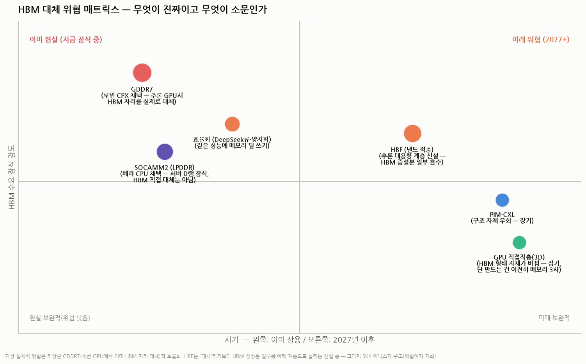
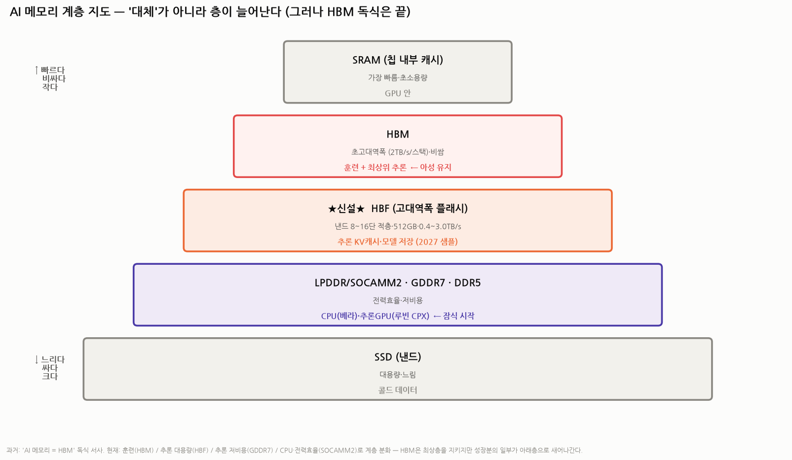

# HBM 대체 위협 점검 — "HBM만이 답"은 언제까지인가 (HBM 심화 ③ · 베어 케이스)

> 작성일: 2026-07-30 · 카테고리: 반도체/산업·테마분석 · `HBM_완전정복`(기술)·`커스텀HBM`(구조)의 후속
> 성격: 지금까지 HBM 리서치는 대부분 불(bull) 쪽이었다. 이번엔 반대편 — **HBM 수요가 기술적으로 우회·잠식당할 가능성**을 하나씩 실체 검증한다. 결론은 겁주기도 안심시키기도 아닌 **"어디가 진짜 위협이고 어디가 소문인가"**의 구분.
> **검증 메모**: 루빈 CPX·SOCAMM2·HBF 표준(SK×샌디스크)·GDDR7 공급을 언론·회사 발표로 교차검증.

---

## 0. 한 문장 요약

> **"AI 메모리 = HBM 독식" 서사는 이미 금이 갔다.** 엔비디아가 추론 GPU(루빈 CPX)에 HBM 대신 **GDDR7**을, CPU(베라)에 **SOCAMM2(LPDDR)**를 채택했고, HBM과 SSD 사이엔 **HBF(낸드 적층)**라는 새 층이 만들어지는 중이다. 다만 이는 **'대체'라기보다 '계층 분화'** — HBM은 최상층(훈련·최상위 추론)을 지키되, **수요 성장분의 일부가 아래층으로 새어나가는 구조**다. 진짜 리스크는 HBM의 소멸이 아니라 **"비트 성장률·믹스의 하향"**이다.

---

## 1. 왜 대체 압력이 생기나 — 추론 시대의 경제학

훈련(training)은 성능이 전부라 비싼 HBM을 감수한다. 그런데 AI 연산의 무게중심이 **추론(inference, 이미 ~75%)**으로 넘어가면 계산이 달라진다:

- 추론은 **"토큰당 비용"** 싸움이다. 메모리가 시스템 원가의 큰 몫(HBM은 AI 가속기 원가의 상당 부분)인데, 모든 추론 작업이 HBM급 대역폭을 필요로 하진 않는다.
- 추론 워크로드는 성격이 갈린다: **문맥(KV캐시)을 크게 담아야 하는 작업(용량 중심)** vs **빠르게 응답해야 하는 작업(대역폭 중심)**. 전자는 HBM이 과잉 스펙이다.
- 여기에 **전력 병목**(☞ 전력병목 시리즈)까지 겹치며 "전성비 좋은 더 싼 메모리" 수요가 구조화됐다.

→ 그래서 하이퍼스케일러·엔비디아 스스로가 **"HBM만이 답은 아니다"**라며 메모리를 용도별로 쪼개기 시작했다.

---

## 2. 위협 후보 6개 — 하나씩 실체 검증

### ① GDDR7 — 🔴 가장 실체적 (이미 HBM 자리를 대체)
- **팩트**: 엔비디아 **추론 특화 GPU '루빈 CPX'가 HBM 대신 GDDR7 채택**, 삼성전자가 공급 예정. GDDR7은 그래픽용 고속 D램으로, HBM보다 대역폭은 낮지만 **비용·전력·경량성 우위**.
- **의미**: 상징성이 크다 — **HBM 최대 고객인 엔비디아가, 자기 신제품에서, HBM을 빼고 GDDR7을 넣었다.** "추론의 일부는 HBM이 필요 없다"는 공식 선언. 추론 GPU 라인이 커질수록 이 잠식은 구조화된다.
- **반론(균형)**: CPX는 문맥 처리 특화 보조 칩이고, 주력 루빈은 여전히 HBM4 대량 탑재. 즉 **HBM을 밀어낸 게 아니라 'HBM을 아껴 쓰는 설계'**가 등장한 것.

### ② SOCAMM2 (LPDDR 모듈) — 🟡 서버 D램 잠식, HBM 직접 대체는 아님
- **팩트**: 엔비디아 주도 규격. 스마트폰용 저전력 D램(LPDDR)을 서버용 모듈로 만든 것. **차세대 CPU '베라'에 SOCAMM2 탑재.**
- **의미**: 잠식 대상은 HBM이 아니라 **서버용 DDR5(RDIMM)** — CPU 옆 메모리를 전력효율형으로 바꾸는 것. HBM엔 간접 영향(시스템 전력 예산을 아껴 GPU에 몰아줌). 메모리 3사엔 오히려 신규 시장.

### ③ HBF (고대역폭 플래시) — 🟠 '대체'가 아니라 '신설 층', 그러나 성장분을 나눠 감
- **팩트(표준 공개됨)**: **SK하이닉스×샌디스크가 표준화 착수, 첫 표준 공개** — 낸드를 **8/16단 적층, 스택당 최대 512GB**, 대역폭 **Grade 1~3(0.4~3.0TB/s)**. **2026 하반기 시제품, 2027년 초 추론 장치 샘플.**
- **의미**: DRAM(HBM)의 1/10 가격대인 낸드로 **HBM 아래·SSD 위의 새 계층**을 만든다. 대형 모델의 **KV캐시·모델 가중치 저장** 같은 '용량 중심 추론'을 흡수 → **원래라면 HBM 증설로 갔을 수요의 일부가 HBF로** 간다.
- **핵심 반전**: 이 위협의 주도자가 **HBM 1위 SK하이닉스 자신**이다. 즉 자기잠식을 감수하고 계층 전체를 장악하려는 전략 — **HBM 투자자에겐 위협이자, SK 투자자에겐 옵션**. (낸드는 느려서 HBM을 '완전 대체'는 물리적으로 불가 — 읽기 지연이 DRAM 대비 수십~수백 배.)

### ④ 효율화 (DeepSeek류·양자화·희소화) — 🟠 조용하지만 누적적
- 같은 성능을 더 적은 메모리로 내는 소프트웨어 기술(저정밀 양자화, KV캐시 압축, MoE 등)이 계속 발전. **칩을 안 바꾸고 HBM 수요를 깎는** 유일한 경로라 방심 불가. 단 역사적으로 효율화는 수요를 줄이기보다 **더 큰 모델을 부르는(제본스 역설)** 쪽으로 작용해 왔다.

### ⑤ PIM·CXL — 🔵 장기·구조 우회
- PIM(메모리 내 연산)은 데이터 이동 자체를 줄이고, CXL은 메모리를 풀(pool)로 묶어 공유. 둘 다 유망하나 **생태계·소프트웨어 장벽으로 상용 침투는 장기 과제**. 게다가 PIM은 커스텀 HBM의 '기능'으로 흡수되는 중(☞ 커스텀HBM편) — 위협이 아니라 HBM의 진화 경로가 될 가능성.

### ⑥ GPU 위 직접 적층(3D) — 🔵 장기, 형태 변화일 뿐
- HBM을 인터포저 옆이 아니라 **GPU 바로 위에** 쌓는 로드맵. 실현되면 'HBM'이라는 제품 형태는 바뀌지만, **그 D램 적층을 만드는 건 여전히 메모리 3사** — 산업 구도가 아니라 패키징 방식의 변화.

---

## 3. 종합 — 계층 지도로 보면 명확하다

**과거 서사**: "AI 메모리 = HBM" (독식)
**새 현실**: 용도별 계층 분화 —
- **훈련·최상위 추론** → HBM (아성 유지, 루빈 주력도 HBM4)
- **추론 대용량(KV캐시)** → **HBF** (2027~, 신설 층)
- **추론 저비용** → **GDDR7** (루빈 CPX, 이미 시작)
- **CPU·전력효율** → **SOCAMM2** (베라, 이미 시작)

**그래서 베어 케이스의 올바른 형태는**:
- ❌ "HBM이 대체되어 사라진다" — 물리적으로 무리(최상위 대역폭·지연은 HBM만 가능, 낸드는 수십 배 느림)
- ⭕ **"HBM 비트 성장률이 컨센서스(예: TAM $100B, CAGR 30%+)를 하회한다"** — 추론 수요의 상당 부분이 GDDR7·HBF·효율화로 새면, HBM은 성장하되 **기대만큼 못 성장**하고, 그 갭이 멀티플(특히 PER 리레이팅 논거)을 때린다.

**리스크의 크기 감각**: 추론이 AI 연산의 75%인데 그중 '용량·비용 중심' 비중이 커질수록 하방이 커진다. 반대로 프런티어 모델 경쟁(더 큰 모델)이 지속되면 HBM 최상층 수요는 방어된다. **관건은 "프런티어 훈련·프리미엄 추론 vs 값싼 대량 추론"의 믹스.**

---

## 4. 투자 함의

1. **HBM 순수 불 케이스에 헤어컷 필요**: "TAM $100B·독식" 전제의 목표가는 계층 분화를 반영해 보수화. 특히 **2027년 이후 추론 믹스**가 분수령.
2. **SK하이닉스는 양다리라 상대적 방어**: HBM 1위 + **HBF 표준 주도** — 계층이 분화해도 두 층을 다 가진다. 삼성도 GDDR7(루빈 CPX 공급)·LPDDR로 하위 계층 수혜.
3. **가장 순수한 피해자는 'HBM 단일 노출' 서사**: HBM 장비·소재 중 최상위 적층에만 특화된 체인(예: 고단 본딩 전용)은 믹스 하향 시 타격이 집중될 수 있다.
4. **트래킹 지표**: ① 루빈 CPX류 '비(非)HBM 추론 칩'의 라인업 확장 속도, ② HBF 샘플(2027 초)→양산 채택, ③ 엔비디아 차차기 세대의 HBM 탑재량 증가율(둔화 여부), ④ KV캐시 오프로딩 소프트웨어 생태계, ⑤ HBM 계약가 협상(2027 2배 실현 vs 무산).
5. **연계**: 이 리포트는 `메모리수요_PERvsPBR`의 "재주문 구조" 논거에 대한 **공식 반론 파트**다 — 두 편을 같이 읽어야 균형이 맞는다.

---

## 참고 출처 (검증)

- [루빈 CPX에 GDDR7 채택·삼성 공급, SOCAMM2 베라 탑재 (헤럴드경제/뉴데일리)](https://biz.heraldcorp.com/article/10628617)
- ["HBM만이 답 아니다" — 업계 대안 모색 (ZDNet Korea)](https://zdnet.co.kr/view/?no=20260709161628)
- [SK하이닉스×샌디스크 HBF 표준화·첫 표준 공개(8/16단·512GB·0.4~3.0TB/s) (SK하이닉스 뉴스룸/디지털데일리)](https://news.skhynix.co.kr/hbf-standardization-with-sandisk/)
- [HBF 시제품 2H26·추론장치 샘플 2027초 (경향신문 외)](https://www.khan.co.kr/article/202602261631001)
- [HBC·HBF 차세대 메모리 부상 (다음/뉴스)](https://v.daum.net/v/20260702003912772)
- [메모리 역할분담론 — HBM·LPDDR·SOCAMM (디지털포스트)](https://www.ilovepc.co.kr/news/articleView.html?idxno=59529)

**저장소 연계**: `반도체/배경지식/HBM_완전정복` · `반도체/산업·테마분석/커스텀HBM_메모리의ASIC화` · `시장브리핑/메모리수요_구조적인가_사이클인가_PERvsPBR` · `반도체/배경지식/차세대메모리_PIM_심층분석`

> 유의: 각 기술의 채택 속도·잠식 규모는 추정이며, 특히 HBF는 표준·샘플 단계라 양산 성공이 미확정이다. 잠식 강도 매트릭스는 해석용 주관 배치. 확정치는 각 사 발표·실적으로 재확인 권장.
