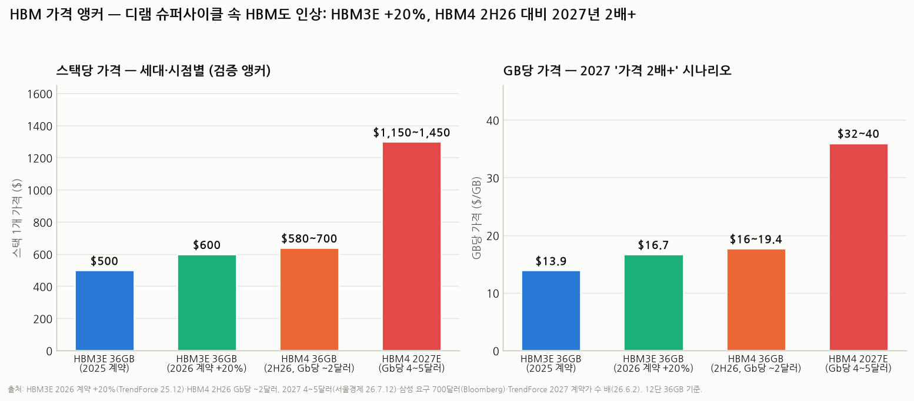

# HBM 바텀업 모델 — 버전별 가격은 얼마고, 매출·이익은 얼마가 되나 (HBM 심화 ⑦)

> 작성일: 2026-08-05 (v2 — 디램 슈퍼사이클 반영 개정) · 카테고리: 반도체/산업·테마분석 · HBM 시리즈 7편
> 질문: "바텀업 관점에서 HBM이 버전별로 가격이 얼마나 될 것 같고, 이를 통해 얼마의 매출과 이익을 기대할 수 있을까?"
> **검증 메모(중요 — 개정 이력)**: v1은 "HBM3E 스팟 ~$300/스택(Silicon Analysts)"을 앵커로 써서 HBM3E 가격이 하락한다고 가정했다. 그러나 ① 이 수치는 2025년 산업 매출(~$35B, Yole)과 나누기 검산이 안 맞고(평균 $16/GB여야 하는데 $8.3/GB), ② 삼성·SK가 **2026년 HBM3E 계약가를 ~20% 인상**했다는 보도(TrendForce/Digitimes, 2025.12)와 방향이 반대다. 디램 슈퍼사이클(1Q26 재래식 디램 계약가 +105~110% QoQ)까지 반영해 **가격 경로를 상향 재보정**했다. 2027 가격 앵커(Gb당 $4~5)는 오래된 수치가 아니라 **2026년 7월 12일자 보도**로 최신임을 재확인했다.

---

## 0. 아주 쉬운 버전 (여기만 읽어도 됨)

지금 메모리 시장은 "쌀값이 미친 시장"이다. 일반 디램(DDR5, 서버·PC용)이 **1분기에만 두 배**로 뛰었다. 그런데 HBM과 일반 디램은 **같은 논(웨이퍼 캐파)에서 나는 쌀**이다. 일반 쌀값이 두 배가 되면, 프리미엄 쌀(HBM)을 싸게 팔 이유가 없어진다 — 실제로 1분기에 **웨이퍼당 이익이 일반 디램(DDR5) > HBM3E로 역전**되는 사건까지 벌어졌고, 그래서 제조사들이 HBM 가격을 공격적으로 올리는 중이다.

숫자로 요약(36GB 스택 1개 기준):

| | 2025 | 2026 | 2027 협상 중 |
|---|---|---|---|
| **HBM3E** | ~$500 | **~$600 (+20% 인상)** | 유지~상승 (구세대라고 안 싸짐 — 공급 부족) |
| **HBM4** | — | ~$580~700 (Gb당 ~$2) | **$1,150~1,450 (Gb당 $4~5, 2배+)** |

산업 전체로 계산하면(판매량 × 가격):

- **2025: ~$31~35B** — 확정된 과거
- **2026: ~$58~72B (기본 $66B)** — 물량 +70% × 가격 +20%가 겹치는 해
- **2027: ~$113~186B (기본 $150B)** — 가격 2배 협상이 성사되느냐가 $70B을 좌우

이익은 영업이익률 55% 가정 시 **2025 $17B → 2026 $36B → 2027 기본 $82B**. 2년 만에 산업 이익 파이가 **약 5배**가 되는 그림이고, 이 파이의 절반 이상을 SK하이닉스가 가져간다(점유 1위 + 엔비디아와 최대 $500B 장기공급 딜 체결).

**주의**: 2027 강세($186B)는 "가격 5배 소리 나오는 협상"이 다 관철될 때 얘기고, 사는 쪽(엔비디아·빅테크)의 저항·수요 파괴 가능성 때문에 **현실적 착지는 $110~150B**로 보는 게 합리적이다.

---

## 1. 왜 바텀업인가 — 계산 구조

**바텀업(bottom-up)** = 아래(개당 가격 × 판매량)에서 위(산업 매출)로 쌓아 올리는 방식. 장점은 **어떤 가정이 숫자를 움직이는지** 투명하게 보인다는 것.

```
산업 매출 = 총 판매 용량(EB, 엑사바이트) × 평균 판매가격($/GB)
산업 영업이익 = 매출 × 영업이익률(OPM)
```

단위 정리(혼동 주의): **1 GB = 8 Gb**(바이트 vs 비트), **1 EB = 10억 GB**. 보도는 $/Gb와 $/GB를 섞어 쓰는데 이 리포트는 **$/GB로 통일**한다. 36GB 스택 = 288Gb이므로 "Gb당 $4" = "GB당 $32" = "스택당 $1,150"이다.

---

## 2. 검증된 앵커 — 전부 날짜 병기 (최신성 확인)



### 배경: 디램 슈퍼사이클 (HBM 가격의 바닥을 받치는 힘)

| 사실 | 수치 | 출처(날짜) |
|---|---|---|
| PC 디램 계약가 1Q26 | **+105~110% QoQ** (사상 최대) | TrendForce |
| 재래식 디램 전체 1Q26 | +90~95% QoQ, 산업 매출 +81% QoQ | TrendForce (2026.6.1) |
| 2Q26 추가 인상 | +58~63% | TrendForce |
| 웨이퍼당 수익성 역전 | 1Q26 DDR5 64GB RDIMM이 HBM을 **매출·이익 모두 추월** | TrendForce — HBM 인상의 직접 원인 |

### HBM 가격 앵커

| 항목 | 수치 | 출처(날짜) |
|---|---|---|
| HBM3E 2025 계약가 | 12단 36GB ~$500, 8단 24GB ~$360 (GB당 ~$14~15) | 2024~25 업계 보도 종합 |
| HBM3E 2026 계약가 | **~20% 인상** → 스택당 ~$600 (GB당 ~$17~18) | TrendForce/Digitimes (2025.12.24) |
| HBM3E 인상 모멘텀 | DDR5 수익성 상회가 "2026 HBM3E 가격을 강화" | TrendForce (2025.12.18) |
| HBM4 2H26 | **Gb당 ~$2** (GB당 $16, 스택당 ~$580) · 삼성 요구가 ~$700 | 서울경제(2026.7.12) · Bloomberg |
| **HBM4 2027 계약 협상** | **Gb당 $4~5 (GB당 $32~40, 스택당 $1,150~1,450)** | **서울경제 (2026.7.12자 — 최신)** |
| 2027 계약가 방향 | "타이트한 디램 공급 → 공급사가 절대적 가격결정력, **2027 계약가 수 배 상승**" | TrendForce 공식 (2026.6.2) |
| 장기공급 확약 | 엔비디아×SK그룹 **최대 $500B** 전략 파트너십(HBM3E·HBM4 우선공급 LOI) · 삼성×브로드컴 $200B 협력 | CNBC·SK하이닉스 뉴스룸 (2026.7.25) |

### 물량 앵커

| 항목 | 수치 | 출처 |
|---|---|---|
| HBM 수요 성장률 | 2025 +130% → 2026 **+70%** YoY | TrendForce |
| 2026 출하량 | **30B Gb 이상 = ~3.75EB** · 2026 캐파는 2025년 말 이미 완판 | TrendForce |
| 2025 출하량 | ~2.2EB (+70% 역산, 추정) | — |
| 2027 출하량 | ~5.25EB (**+40% — 가정**, 성장 둔화 추세 연장) | 검증된 전망치 아님 |
| 세대 믹스 | 2H26 HBM4가 HBM3E 역전 | TrendForce |
| GPU당 탑재량 | B200 192GB → Rubin 288GB → Rubin Ultra 384GB(2027) | 엔비디아 로드맵 (기존 검증) |

---

## 3. 모델 — 가정 전부 공개

| 가정 | 2025 | 2026E | 2027E | 성격 |
|---|---|---|---|---|
| 물량(EB) | 2.2 | 3.75 | 5.25 | 25~26 앵커 기반, **27은 가정** |
| 믹스: HBM3 / 3E / 4 | 15/85/0% | 0/55/45% | 0/25/75% | 2H26 역전 앵커에 정합시킨 **가정** |
| 영업이익률(OPM) | 55% | 55% | 55% | 삼성 HBM4 $700 시 50~60% 앵커 중간값. 슈퍼사이클에선 상향 여지 |

가격 시나리오($/GB — 세대별 연평균 계약가):

| 시나리오 | 2026 HBM3E / HBM4 | 2027 HBM3E / HBM4 | 의미 |
|---|---|---|---|
| **보수** | $15 / $16 | $14 / **$24** | 2026 인상 일부 반납, 2027 Gb당 $3에 타협 |
| **기본** | $18 / $17 | $18 / **$32** | +20% 인상 유지 + 2027 Gb당 $4 실현 |
| **강세** | $19 / $19.4 | $22 / **$40** | 삼성 $700 관철 + 2027 Gb당 $5 + 구세대 EOL 스퀴즈 |

> 참고: 2026년 기본에서 HBM4($17)가 HBM3E($18)와 비슷한 건 오타가 아니다 — 신제품 초기 가격(Gb당 ~$2)이 확 인상된 구세대와 겹치는 과도기 현상으로, 2027년에 프리미엄이 크게 벌어지는 구조다(서울경제 보도 기준).

---

## 4. 결과 — 매출과 이익


**산업 매출($B):**

| | 2025 | 2026E | 2027E |
|---|---|---|---|
| 보수 | 31 | 58 | 113 |
| **기본** | 31 | **66** | **150** |
| 강세 | 31 | 72 | 186 |

**산업 영업이익($B, OPM 55% 가정):**

| | 2025 | 2026E | 2027E |
|---|---|---|---|
| 보수 | 17 | 32 | 62 |
| **기본** | 17 | **36** | **82** |
| 강세 | 17 | 40 | 103 |

**읽는 법**:
- **2026은 '물량×인상 중첩의 해'** — 물량 +70%에 가격 +20%가 곱해져 기본 $66B(전년 대비 2.1배). 캐파는 이미 완판이라 시나리오 격차($58~72B)는 상대적으로 작다.
- **2027은 '가격의 해'** — HBM4 계약가(Gb당 $3이냐 $4냐 $5냐) 하나가 매출 **$70B**를 좌우한다. 2026년 말~2027년 초 계약가 확정 뉴스가 3사 주가의 최대 촉매.
- 기본 기준 **이익 풀 $17B → $82B (2년 5배)**. SK 점유율(HBM 1위 + $500B 딜)을 절반으로 두면 SK 몫만 연 **$40B(약 55조 원)** 규모 — 다만 점유율 배분은 **추정**이므로 참고만.

---

## 5. 크로스체크 — 이 숫자가 말이 되나

1. **2025 검산**: 모델 $31B vs Yole ~$35B (-10%, 정합) ✅
2. **2026 검산**: 기본 $66B는 BofA $54.6B·Yole $60B를 웃돈다 — 그런데 이 전망들은 **12월 인상 발표 전**에 나온 것이라, +20% 인상을 반영하면 상회가 자연스럽다. 1Q26 디램 산업 매출 +81% QoQ라는 실적이 상향을 지지 ✅
3. **마이크론 TAM 경로($35B 2025 → $100B 2028)와 대조**: 기본 2027 $150B는 이 경로를 **1년 이상 앞당겨 돌파**하는 그림. 마이크론 전망 역시 슈퍼사이클 이전 수치라 낡았을 가능성이 크다 — 다만 이 말은 곧 "현재 가격이 사이클 고점권 수치"라는 뜻이기도 하다(아래 리스크) ⚠️
4. **GPU 한 대 검산**: Rubin 288GB = 36GB×8스택. 2027 기본 가격($1,150/스택)이면 **GPU 한 대에 HBM만 ~$9,200** — GPU 판가(3~5만 달러 추정)의 20~30%. 엔비디아가 장기공급 딜($500B)로 물량을 잠근 이유이자, 동시에 **탑재량 절약 설계(HBF·GDDR7 계층화, ☞ 대체위협 리포트)의 유인이 커지는 임계점** ✅

**핵심 통찰**: 이번 개정에서 배울 점은 "구세대는 싸진다"는 반도체 상식이 **공급 부족 사이클에선 작동하지 않는다**는 것. DDR4가 EOL(단종) 국면에서 폭등했듯, HBM3E도 캐파가 HBM4로 이동하는 2027년에 오히려 귀해질 수 있다. 가격의 바닥을 재래식 디램의 기회비용이 받치고 있는 구조다.

---

## 6. 리스크 — 이 모델이 틀리는 경우

| 리스크 | 어느 가정이 깨지나 | 결과 |
|---|---|---|
| 2027 계약이 Gb당 $3 이하로 타결 | 기본→보수 | 매출 $113B — 그래도 2025의 3.6배 |
| AI 캐펙스 사이클 꺾임 (빅테크 발주 축소) | 물량 +40% 가정 붕괴 | 물량·가격 동시 하락 — 최악 조합. **지금 가격 앵커들이 사이클 고점권 수치일 위험** (☞ 메모리 급락 리포트) |
| 사이클 정점 통과 (2027~28 증설분 공급 도달) | 가격 시나리오 전체 | 슈퍼사이클의 숙명 — 인상 폭이 클수록 하강도 깊다. PBR 밸류에이션 회귀 |
| 수요 파괴 (HBM이 너무 비싸짐) | GPU당 탑재량 성장 둔화 | HBF·GDDR7·SOCAMM 계층 분화 가속 (☞ 대체위협) |
| OPM 55% 가정 | 원가(TSV·수율·파운드리 베이스다이) 상승 | HBM4는 베이스다이 외주(TSMC)로 원가 구조가 다름 — 마진 상향폭 제한 가능 |

---

## 참고 출처 (검증·날짜순)

- [TrendForce — HBM3E 2026 계약가 ~20% 인상 (2025.12.24)](https://www.trendforce.com/news/2025/12/24/news-samsung-sk-hynix-reportedly-plan-20-hbm3e-price-hike-for-2026-as-nvidia-h200-asic-demand-rises/)
- [TrendForce — DDR5 수익성이 HBM3E 상회, 2026 HBM3E 가격 강화 (2025.12.18)](https://www.trendforce.com/presscenter/news/20251218-12843.html)
- [TrendForce — 1Q26 디램 산업 매출 +81% QoQ, PC 디램 +105~110% (2026.6.1)](https://www.trendforce.com/presscenter/news/20260601-13070.html)
- [TrendForce — 공급사 가격결정력 강화, 2027 HBM 계약가 수 배 상승 전망 (2026.6.2)](https://www.trendforce.com/presscenter/news/20260602-13074.html)
- [서울경제 — HBM4 2H26 Gb당 ~$2 → 2027 $4~5 (2026.7.12)](https://en.sedaily.com/finance/2026/07/12/hbm4-prices-to-double-next-year-as-samsung-sk-hynix-keep)
- [CNBC — 엔비디아×SK하이닉스 최대 $500B AI 딜, HBM 우선공급 (2026.7.25)](https://www.cnbc.com/2026/07/25/nvidia-locks-down-memory-from-sk-hynix-as-part-of-500-billion-ai-deal.html)
- [SK하이닉스 뉴스룸 — SK그룹×엔비디아 전략 파트너십 (2026.7)](https://news.skhynix.com/en/skhynix-nvidia-partnership-2026/)
- Yole Group — HBM 매출 2025 ~$35B (인상 이전 전망) · BofA — 2026 $54.6B (〃)
- Bloomberg — 삼성 HBM4 ~$700 요구, OPM 50~60% 함의
- 마이크론 — HBM TAM 2025 $35B → 2028 $100B (실적 콜, 인상 이전 전망)

**저장소 연계**: `HBM_완전정복` · `커스텀HBM_메모리의ASIC화`(웨이퍼당 마진 역전 상세) · `HBM_대체위협`(수요 파괴 경로) · `CoWoS_첨단패키징병목`(물량 제약) · `메모리수요_구조적인가_사이클인가`(PER vs PBR — 사이클 고점 판별)

> 유의: 이 모델은 산업 '파이 크기' 추정이지 특정 종목의 실적 전망이 아니다. 2027 가격은 협상 중인 수치이며, 계약가 확정·분기 실적이 나올 때마다 갱신이 필요하다. 특히 현재 앵커들은 슈퍼사이클 한복판의 수치라 **고점 편향** 가능성을 항상 염두에 둘 것.
