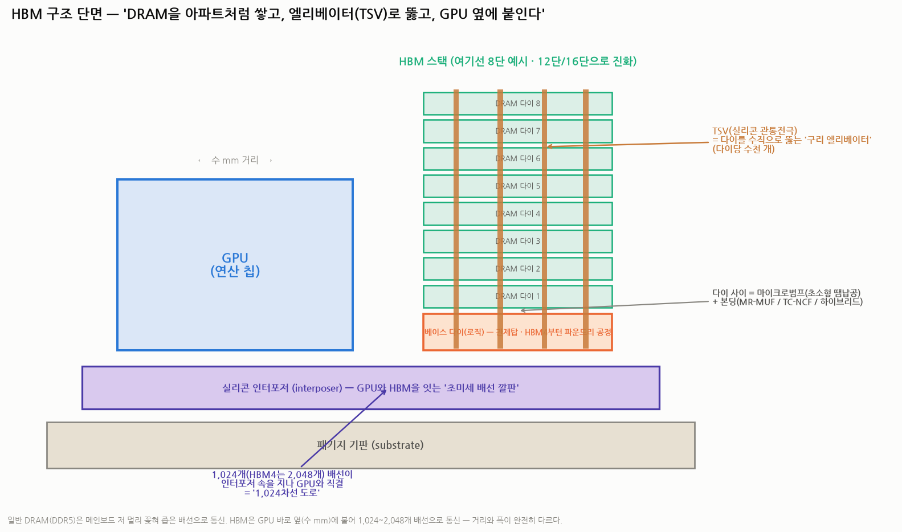
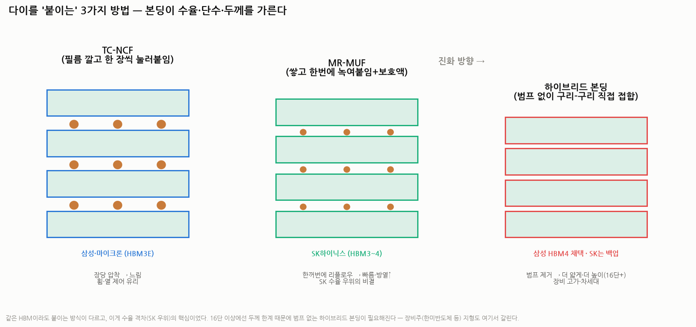
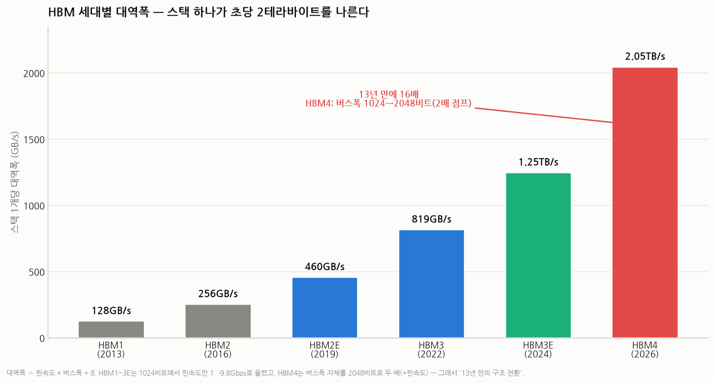

# HBM 완전정복 — 개념·구조·작동원리·세대별 차이 (배경지식 0 → 전공자 수준)

> 작성일: 2026-07-30 · 카테고리: 반도체/배경지식
> 대상: **배경지식이 전혀 없는 독자가 전공자 수준의 이해에 도달하는 것**이 목표. 모든 용어를 비유로 먼저 풀고, 그 다음 정확한 기술 용어로 다시 말한다.
> **검증 메모**: 세대별 사양(대역폭·핀속도·버스폭·단수)·본딩 방식(MR-MUF/TC-NCF/하이브리드)·HBM4 구조 전환은 JEDEC 표준 해설·TrendForce·Tom's Hardware 등으로 교차검증.

---

## 0. 한 문장 요약

> **HBM(High Bandwidth Memory, 고대역폭 메모리) = "DRAM 칩을 아파트처럼 8~16층 쌓고, 층마다 구리 엘리베이터(TSV)를 뚫고, GPU 바로 옆에 붙여, 1,024~2,048개의 배선으로 데이터를 쏟아붓는 메모리."** AI 반도체 성능의 진짜 병목인 '메모리 벽'을 부수기 위해 태어났고, 세대가 오를수록 '더 높이 쌓고(단수), 더 빨리 보내고(핀속도), 더 넓게 뚫는(버스폭)' 세 축으로 진화한다.

---

## 1. 왜 HBM이 필요한가 — '메모리 벽(Memory Wall)' 문제

### 1.1 연산은 빠른데 배달이 느리다

컴퓨터의 계산은 두 단계다: **① 메모리에서 데이터를 가져온다 → ② 연산 칩(GPU)이 계산한다.** 문제는 지난 수십 년간 **②(연산)는 수만 배 빨라졌는데 ①(데이터 배달)은 그만큼 못 빨라졌다**는 것. 그래서 아무리 좋은 GPU도 **데이터가 도착하길 기다리며 노는** 상황이 생긴다. 이걸 **메모리 벽(memory wall)** 이라 부른다.

- 비유: **주방장(GPU)은 세계 최고인데 재료 배달(메모리)이 느려서 요리를 못 하는 식당.** 주방장을 더 좋은 사람으로 바꿔봐야 소용없다. **배달을 고쳐야 한다.**
- AI(대형 언어모델)는 특히 심하다. 모델 파라미터 수천억 개를 **끊임없이 메모리에서 읽어와야** 하기 때문에, AI 연산의 성능은 사실상 **연산속도(FLOPS)가 아니라 메모리 대역폭이 결정**하는 경우가 많다.

### 1.2 대역폭이란 무엇인가

- **대역폭(bandwidth)** = 초당 옮길 수 있는 데이터 양(GB/s). **도로의 폭 × 차의 속도**.
- 기존 방식(DDR·GDDR)은 **좁은 도로(32~64차선)에 아주 빠른 차**를 보내는 전략. 그런데 차를 무한정 빠르게 할 수 없다(신호 왜곡·전력·발열).
- **HBM의 발상 전환: 차를 조금 느리게 하는 대신, 도로를 1,024차선으로 넓히자.** 이게 'High Bandwidth'라는 이름의 뜻이다.

핵심 공식 (전공자용 — 이거 하나면 모든 세대 스펙이 계산된다):

> **스택 대역폭(GB/s) = 핀당 속도(Gbps) × 버스폭(bit) ÷ 8**
>
> 예: HBM3E = 9.8Gbps × 1,024bit ÷ 8 ≈ **1.25TB/s** / HBM4 = 8Gbps × 2,048bit ÷ 8 ≈ **2TB/s**

---

## 2. 배경지식 — DRAM이 뭔지부터 (1분)

HBM은 결국 **DRAM을 쌓은 것**이므로 DRAM부터.

- **DRAM(Dynamic Random Access Memory)** = 데이터를 임시로 담아두는 '작업 책상'. 1비트를 **커패시터(전기를 담는 초소형 그릇) + 트랜지스터(수도꼭지) 1개**로 저장한다. 그릇에 전하가 있으면 1, 없으면 0.
- 그릇의 전하가 저절로 새기 때문에 **수십 밀리초마다 다시 채워줘야(리프레시)** 한다 — 그래서 'Dynamic(동적)'이고, 전원이 꺼지면 다 사라진다(휘발성).
- DRAM 칩 하나는 이런 셀 수십억 개를 **뱅크(bank)** 라는 구역으로 나눠 담고 있다.

기존 배치의 문제: DDR5 메모리는 **메인보드 슬롯에 꽂혀 CPU/GPU에서 수 cm 떨어져** 있고, 기판 위 배선 수십 개로 통신한다. **멀고 좁다.** HBM은 이 두 가지(거리·폭)를 동시에 부순다.

---

## 3. 구조 — HBM은 어떻게 생겼나

밑에서부터 층층이:

### 3.1 패키지 기판과 실리콘 인터포저 (2.5D 패키징)
- **인터포저(interposer)** = GPU와 HBM 스택이 함께 올라앉는 **실리콘으로 만든 '초미세 배선 깔판'**. 일반 기판(PCB)에는 1,024개 배선을 그 밀도로 새길 수 없어서, **반도체 공정으로 만든 실리콘 판**에 배선을 새긴다. TSMC의 **CoWoS**(Chip-on-Wafer-on-Substrate)가 대표 공법.
- GPU와 HBM이 **수 밀리미터 거리**로 나란히 앉는다 — 거리가 짧을수록 신호가 빠르고 전력이 덜 든다. 칩을 완전히 위로 쌓는 3D와 구분해 **2.5D 패키징**이라 부른다.

### 3.2 베이스 다이 (base die / logic die) — 스택의 '관제탑'
- 스택 맨 아래층. DRAM이 아니라 **로직 칩**으로, 위층 DRAM들과 GPU 사이의 **신호 교통정리·테스트·전력 관리**를 담당한다.
- **HBM4부터의 대변화**: 이 베이스 다이가 메모리 공정이 아니라 **파운드리 로직 공정(SK하이닉스는 TSMC와 협력)** 으로 만들어진다. → 관제탑이 똑똑해져 **고객 맞춤 기능(커스텀 HBM)** 을 넣을 수 있게 됐다. 메모리와 파운드리 산업이 여기서 융합된다.

### 3.3 DRAM 다이 적층 — 아파트
- 베이스 다이 위에 **DRAM 다이 8~16장**을 쌓는다(8단/12단/16단 = 8-Hi/12-Hi/16-Hi).
- 각 다이는 **얇게 갈아낸(백그라인딩) 상태**로, 전체 스택 높이가 규격(약 720μm 근처)을 넘지 않아야 한다. **단수가 올라갈수록 다이를 더 얇게 갈아야 해서** 깨짐·휨 위험이 커진다 — 이게 고단 적층이 어려운 첫 번째 이유.

### 3.4 TSV — 구리 엘리베이터
- **TSV(Through-Silicon Via, 실리콘 관통전극)** = **다이를 수직으로 관통하는 미세한 구리 기둥.** 다이당 수천 개.
- 아파트 비유의 엘리베이터: 층과 층 사이 데이터·전력이 이 기둥으로 오르내린다. 와이어(옆으로 빙 둘러가는 전선)로 잇는 것보다 **거리가 수백 분의 1**이라 빠르고 전력이 적다.
- 제조: 다이에 깊고 가는 구멍을 식각 → 절연막 → 구리 채움 → 웨이퍼를 얇게 갈아 구멍을 노출. **구멍 하나라도 불량이면 그 다이는 못 쓴다** — 고단 적층 수율이 어려운 두 번째 이유.

### 3.5 마이크로범프와 본딩 — 층과 층을 '붙이는' 기술

다이와 다이 사이는 **마이크로범프(지름 수십 μm의 초소형 땜납 공)** 로 연결·접합한다. **어떻게 붙이느냐가 3사 경쟁력을 갈랐다:**

| 방식 | 원리 | 장단점 | 채택 |
|---|---|---|---|
| **TC-NCF** (Thermal Compression - Non Conductive Film) | 다이마다 절연 필름을 깔고 **한 장씩 열·압력으로 눌러붙임** | 휨 제어 유리 / **장당 압착이라 느리고 열 부담 누적** | 삼성·마이크론(HBM3E) |
| **MR-MUF** (Mass Reflow - Molded UnderFill) | 다이를 다 쌓은 뒤 **한꺼번에 가열해 땜납을 녹여 붙이고**, 액상 보호재(EMC)를 흘려 채움 | **한 번에 접합 → 생산성·방열↑, 휨↓** | **SK하이닉스(HBM3~4)** — 수율 우위의 핵심 비결 |
| **하이브리드 본딩** (hybrid bonding) | **범프를 아예 없애고** 구리 패드끼리 직접 접합(Cu-Cu) | 스택이 얇아져 **16단+ 필수 후보**, 신호·전력 개선 / **장비 극도로 고가** | **삼성 HBM4 채택**, SK는 12단 검증 완료·백업(16단도 어드밴스드 MR-MUF 유지 결정) |

> 투자 포인트: 본딩 방식 선택은 **수율 격차(SK 우위의 역사적 이유)** 와 **장비주 지형**(TC본더의 한미반도체·한화, 하이브리드 본더의 베시/AMAT 등)을 동시에 결정한다.

---

## 4. 작동원리 — 왜 이 구조가 빠른가 (전공자 수준)

### 4.1 넓은 버스: 1,024비트의 의미
- 일반 DDR5 모듈의 채널은 64비트. HBM 스택 하나는 **1,024비트(HBM4는 2,048비트)** — **한 번의 클럭에 16~32배 많은 데이터**가 병렬로 이동한다.
- 이 1,024개 배선은 스택 내부적으로 **독립 채널 여러 개**(HBM3는 16채널×64비트, 각 채널은 다시 2개의 의사채널(pseudo-channel)로 분할)로 나뉜다. → GPU의 수천 개 코어가 **서로 다른 채널에 동시 접근**할 수 있어 병렬 처리에 최적.

### 4.2 낮은 클럭 + 짧은 거리 = 전력 효율
- 신호를 멀리, 빠르게 보낼수록 전력이 급증한다(구동 전압·신호 정형 회로 필요). HBM은 **거리가 수 mm**라 핀당 속도를 GDDR(수십 Gbps)보다 낮게 유지하면서도 총 대역폭에서 압승한다.
- 결과: **비트당 전송 에너지(pJ/bit)가 GDDR 대비 수분의 1.** 데이터센터 전력이 병목인 시대(☞ 전력병목 시리즈)에 이 효율이 HBM 채택의 숨은 이유다.

### 4.3 용량 확장: 위로 쌓기
- 평면(2D)에서 용량을 늘리면 면적·거리가 커진다. HBM은 **수직으로 쌓아** 같은 바닥 면적에서 용량을 8~16배로. 단, 열이 위로 갇히는 **방열 문제**가 따라온다(아래층 다이의 열이 위층을 통과해야 함) — MR-MUF의 방열 우위, 액체냉각 필수화와 연결되는 지점.

### 4.4 정리 — HBM의 3대 원리
1. **넓게**(1,024~2,048비트 병렬 버스) 2. **가깝게**(인터포저 위 수 mm) 3. **높게**(TSV 적층 8~16단). 이 셋의 곱이 대역폭·용량·전력효율이다.

---

## 5. 세대별 차이 — 한 장 표 + 서사

| 세대 | 양산 | 핀속도 | 버스폭 | **스택 대역폭** | 단수/용량 | 비고 |
|---|---|---|---|---|---|---|
| HBM1 | 2013~15 | 1 Gbps | 1,024bit | **128 GB/s** | 4단·1GB | AMD·SK하이닉스 공동 개발, 게임 GPU 첫 탑재 |
| HBM2 | 2016 | 2 Gbps | 1,024bit | **256 GB/s** | 4~8단·8GB | 서버·HPC 확산 |
| HBM2E | 2019 | 3.6 Gbps | 1,024bit | **~460 GB/s** | 8단·16GB | AI 훈련 초기(A100) |
| HBM3 | 2022 | 6.4 Gbps | 1,024bit | **819 GB/s** | 8~12단·24GB | H100 — AI 붐 개막, SK 사실상 독주 |
| **HBM3E** | 2024 | **9.8 Gbps** | 1,024bit | **~1.25 TB/s** | 8/12단·24/36GB | H200·B200. SK 점유 과반, 12단 경쟁 |
| **HBM4** | 2026 | ~8 Gbps+ | **2,048bit** | **2 TB/s+** | 12/16단·최대 64GB | **13년 만의 버스폭 2배 + 베이스다이 파운드리 전환 + 커스텀화** — 루빈 세대 탑재 |

**세대 서사를 한 줄로**: HBM1→3E까지 13년은 **버스폭 1,024비트를 고정한 채 핀속도만 1→9.8Gbps로 10배** 올린 역사다. **HBM4는 처음으로 도로 자체를 2배(2,048비트)로 넓히는 구조 전환** — 그래서 인터포저 배선·베이스 다이·패키징이 전부 다시 설계되고, 산업 지형(파운드리 융합·커스텀 HBM·하이브리드 본딩)까지 흔든다.

**HBM4가 특별한 3가지 (전공자 포인트):**
1. **2,048비트 인터페이스** — 배선 수가 2배가 되어 인터포저·베이스다이 설계 난도 급상승. 핀속도를 무리하게 안 올려도 2TB/s 달성.
2. **베이스 다이의 파운드리 전환** — SK하이닉스×TSMC 협력. 메모리사가 처음으로 로직 공정을 스택 안에 품는다 → **고객별 커스텀 HBM**(엔비디아·구글 요구 기능 내장) 시대.
3. **16단 경쟁과 본딩 전환점** — 두께 한계 때문에 범프 없는 하이브리드 본딩이 부상(삼성 채택). SK는 어드밴스드 MR-MUF로 16단까지 버티는 전략 — 이 선택이 차세대 수율 승부처.

---

## 6. 경쟁 구도와 투자 연결 (짧게)

- **SK하이닉스**: HBM3 독주 → HBM3E 과반 → HBM4 선행 양산(12단, 2026). 엔비디아 물량 약 2/3. 비결 = MR-MUF 수율 + 선행 개발.
- **삼성전자**: HBM3E에서 TC-NCF·퀄 지연으로 열세 → **HBM4에서 하이브리드 본딩 + 자체 파운드리(베이스다이 일관 생산)로 역전 시도.**
- **마이크론**: HBM3E부터 본격 참전, take-or-pay 장기계약으로 물량 확보.
- **연결되는 저장소 리포트**: 메모리 수요 구조(PERvsPBR)·공급병목(웨이퍼 3배 잠식)·HBM 밸류체인(일일공부 D03)·한미반도체(TC본더 경쟁).

---

## 7. 30초 복습 (기억할 것 7개)

1. HBM은 **메모리 벽**(연산은 빠른데 배달이 느림)을 부수는 해법.
2. 전략은 **"빠른 차 대신 1,024차선 도로"** — 넓게·가깝게·높게.
3. **대역폭 = 핀속도 × 버스폭 ÷ 8** — 이 공식 하나로 모든 세대가 설명된다.
4. 구조는 **인터포저(깔판) + 베이스 다이(관제탑) + DRAM 8~16단(아파트) + TSV(엘리베이터) + 범프/본딩(접합)**.
5. 본딩 3종(**TC-NCF / MR-MUF / 하이브리드**)이 수율·단수·장비 지형을 가른다.
6. HBM1→3E는 핀속도의 역사, **HBM4는 버스폭 2배 + 파운드리 융합 + 커스텀화**라는 구조 전환.
7. HBM이 비싼 이유 = TSV·박막화·적층 수율의 복리 + 웨이퍼를 일반 DRAM의 3배 소모.

---

## 참고 출처 (검증)

- [HBM 세대별 사양 총정리 (SemiHub/HBM 시리즈)](https://semihub.io/blog/hbm-guide-2.html)
- [HBM3E vs HBM4 비교 — 2048bit·2TB/s (TILNOTE 외)](https://tilnote.io/en/pages/695debe98e27ae21551470fa)
- [MR-MUF vs TC-NCF·하이브리드 본딩, 삼성 HBM4 채택 (Tom's Hardware)](https://www.tomshardware.com/pc-components/dram/samsung-to-adopt-hybrid-bonding-for-hbm4-memory)
- [SK하이닉스 12단 하이브리드 본딩 검증·16단 MR-MUF 유지 (TrendForce)](https://www.trendforce.com/news/2026/01/13/news-sk-hynix-may-stick-with-mr-muf-for-hbm4-16-high-despite-asmpt-tc-bonder-orders/)
- [HBM4 12단 양산·16단 경쟁 (TrendForce)](https://www.trendforce.com/news/2026/01/09/news-nvidia-demand-fuels-hbm4-race-12-layer-ramps-16-layer-push-by-sk-hynix-samsung-and-micron/)
- [Deep Dive on HBM (Nomad Semi)](https://www.nomadsemi.com/p/deep-dive-on-hbm)

**저장소 연계**: `일일공부/2026-07-26_D03_반도체_HBM밸류체인.md` · `반도체/산업·테마분석/메모리반도체_공급병목분석리포트.md` · `시장브리핑/메모리수요_구조적인가_사이클인가_PERvsPBR_2026-07.md`

> 유의: 핀속도·대역폭은 표준(JEDEC)과 각사 실제 제품 간 차이가 있고(예: HBM3E 9.2~9.8Gbps, HBM4 표준 초과 스펙 경쟁), 단수·용량은 제품별로 다르다. 수치는 대표값이며 최신 제품 스펙은 각사 발표로 재확인 권장.
