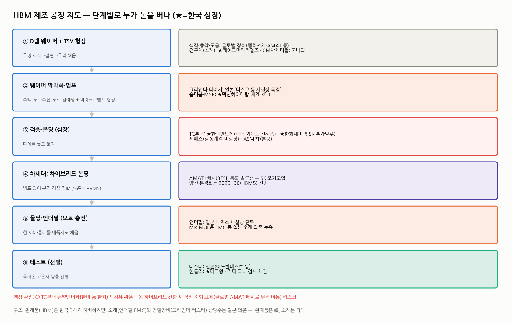

# HBM 장비·소재주 지도 — 공정 단계별로 누가 돈을 버나 (HBM 심화 ⑤)

> 작성일: 2026-07-30 · 카테고리: 반도체/산업·테마분석 · HBM 시리즈 5편(완전정복→커스텀→대체위협→CoWoS→본편)
> 목적: HBM 한 스택이 만들어지는 **공정 순서대로**, 각 단계에서 **어떤 장비·소재가 필요하고 누가 공급하는지** 지도를 그린다. 특히 **한국 상장사(★)가 어디에 있고, 어디가 일본·글로벌 의존인지**를 구분한다.
> **검증 메모**: 종목-역할 매칭은 언론·발주 공시 보도로 검증된 것만 기재(한미·한화세미텍·세메스·테크윙·덕산하이메탈·레이크머티리얼즈·나믹스·AMAT+베시). 확인 안 된 종목은 넣지 않았다.

---

## 0. 한 문장 요약

> **완제품(HBM)은 한국 3사가 지배하지만, 그걸 만드는 장비·소재의 지도는 훨씬 국제적이다.** 한국은 **본딩(한미·한화)·핸들러(테크윙)·솔더볼(덕산)·전구체(레이크)** 에 강하고, **언더필·EMC(나믹스)·그라인더·테스터는 일본**, **하이브리드 본딩은 미국·유럽(AMAT+베시)** 이 쥔다. 투자 관전 포인트는 ① TC본더 듀얼벤더 싸움(한미 vs 한화), ② 하이브리드 전환 시 장비 지형 교체 리스크다.

---

## 1. 공정 지도 — 6단계, 단계별 공급자

### ① D램 웨이퍼 + TSV 형성 (전공정)
- **하는 일**: D램 웨이퍼에 수직 구멍(TSV)을 식각하고 절연막을 입힌 뒤 구리로 채운다(☞ HBM 완전정복 3.4).
- **공급자**: 식각·증착·도금 장비는 **글로벌 대형사(램리서치·어플라이드 등)** 영역. 국내에선 **★레이크머티리얼즈**가 증착용 **전구체(프리커서, 박막 원료 화학물질)** 로 HBM 수요 수혜가 확인된다.

### ② 웨이퍼 박막화·범프 형성
- **하는 일**: 웨이퍼를 수백→수십 마이크로미터로 갈아내고(백그라인딩), 다이 표면에 마이크로범프를 만든다. 얇을수록 잘 깨져 고난도.
- **공급자**: 그라인더·다이서는 **일본이 사실상 독점**(디스코 등). 범프·솔더볼 소재는 **★덕산하이메탈 — 세계 3대 솔더볼 업체**로 마이크로솔더볼(MSB)까지 공급.

### ③ 적층·본딩 — 지도의 심장 🫀
- **하는 일**: 다이를 쌓고 붙인다. HBM 원가·수율의 핵심 공정.
- **공급자(TC본더)**:
  - **★한미반도체** — TC본더 시장 리더. SK하이닉스 주력 벤더였고 '와이드 TC본더' 신제품으로 HBM4 대응.
  - **★한화세미텍** — SK하이닉스가 **한미와 함께 추가 발주**(듀얼벤더화 공식화). 한미와 특허소송 중.
  - **세메스**(삼성 계열, 비상장) — 삼성 내재화 축. **ASMPT**(홍콩) — 글로벌.
- **관전**: SK하이닉스의 의도적 이원화로 **한미 독점 → 한미+한화 과점**으로 재편 중(☞ 독점기업 경쟁자등장 리포트의 '압축' 사례). 발주 비중 추이가 두 종목 주가의 핵심 변수.

### ④ 차세대: 하이브리드 본딩 — 지형 교체 예고
- **하는 일**: 범프 없이 구리-구리 직접 접합(16단+·HBM5).
- **공급자**: **어플라이드 머티리얼즈(AMAT) + 베시(BESI)의 통합 솔루션**을 SK하이닉스가 조기 도입. **양산 본격화는 2029~2030(HBM5)** 전망.
- **관전(중요)**: 하이브리드로 넘어가면 **TC본더 수요 구조가 바뀐다** — 국내 본더 업체엔 중장기 리스크, 글로벌(AMAT·베시)로 무게 이동 가능. 다만 SK가 HBM4 16단까지는 어드밴스드 MR-MUF(=TC본더 계속 사용)를 유지하기로 해 **전환은 급하지 않다**(☞ HBM 완전정복).

### ⑤ 몰딩·언더필 — 일본의 성역
- **하는 일**: 칩 사이·둘레를 에폭시로 채워 보호·방열(MR-MUF의 'MUF'가 여기).
- **공급자**: **언더필은 일본 나믹스(NAMICS)가 사실상 단독 공급.** EMC 등 몰딩 소재도 일본 의존이 높다. — **"완제품은 한국, 소재는 일본"** 구조의 대표 사례로, 국산화 시도가 이어지는 영역.

### ⑥ 테스트 — 극한 선별
- **하는 일**: 극저온·고온 환경에서 스택 양품을 선별. HBM은 스택 하나가 비싸 테스트 강도·시간이 일반 D램의 몇 배.
- **공급자**: 테스터(검사기 본체)는 **일본(어드반테스트 등)** 이 강하고, **핸들러(칩을 옮기고 온도 환경을 만드는 장비)는 ★테크윙** — 극저온·고온 테스트 핸들러로 HBM 수혜가 확인된다.

---

## 2. 한국 상장 체인 요약 (검증된 것만)

| 종목 | 단계 | 역할 | 비고 |
|---|---|---|---|
| **한미반도체** | ③본딩 | TC본더 리더 | HBM4용 와이드 신제품, SK 발주 지속 |
| **한화세미텍**(한화 계열) | ③본딩 | TC본더 2nd 벤더 | SK 추가 발주로 듀얼벤더 공식화 |
| **테크윙** | ⑥테스트 | 테스트 핸들러 | 극저온·고온 환경 장비 |
| **덕산하이메탈** | ②범프 | 솔더볼·MSB 세계 3대 | FC-BGA 체인에도 공급 |
| **레이크머티리얼즈** | ①TSV/증착 | 전구체(프리커서) | HBM 수요·신규 소재 확인 |
| (참고) 피에스케이홀딩스·이오테크닉스 | 후공정 장비 | SK·삼성 공급망 중복 보도 | 역할 세부는 추가 확인 권장 |

> ⚠️ 시중 'HBM 테마주' 목록에는 수십 개 종목이 돌지만, **역할이 공시·발주 보도로 검증되는 종목은 위처럼 소수**다. 목록에 있다고 다 실적으로 연결되는 게 아니다 — 반드시 "무엇을 어느 단계에 납품하나"를 확인할 것.

---

## 3. 투자 관전 포인트 3가지

1. **TC본더 점유 싸움 (한미 vs 한화)** — SK 발주 배분이 실적을 직결 결정. 한미는 기술 리더십+신제품, 한화는 그룹 지원+가격. 특허소송 결과도 변수. (역사적 유사 사례: 발주 이원화에도 1위가 71% 점유를 지킨 '압축' 패턴 — 독점기업 리포트 참조.)
2. **하이브리드 본딩 전환 시점 = 장비 지형 교체 시점** — 2029~30(HBM5) 양산설이 맞다면 그 2년 전부터 장비 발주가 갈린다. **국내 본더 업체들의 하이브리드 대응력**(개발·수주 뉴스)이 중장기 밸류를 가른다. 반대로 전환이 늦어질수록(SK의 MR-MUF 연장) 기존 TC본더 체인의 수명이 연장된다.
3. **일본 의존 소재의 국산화** — 언더필(나믹스 단독)·EMC·그라인더는 국산화 성공 시 큰 기회가 열리는 공백지. 관련 국산화 뉴스가 나오는 종목은 주목 가치.

**베어케이스 연결(☞ 심화③)**: HBM 믹스 하향 시 가장 타격이 큰 건 **본딩·테스트처럼 'HBM 고단 적층'에만 특화된 체인**이다. 반면 전구체·솔더볼처럼 범용 반도체에도 걸친 소재는 방어력이 상대적으로 높다.

---

## 참고 출처 (검증)

- [SK하이닉스, 한미반도체·한화세미텍에 TC본더 추가 발주 (디일렉)](https://www.thelec.kr/news/articleView.html?idxno=50886)
- [한미반도체 와이드 TC본더·HBM4 (서울경제/아주경제)](https://www.sedaily.com/article/20006571)
- [세메스 HBM TC본더 장영실상 (세메스)](https://www.semes.com/ko/media/newsroom/detail/143)
- [테크윙 테스트 핸들러·HBM (주식스토커 외 검증)](https://stockstalker.co.kr/semiconductor-equipment-2/)
- [덕산하이메탈 세계 3대 솔더볼·MSB (더체크/한국경제)](https://www.hankyung.com/article/202510100503a)
- [레이크머티리얼즈 HBM 수요·신규 소재 (데일리인베스트)](http://www.dailyinvest.kr/news/articleView.html?idxno=64193)
- [언더필 나믹스 사실상 단독·'완제품은 韓 소재는 日' (ZDNet Korea)](https://zdnet.co.kr/view/?no=20250829143837)
- [SK하이닉스 AMAT+베시 하이브리드 통합솔루션 조기도입·HBM5 2029~30 (카운터포인트 외)](https://korea.counterpointresearch.com/hybrid-bonding-expands-from-logic-to-memory/)

**저장소 연계**: `HBM_완전정복`(본딩 3종 원리) · `HBM_대체위협`(단일노출 체인 리스크) · `CoWoS_첨단패키징병목`(전방 병목) · `반도체소부장_*`·`한미반도체_심층분석리포트`

> 유의: 종목-역할 매칭은 보도 기준이며 발주 규모·비중은 대부분 비공개다. 테마주 목록의 미검증 종목은 제외했다. 매매 전 각 사 공시(DART)로 실제 매출 비중을 확인할 것.
