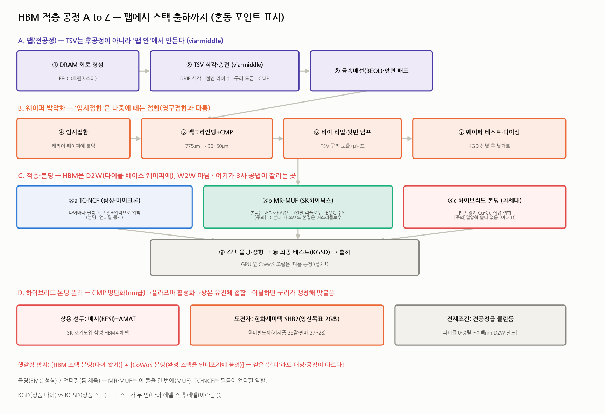

# HBM 적층 공정 A to Z + 하이브리드 본딩에서 한미·한화의 자리 (HBM 심화 ⑥)

> 작성일: 2026-07-30 · 카테고리: 반도체/배경지식(공정)·산업분석 혼합 · `HBM_완전정복`·`장비소재주 지도`의 심화
> 질문: ① HBM을 '쌓는' 공정의 전체 흐름을 전공자 수준으로. ② 헷갈리기 쉬운 공정 구분을 명시. ③ **하이브리드 본딩에 한미반도체·한화세미텍이 기여하는가?**
> **검증 메모**: 한미(시제품 2026말·공장 2027 상반기·판매 27~28)·한화세미텍(SHB2 양산목표 2026초)·베시+AMAT(SK 조기도입) 일정을 디일렉·한경·조세일보 등으로 교차검증. 공정 세부는 업계 표준 지식으로, 사별 레시피는 비공개임을 감안.

---

## 0. 한 문장 요약

> HBM 제조는 **"팹에서 TSV까지 만든 웨이퍼(A) → 종잇장처럼 갈아 뒷면 범프(B) → 다이를 베이스 웨이퍼 위에 쌓아 붙임(C)"** 의 3막극이고, 3막(본딩)이 3사 공법(TC-NCF vs MR-MUF)과 수율을 가른다. **차세대 하이브리드 본딩의 상용 선두는 베시(BESI)+AMAT이며, 한미반도체·한화세미텍은 아직 '개발 단계 도전자'다** — 한화가 일정상 앞서고(양산목표 2026초), 한미는 시제품 2026말·판매 2027~28 로드맵이다. 즉 **현재 시점 기여도: 상용 0, 도전 진행형.**

---

## 0.5 아주 쉬운 버전 — 5분 아파트 비유 (어려우면 이것만 읽어도 됨)

**HBM 만들기 = 초고층 아파트 짓기**라고 생각하자.

**1단계. 공장에서 각 층 만들기 (팹)**
반도체 공장에서 아파트의 '각 층'(DRAM 낱장)을 만든다. 이때 중요한 것 — **나중에 엘리베이터가 지나갈 구멍(TSV)을 각 층에 미리 뚫고 구리를 채워둔다.** 아파트 다 짓고 엘리베이터 통로를 뚫는 게 아니라, 층을 만들 때부터 통로 자리를 만들어 두는 것.

**2단계. 각 층을 종잇장처럼 얇게 갈기**
아파트를 8~16층 쌓아도 전체 높이 제한(규격)이 있어서, **각 층을 종잇장 두께로 갈아낸다**(머리카락 절반 두께). 너무 얇아서 혼자 못 서 있으니, **딱딱한 유리판에 임시로 붙여놓고**(임시접합) 갈고, 다 갈면 떼어낸다. 그리고 각 층 아래에 **아주 작은 땜납 구슬**(마이크로범프)을 붙인다 — 층과 층을 이어줄 '다리 발'이다.

**3단계. 층 쌓아서 붙이기 (여기가 핵심!)** — 회사마다 방식이 다르다:
- **삼성 방식(TC-NCF)** = **"양면테이프 붙이고 다리미로 한 장씩 꾹꾹"**. 각 층 밑에 접착 필름을 깔고, 뜨거운 다리미(장비)로 한 장 올릴 때마다 눌러 붙인다. 확실하지만 **한 장씩이라 느리다.**
- **SK 방식(MR-MUF)** = **"레고처럼 살짝 얹어만 놓고, 오븐에 통째로 넣어 한 번에 굽기"**. 층들을 가볍게 쌓아만 놓고 오븐에 넣으면 땜납 구슬이 녹으며 한꺼번에 붙는다. 그다음 **빈틈에 액체 접착제를 부어 굳힌다.** 한 번에 되니 **빠르고, 열도 잘 빠진다** — SK가 HBM 1위가 된 비결.
- 여기서 헷갈림 주의: SK 라인에서 쓰는 장비도 'TC본더'라고 부르는데(한미반도체·한화세미텍이 파는 그 장비), **실제 역할은 '레고 얹기'(정확히 배치하고 살짝 고정)**다. 다리미질이 아니다.

**4단계(미래). 하이브리드 본딩 = "풀도 못도 없이 붙이기"**
깨끗한 유리 두 장을 완벽하게 닦아서 맞대면 저절로 달라붙는 것을 본 적 있을 것이다. 하이브리드 본딩이 그 원리다 — **층 표면을 거울처럼 완벽하게 갈아서(먼지 하나도 없이) 그냥 맞대면 붙고, 오븐에 넣으면 구리끼리 한 몸이 된다.** 땜납 구슬이 필요 없어서 층 사이 틈이 사라진다 → **같은 높이에 더 많은 층**을 넣을 수 있다(16층+ 시대의 필수 기술). 대신 **먼지 한 톨이 불량 하나**라서 초청정 공장과 초고가 장비가 필요하다.

**그래서 한미반도체·한화세미텍은? (질문의 답)**
- 이 '풀 없이 붙이는' 새 장비를 **지금 실제로 파는 회사는 외국 회사들**(네덜란드 베시 + 미국 어플라이드)이다. SK도 삼성도 일단 이들 장비를 쓴다/쓸 예정.
- **한미와 한화는 아직 개발 중인 도전자**다. 한화가 일정상 조금 앞서고(2026년 초 양산 목표), 한미는 올해 말 시제품 공개 + 1,000억짜리 전용 공장을 짓는 중(판매는 2027~28년 목표).
- **당장 걱정할 건 없다** — SK가 현행 방식(오븐 굽기)을 HBM4 세대까지 계속 쓰기로 해서, 한미·한화의 기존 장비(레고 얹기용)는 몇 년 더 잘 팔린다.
- **진짜 시험은 2029~30년** — SK가 차세대(HBM5)에서 새 방식으로 갈아탈 때다. 그때까지 한미·한화가 새 장비 성능을 입증하면 대박, 못 하면 기존 밥줄이 줄어드는 시기와 겹쳐 힘들어진다.

**쉬운 용어 번역표**
| 어려운 말 | 쉬운 말 |
|---|---|
| 다이(die) | 반도체 낱장 (아파트 한 층) |
| 웨이퍼 | 낱장을 오려내기 전의 큰 원판 (피자판) |
| TSV | 층을 관통하는 엘리베이터 구멍(구리 기둥) |
| 마이크로범프 | 층 사이를 잇는 초소형 땜납 구슬 |
| 본딩 | 붙이기 |
| 리플로우 | 오븐에 넣어 땜납 녹여 붙이기 |
| 언더필 | 틈새에 붓는 접착제 |
| 몰딩 | 겉을 플라스틱으로 포장하기 |
| CMP | 표면을 거울처럼 광내는 사포질 |
| KGD | 검사에 합격한 낱장(양품) |
| 임시접합 | 갈아내는 동안만 딱딱한 판에 붙여두기 |
| D2W | 낱장(다이)을 큰 원판(웨이퍼) 위에 쌓기 |
| 하이브리드 본딩 | 풀·땜납 없이 표면끼리 직접 붙이기 |

> 아래부터는 전공자 수준의 상세 버전이다. 위 비유를 기억하며 읽으면 훨씬 쉽다.

---

## 1. 먼저 헷갈림부터 정리 — 같은 말, 다른 공정 (마스터 표)

HBM 공정 기사를 읽을 때 오해가 가장 많이 생기는 지점들이다. **이 표만 기억해도 절반은 전공자다.**

| 헷갈리는 쌍 | 구분 |
|---|---|
| **HBM 스택 본딩 vs CoWoS 본딩** | 전자는 **DRAM 다이를 쌓는** 공정(메모리사 후공정), 후자는 **완성된 HBM 스택을 GPU 옆 인터포저에 붙이는** 공정(TSMC/OSAT). 같은 '본더'라도 장비·주체·장소가 다르다. ☞ CoWoS편 |
| **TSV 형성 위치** | TSV는 후공정이 아니라 **팹(전공정) 안에서** 만든다(via-middle). 후공정에서 하는 건 '뒷면에서 그 TSV를 노출'시키는 것뿐 |
| **TC본딩 vs 매스리플로우** | TC(열압착)는 다이 **한 장씩** 열+압력으로 붙임. 매스리플로우는 쌓아두고 **한꺼번에** 가열해 솔더를 녹임. **SK 라인의 'TC본더'는 배치·가고정용**이라 이름과 달리 공정 본질은 매스리플로우다 |
| **몰딩 vs 언더필 vs MUF** | 몰딩=스택 겉을 EMC로 성형, 언더필=다이 틈을 채움. **MR-MUF는 둘을 한 번에**(Molded UnderFill). TC-NCF는 필름(NCF)이 언더필 역할 |
| **임시접합 vs 영구접합** | 임시접합=박막화 동안 캐리어에 붙였다 **떼는** 것(디본딩 전제). 영구접합=다이 적층 |
| **W2W vs D2W** | 웨이퍼끼리 통째 접합(W2W) vs 낱개 다이를 웨이퍼에 접합(D2W). **HBM은 D2W** — 코어 다이와 베이스 다이 크기가 달라 W2W 불가. (W2W는 CIS·낸드에서 성숙) |
| **KGD vs KGSD** | Known Good **Die**(다이 레벨 양품) vs Known Good **Stack** Die(스택 레벨 양품). 테스트가 **두 번** 있다는 뜻 |
| **하이브리드 본딩의 '본딩'** | 열압착도 솔더도 아니다. **상온 유전체 접합 + 어닐 시 구리 팽창**으로 붙는 전혀 다른 물리 |

---

## 2. A막 — 팹(전공정): TSV까지 심어서 나온다

1. **DRAM 회로 형성(FEOL)**: 1c나노급 공정으로 셀·트랜지스터 형성. 여기까진 일반 DRAM과 동일.
2. **TSV 식각·충전(via-middle)**: 트랜지스터 형성 후·금속배선 완성 전 단계에서 —
   - **DRIE(딥 반응성 이온 식각, 보쉬 공정)** 로 지름 수 μm·깊이 수십 μm의 수직 구멍을 판다(식각↔측벽보호 가스를 교대로 쏘는 방식).
   - 구멍 안에 **절연 라이너(산화막)** → **배리어/시드 금속** → **전해도금으로 구리 충전** → **CMP**로 웃면 평탄화.
   - 이 시점의 TSV는 웨이퍼를 관통하지 않는다 — **'심어둔 기둥'** 상태. (그래서 뒤에서 뒷면을 갈아 노출시켜야 한다.)
3. **금속배선(BEOL)·앞면 패드**: 배선층을 올리고 앞면 마이크로범프/패드 형성.

> ⚠️ 포인트: **"HBM은 후공정 제품"이라는 통념은 절반만 맞다.** TSV라는 심장은 팹에서 만들어지며, 이게 HBM 웨이퍼가 일반 DRAM 웨이퍼보다 3배 면적을 먹는 이유 중 하나다(공정 추가 + KGD 손실).

## 3. B막 — 박막화: 종잇장 만들기

4. **임시접합**: 소자 면을 보호하며 **캐리어 웨이퍼에 임시 접착**(WSS). 30~50μm짜리 웨이퍼는 혼자 못 서 있기 때문.
5. **백그라인딩+CMP**: 뒷면을 갈아 **775μm → 30~50μm**. 다이아몬드 휠 조삭 후 CMP·스트레스 릴리프로 마무리(그라인딩 데미지층 제거 안 하면 깨진다). 16단은 더 얇게 → 휨·크랙 리스크 급증.
6. **비아 리빌 + 뒷면 범프**: 뒷면을 살짝 더 식각해 **심어둔 TSV 구리를 노출**시키고, 절연·패드 형성 후 **뒷면 마이크로범프**를 붙인다. 이제 다이는 위아래로 전기가 통하는 '관통형 레고 블록'.
7. **웨이퍼 테스트·디본딩·다이싱**: 다이 레벨로 **KGD 선별** 후 캐리어를 떼고(디본딩) 낱개로 자른다(레이저/블레이드 다이싱).

## 4. C막 — 적층·본딩: 3사가 갈리는 곳 (D2W)

**공통 골격**: 베이스 다이 웨이퍼(HBM4부턴 파운드리산)를 통째로 깔고, 그 위에 KGD 코어 다이를 **한 자리에 8~16장씩** 쌓는다(**Die-to-Wafer**). 정렬 정밀도는 μm 이하.

### 4a. TC-NCF (삼성·마이크론)
- 다이 아랫면에 **NCF(비전도성 필름)** 를 미리 라미네이트 → TC본더 헤드가 **열(~수백 °C)+압력**으로 한 장씩 눌러붙임. 필름이 녹아 흐르며 **본딩과 언더필이 동시에** 된다.
- 장점: 필름이 다이를 지지해 **휨 제어·미세피치 대응** 유리. 단점: **장당 압착이라 느리고**(생산성↓), 열 이력이 다이마다 누적. (개선형: 여러 장 가압착 후 최종 압착하는 gang bonding 변형.)

### 4b. MR-MUF (SK하이닉스) — 수율 우위의 비결
- 본더는 다이를 **정밀 배치+가고정(tack)** 만 한다 → 스택 전체를 **리플로우 오븐에서 한꺼번에 가열**해 솔더 접합(Mass Reflow) → 금형에 넣고 **액상 EMC를 주입해 틈과 겉을 동시에 채움**(Molded UnderFill).
- 장점: **일괄 접합 = 생산성↑·열 이력↓**, EMC의 **열전도가 NCF보다 좋아 방열↑**, 휨 제어. SK가 HBM3 독주를 만든 공정 자산이며, **HBM4 16단까지 '어드밴스드 MR-MUF'로 간다**고 결정(플럭스리스 검토 후 보류).
- ⚠️ 여기서 쓰는 장비를 'TC본더'라 부르지만(한미·한화세미텍 납품 장비), **완전 열압착이 아니라 배치·가고정 역할** — 기사 읽을 때 헷갈리기 쉬운 대목.

### 4c. 마무리
- 스택 몰딩·성형 → **KGSD 최종 테스트**(번인·고온·고속) → 출하. 이후 GPU와의 결합(CoWoS)은 **완전히 별개의 다음 공정**이다.

---

## 5. D막 — 하이브리드 본딩 딥다이브 (차세대)

### 5.1 원리 — '붙인다'기보다 '한 몸이 된다'
1. 다이 표면을 **유전체(SiO₂/SiCN) + 구리 패드**가 공존하는 평면으로 만들고, **CMP로 나노미터급 평탄도**를 잡는다. 이때 구리를 유전체보다 **아주 미세하게 오목(리세스)** 하게 남기는 게 레시피의 핵심.
2. **플라즈마 활성화**로 유전체 표면에 반응성을 부여.
3. **상온에서 맞대면** 유전체끼리 자발적으로 붙는다(프리본드).
4. **어닐(수백 °C)** 하면 구리가 열팽창하며 서로 닿아 **Cu-Cu 직접 접합** — 솔더도 범프도 없다.

### 5.2 왜 16단+에서 필수인가
- **높이**: 범프+언더필 층(수십 μm/단)이 사라져 같은 규격 높이(~775μm 패키지 한도) 안에 **더 많은 단**을 넣는다.
- **성능**: 접합 피치가 수십 μm → **수 μm 이하**로 줄어 I/O 밀도↑, 저항·인덕턴스↓(전력·속도 개선), 다이 간 열저항↓(방열).
- **대가**: **파티클 하나가 보이드 하나** — 전공정급 클린룸 필요, 정렬 수백 nm, D2W는 다이 에지 오염·개별 핸들링 때문에 W2W보다 훨씬 어렵다. 장비가 극도로 고가.

### 5.3 채택 타임라인 (검증)
- **삼성**: HBM4(16단)에 하이브리드 본딩 채택 선언 — 열세 뒤집기 승부수.
- **SK**: 12단 하이브리드 **검증은 완료**했으나, 16단까지는 **어드밴스드 MR-MUF 유지** — 본격 전환은 **HBM5(2029~30)** 로 보는 시각이 우세.
- **상용 장비 선두**: **베시(BESI) D2W 본더 + AMAT(증착·CMP·활성화 통합)** 콤비 — SK가 이 통합 솔루션을 조기 도입.

---

## 6. 핵심 질문의 답 — 한미반도체·한화세미텍은 하이브리드 본딩에 기여하나?

**현재(2026) 시점의 정확한 답: 상용 기여는 아직 없다. 둘 다 '개발 단계 도전자'다.** 그러나 로드맵과 이해관계가 다르다.

| | **한미반도체** | **한화세미텍** | (참고) 베시+AMAT |
|---|---|---|---|
| 현 주력 | TC본더 리더(SK MR-MUF 라인) | TC본더 2nd(SK 추가발주) | — |
| 하이브리드 상태 | **2세대 시제품 2026년 말 공개 예정** | **SHB2 나노 — 양산목표 2026년 초(국내 최속)** | **상용 선두(SK 조기도입·삼성 채택)** |
| 인프라 | **주안 전용공장 약 1,000억 투자, 2027 상반기 가동** | 한화 그룹 지원 | 기성 생태계 |
| 판매 목표 | **HBM용 2027 · SoC용 2028** | 2026~ | 이미 판매 중 |
| 전략 뉘앙스 | SK향에서 베시에 밀릴 경우 **마이크론 등 신규 고객 공략** 보도 | 그룹 시너지로 SK 침투 확대 노림 | HBM4·HBM5 선점 |

(그 외: LG전자 생산기술원도 2028년 목표로 개발 중 — 후공정 장비 신규 진입 러시.)

**전문가적 해석 4가지:**

1. **당장의 밥그릇(TC본더)은 안전하다** — SK가 HBM4 16단까지 MR-MUF를 유지하기로 하면서, 한미·한화의 TC본더 수요는 **최소 HBM4 세대 내내 지속**된다. 하이브리드 전환 지연 = 국내 본더 듀오의 캐시카우 수명 연장.
2. **하이브리드는 '남의 땅에서 시작하는 싸움'이다** — 하이브리드 본더는 TC본더의 연장선이 아니라 **CMP·플라즈마·나노 정렬이 결합된 사실상 전공정 장비**다. 그래서 상용 선두가 후공정 본더사가 아니라 **베시+AMAT(전공정 강자) 콤비**인 것. 한미·한화가 TC본더 1·2위라는 사실이 하이브리드 승리를 보장하지 않는다.
3. **일정표가 곧 생존표다** — 삼성 HBM4(하이브리드 채택)의 초기 장비는 베시 몫이 유력하고, SK의 본격 전환은 HBM5(2029~30). 즉 **한미(판매 2027)·한화(양산 2026초 목표)가 제때 성능을 입증하면 'SK HBM5 전환기'라는 진짜 시장에 올라탈 수 있다.** 반대로 늦으면 TC본더 쇠퇴기와 하이브리드 부재가 겹치는 이중고.
4. **시나리오 매트릭스**: ⓐ SK가 HBM5에서 국내 본더 채택(최상 — 밸류 리레이팅) ⓑ 베시 독식+국내는 마이크론 등 2군 고객(중간) ⓒ 하이브리드 전환 자체가 지연(TC본더 수명 연장, 단기 호재·장기 정체) ⓓ 국내 개발 실패(최악). 트래킹 지표: **한미 시제품 성능 공개(2026말)·한화 SHB2 수주 공시·SK HBM5 장비 발주처.**

---

## 참고 출처 (검증)

- [한미반도체 "하이브리드 본더 2027~2028년 판매 기대" (디일렉)](https://www.thelec.kr/news/articleView.html?idxno=40898)
- [한미 2세대 시제품 연내·2027 공장 가동·주안 1,000억 (조세일보/한국경제)](https://www.hankyung.com/article/202604099037i)
- [양산목표: 한화세미텍 2026초 최속·한미 2027말·LG 2028 (다음/뉴스)](https://v.daum.net/v/qQLVy0sAtf)
- [한미, SK 대신 마이크론 공략 가능성 (비즈니스포스트)](https://www.businesspost.co.kr/BP?command=article_view&num=404817)
- [SK 12단 하이브리드 검증 완료·16단 MR-MUF 유지 (TrendForce)](https://www.trendforce.com/news/2026/01/13/news-sk-hynix-may-stick-with-mr-muf-for-hbm4-16-high-despite-asmpt-tc-bonder-orders/)
- [삼성 HBM4 하이브리드 채택 (Tom's Hardware)](https://www.tomshardware.com/pc-components/dram/samsung-to-adopt-hybrid-bonding-for-hbm4-memory)
- [SK, AMAT+베시 통합 솔루션 조기도입·HBM5 2029~30 (카운터포인트)](https://korea.counterpointresearch.com/hybrid-bonding-expands-from-logic-to-memory/)

**저장소 연계**: `HBM_완전정복`(본딩 3종 개요) · `HBM_장비소재주_지도`(공급자 지도) · `CoWoS_첨단패키징병목`(다음 공정) · `한미반도체_심층분석리포트`

> 유의: 공정 세부(온도·두께·피치)는 업계 일반치이며 각사 양산 레시피는 비공개다. 장비사 일정은 '목표' 기준으로 지연 가능. 수주·채택은 공시로 확인 필요.
