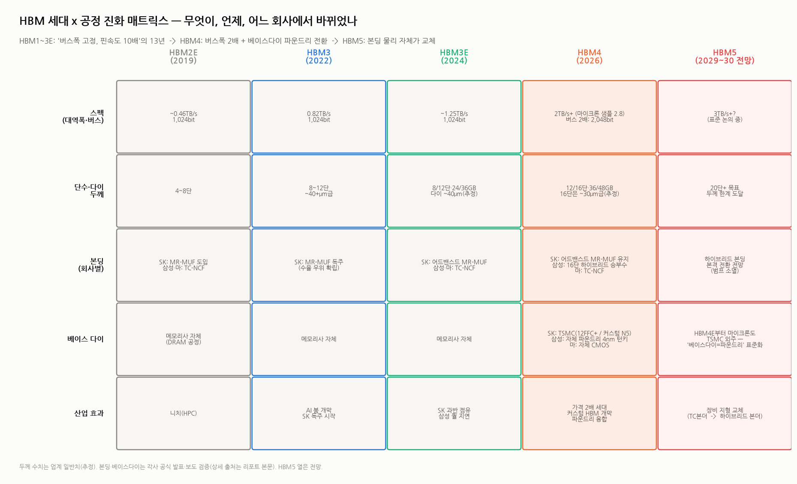

# HBM 주요 공정 — 과정·원리·효과, 회사별 차이와 세대별 진화 (HBM 심화 ⑧)

> 작성일: 2026-08-07 · 카테고리: 반도체/배경지식(공정) · HBM 시리즈 8편
> 질문: "HBM 주요 공정의 과정과 원리, 그리고 **효과**를 자세히. 회사별로 다른 점, 세대별 차이도 정리."
> 위치: `HBM_완전정복`(①구조·세대 스펙)과 `HBM_적층공정AtoZ`(⑥본딩 상세)의 **종합·확장판**이다. 이번 편의 고유한 기여는 ⓐ 공정마다 **"원리 → 효과(성능·수율·원가에 뭘 주나)"를 짝지어** 설명하고, ⓑ **회사별 공정 스택 전체를 한 표로** 비교하고, ⓒ **세대×공정 매트릭스**로 "언제 무엇이 바뀌었나"를 정리하는 것.
> **검증 메모**: 본딩·베이스다이 전략(SK 어드밴스드 MR-MUF 유지, 삼성 HBM4 하이브리드+4nm 턴키, 마이크론 TC-NCF+자체 CMOS→HBM4E부터 TSMC, SK×TSMC 12FFC+/N5)은 TrendForce·Tom's Hardware·EE Times·Digitimes로 교차검증. 다이 두께·온도 등 공정 파라미터는 업계 일반치(각사 레시피 비공개)로 '추정' 표기.

---

## 0. 아주 쉬운 버전 — 공정 여정 5분 요약

HBM 만들기는 **"초고층 아파트 시공"**이다. 각 공정이 존재하는 이유를 한 문장씩:

1. **TSV 뚫기(팹)** — 아파트 각 층을 만들 때부터 **엘리베이터 통로(구리 기둥)를 미리 심는다.** 층을 다 쌓고 뚫을 수 없기 때문. → *효과: 층간 데이터가 최단거리로 이동 = HBM 대역폭의 물리적 기반.*
2. **얇게 갈기** — 층을 16개 쌓아도 **전체 높이 제한**(규격)이 있어서 각 층을 **머리카락 절반 두께**로 간다. → *효과: 단수(=용량)를 결정. 얇을수록 잘 깨져서 수율과의 전쟁.*
3. **쌓아 붙이기(본딩)** — 여기가 **회사별로 갈리는 심장**. 삼성·마이크론은 "양면테이프+다리미로 한 장씩"(TC-NCF), SK는 "레고처럼 얹고 오븐에 통째로 굽기"(MR-MUF). → *효과: 수율·생산성·방열 격차 = SK가 HBM 1위가 된 원천.*
4. **틈 메우고 포장(언더필·몰딩)** — 지진(열팽창)에 견디게 접착제로 채우고 겉을 성형. → *효과: 신뢰성 + 방열(SK 소재의 열전도 우위).*
5. **관제탑 만들기(베이스 다이)** — 스택 맨 아래, 교통정리하는 로직 칩. **HBM4부터 파운드리(TSMC 등) 공정으로 교체** — 관제탑이 똑똑해져 고객 맞춤(커스텀 HBM)이 가능해졌다. → *효과: 가격 2배 세대의 기술적 근거.*
6. **두 번 검사(KGD/KGSD)** — 낱장 검사 + 완성 스택 검사. → *효과: 한 층 불량이 스택 전체(수백 달러)를 날리므로, 검사가 원가의 숨은 축.*

**회사별 한 줄 요약**: SK = "오븐 굽기(MR-MUF)로 수율 1위 + 관제탑은 TSMC에 외주" / 삼성 = "한 장씩 다리미(TC-NCF)로 고전 → HBM4에서 하이브리드 본딩+자체 파운드리 턴키로 역전 승부수" / 마이크론 = "삼성과 같은 다리미파 + 관제탑은 자체 제작(원가 절약)→차세대엔 TSMC 합류".

**세대별 한 줄 요약**: HBM1→3E 13년은 "같은 도로에 차만 10배 빠르게" → **HBM4는 도로를 2배로 넓히고(2,048비트) 관제탑을 파운드리제로 교체** → HBM5는 "붙이는 물리 자체(하이브리드 본딩)"가 바뀐다.

---

## 1. 공정별 딥다이브 — 과정 → 원리 → 효과 → 회사별 → 세대별

전체 흐름도(⑥편에서 상세):

### 1.1 TSV 형성 — "엘리베이터를 미리 심는다"

- **과정**: 팹(전공정)에서 트랜지스터를 만든 뒤·배선을 올리기 전(via-middle), ① DRIE(보쉬 공정 — 식각 가스와 측벽보호 가스를 교대로 쏘아 수직 구멍을 파는 방법)로 지름 수 μm·깊이 수십 μm 구멍 식각 → ② 절연 라이너(산화막) 증착 → ③ 배리어·시드 금속 → ④ 전해도금으로 구리 충전 → ⑤ CMP 평탄화. 이 시점 TSV는 관통이 아니라 **'심어둔 기둥'** 상태다.
- **원리**: 층간 연결을 와이어(옆으로 빙 두르는 전선)가 아니라 **수직 최단거리 구리 기둥**으로 바꾼다. 거리 수백분의 1 = 저항·인덕턴스·전파지연 급감.
- **효과**: ⓐ 1,024~2,048비트 병렬 버스가 물리적으로 가능해짐(와이어로는 불가능한 배선 밀도) ⓑ 비트당 전송 에너지(pJ/bit)가 GDDR 대비 수분의 1 ⓒ **비용**: 공정 추가 + 면적 잠식으로 HBM 웨이퍼가 일반 D램의 ~3배 캐파를 소모 — HBM이 비싸고, 레거시 공급을 잠식하는 이유(☞ 공급병목 리포트).
- **회사별**: 3사 모두 via-middle 방식으로 대동소이. 차이는 공정 미세화 노드와 수율 노하우(비공개). 소재 쪽에선 전구체(레이크머티리얼즈 등)·도금액 체인이 걸린다(☞ 장비소재지도).
- **세대별**: 단수·버스폭이 늘수록 **TSV 개수와 밀도가 증가** — HBM4는 2,048비트 전환으로 다이당 TSV·범프 수가 사실상 2배 스케일. 구멍 하나 불량 = 다이 폐기이므로 세대가 갈수록 TSV 수율이 원가를 좌우한다.

### 1.2 웨이퍼 박막화 — "종잇장 만들기"

- **과정**: 소자면을 캐리어 웨이퍼에 **임시접합** → 뒷면을 다이아몬드 휠로 **백그라인딩**(775μm → 30~50μm, 추정) → CMP·스트레스 릴리프로 데미지층 제거 → 뒷면을 살짝 더 깎아 심어둔 TSV를 노출(**비아 리빌**) → 뒷면 마이크로범프 형성 → 다이 레벨 테스트(KGD 선별) → 디본딩·다이싱.
- **원리**: 패키지 총높이 규격(~720μm급)은 고정인데 단수는 늘어난다 → **단수 증가분만큼 다이가 얇아져야** 한다. 12단 ~40μm → 16단 ~30μm급(업계 추정).
- **효과**: ⓐ 단수 = 용량 = 스택 가격(36GB→48GB→…)을 결정하는 물리적 전제 ⓑ **수율 리스크의 진원지**: 30μm 다이는 자체 무게로도 휘고, 취급 중 마이크로 크랙이 생긴다. 얇아질수록 그라인더(일본 디스코 독점)·임시접합 소재 의존이 커진다.
- **회사별**: 공정 자체는 공통이나, **본딩 방식이 박막화 난도를 되먹임**한다 — TC-NCF는 필름이 다이를 지지해 휨에 유리, MR-MUF는 가고정 단계에서 얇은 다이 취급 노하우가 필요. SK의 '어드밴스드 MR-MUF'에는 휨 제어 개선이 포함된 것으로 알려져 있다.
- **세대별**: HBM4 16단이 **범프 방식의 두께 한계선**에 근접 — 그래서 HBM5(20단+)에서 범프를 없애는 하이브리드 본딩이 필수 후보가 된다(1.3).

### 1.3 적층·본딩 — "회사가 갈리는 심장" ★

**공통 골격**: 베이스 다이 웨이퍼를 깔고 KGD 코어 다이를 8~16장 쌓는 **D2W**(Die-to-Wafer). 정렬 μm 이하.

| | **TC-NCF** (삼성·마이크론) | **MR-MUF** (SK) | **하이브리드 본딩** (차세대) |
|---|---|---|---|
| 과정 | 다이 밑에 비전도성 필름(NCF) 라미네이트 → 열(수백 °C)+압력으로 **한 장씩** 압착 | 본더로 **배치+가고정만** → 오븐에서 **일괄 리플로우** → 액상 EMC 주입(몰딩+언더필 동시) | CMP로 nm급 평탄화(구리를 미세하게 오목하게) → 플라즈마 활성화 → **상온 맞대면 접합** → 어닐 시 구리 팽창으로 Cu-Cu 결합 |
| 원리 | 필름이 녹아 흐르며 접합+절연+언더필을 동시에 | 표면장력으로 솔더가 자가정렬(self-align)되며 한꺼번에 접합 | 범프 없이 **유전체 분자결합 + 구리 열팽창** — 솔더가 아예 없음 |
| **효과** | 휨 제어·미세피치 유리 / **장당 압착이라 느리고 열 이력 누적** | **일괄 접합 = 생산성↑·열 부담↓**, EMC 열전도 우위로 **방열↑** | 단간 갭 소멸 → 같은 높이에 더 많은 단, I/O 밀도↑·저항↓·열저항↓ / **파티클 1개 = 불량 1개**, 전공정급 클린룸 필요 |
| 수율·실적 효과 | 삼성 HBM3E 퀄 지연의 배경으로 지목 | **SK HBM3 독주·3E 과반 점유의 공정적 원천** | 장비 지형 교체(한미·한화 → 베시+AMAT 구도, ☞⑥편) |

- **회사별 현재 전략(검증)**: SK — 12단 하이브리드 검증은 마쳤지만 **HBM4 16단까지 어드밴스드 MR-MUF 유지** 결정. 삼성 — **HBM4 16단에 하이브리드 본딩 채택**(열세 뒤집기 승부수, 12단은 TC-NCF 계열). 마이크론 — TC-NCF 유지.
- **세대별**: HBM2E에서 SK가 MR-MUF를 도입한 것이 오늘날 판도의 출발점 → HBM3~3E에서 격차 확대 → HBM4에서 삼성이 물리를 바꿔 도전 → **HBM5(2029~30)에서 전 업계 하이브리드 전환 전망** = 장비주 지형이 통째로 바뀌는 시점.

### 1.4 몰딩·언더필 — "지진 대비 + 방열"

- **과정·원리**: 다이 틈과 겉을 에폭시 수지로 채우고 성형. 실리콘(다이)과 솔더·기판의 **열팽창 계수가 달라** 온도가 오르내릴 때마다 접합부에 응력이 걸리는데, 언더필이 이를 분산한다.
- **효과**: 신뢰성(수명) + **방열 경로**. HBM은 아래층 열이 위층을 뚫고 나가야 하므로 충전재의 열전도가 성능(스로틀링)에 직결된다. SK MR-MUF의 EMC는 NCF 대비 열전도 우위로 알려져 있다 — 12단 이후 고발열 시대에 유효한 자산.
- **회사별·소재**: 언더필·EMC 소재는 **일본 의존이 높다**(나믹스 사실상 단독 공급 — ☞ 장비소재지도 ⑤). MR-MUF용 액상 EMC 배합은 SK·소재사의 비공개 노하우.
- **세대별**: 하이브리드 본딩 세대(HBM5)가 오면 **갭 자체가 사라져 언더필 수요 구조가 바뀐다** — 소재 체인에도 지형 변화 예고.

### 1.5 베이스 다이 — "관제탑의 파운드리 전환" ★ HBM4 최대 변화

- **과정·원리**: 스택 맨 아래 로직 칩. 위층 D램들과 GPU 사이의 신호 교통정리·테스트·전력 관리를 담당. HBM3E까지는 **메모리사가 자체 D램 공정**으로 만들었다.
- **HBM4의 대전환**: 2,048비트 인터페이스 + 고객 맞춤 기능(커스텀 HBM)을 넣으려면 D램 공정으로는 로직 성능이 부족 → **파운드리 로직 공정으로 교체**.
- **회사별 3전략 (검증)**:
  - **SK하이닉스**: TSMC 외주 — 표준품은 **12FFC+(12nm급)**, 커스텀은 **N5(5nm급)** 투트랙. "최고 파트너와 분업" 전략.
  - **삼성전자**: **자체 파운드리 4nm 턴키** — 메모리+로직+패키징을 한 지붕에서. 유일하게 수직통합이 가능한 회사라는 점을 무기화.
  - **마이크론**: HBM4는 **자체 CMOS**(원가 절약형) → **HBM4E부터 TSMC 합류**(표준·커스텀 모두). 
- **효과**: ⓐ 커스텀 HBM 시대 개막(고객 IP를 베이스 다이에 내장 — 엔비디아·구글별 맞춤, ☞ 심화②) ⓑ **HBM4 가격 2배의 기술적 근거**(비싼 파운드리 다이 + 설계 복잡도) ⓒ 메모리-파운드리 산업 융합: "베이스다이=파운드리"가 표준이 되면 TSMC가 HBM 밸류체인의 관문을 하나 더 쥔다.
- **세대별**: 자체 D램 공정(~3E) → 파운드리 분업/자체 턴키 분화(4) → HBM4E에서 사실상 TSMC 표준화 전망(Digitimes).

### 1.6 테스트 — "두 번 걸러야 산다"

- **과정**: ① 박막화 후 다이 레벨 **KGD**(Known Good Die) 선별 ② 적층 후 스택 레벨 **KGSD** 최종 테스트(번인·극저온·고온·고속).
- **원리·효과**: 12단 스택에서 다이 하나라도 불량이면 나머지 11장 + 베이스 다이 + 공정비가 통째로 손실이다. 다이당 수율 p의 12제곱이 스택 수율이 되는 **복리 구조** — 그래서 검사를 아무리 강화해도 남는 장사고, HBM 테스트 강도·시간은 일반 D램의 몇 배다. 이 구조가 **한 스택 = 일반 D램 대비 프리미엄 가격**의 원가 근거이기도 하다.
- **회사별·장비**: 테스터 본체는 일본(어드반테스트) 강세, 핸들러는 한국 테크윙(극저온·고온) — ☞ 장비소재지도 ⑤.
- **세대별**: 단수↑·커스텀화↑일수록 테스트 항목·시간 증가. HBM4 16단은 다이 16제곱 복리라 **KGD 정확도가 사실상 수익성을 결정**한다.

---

## 2. 회사별 공정 스택 종합 비교 (한 표)

| 공정 | **SK하이닉스** | **삼성전자** | **마이크론** |
|---|---|---|---|
| 코어 D램 노드 | 1b → 1c 전환 중 | 1c 전환으로 만회 시도 | 1-베타 → 1-감마 |
| 본딩 (HBM3E) | 어드밴스드 MR-MUF | TC-NCF (퀄 지연 겪음) | TC-NCF |
| 본딩 (HBM4) | **어드밴스드 MR-MUF 유지** (16단까지) | 12단 TC-NCF + **16단 하이브리드 승부수** | TC-NCF |
| 베이스 다이 (HBM4) | **TSMC 외주** (12FFC+/N5) | **자체 4nm 턴키** | 자체 CMOS (저비용) |
| 베이스 다이 (HBM4E) | TSMC | 자체 (2nm 목표 보도) | **TSMC 합류** |
| 하이브리드 본딩 | 12단 검증 완료·HBM5 대비 | **HBM4 16단 최초 양산 도전** | 후발 |
| 강점 요약 | 수율·양산 검증 + 엔비디아 관계($500B 딜) | 유일한 수직통합(메모리+파운드리+패키징) | 원가 효율 + 미국 정책 수혜 |
| 약점 요약 | 로직은 외부 의존 | HBM3E 신뢰 회복 중 — 하이브리드는 미검증 도박 | 커스텀 대응 한 세대 뒤 |

**읽는 법**: 3사의 선택은 "**검증된 것을 지킨다(SK) vs 물리를 바꿔 추월한다(삼성) vs 비용으로 버티다 합류한다(마이크론)**"로 요약된다. 투자 관점에서 이 표의 함의는 — 삼성의 하이브리드가 **성공하면** 수율 열세를 구조적으로 뒤집을 수 있고(+장비주 지형 조기 교체), **실패하면** HBM4에서도 SK 독주가 연장된다는 것. 2026~27년 삼성 16단 퀄 뉴스가 이 시리즈 전체의 최대 분기점이다.

---

## 3. 세대별 진화 — 한 장 매트릭스

서사로 정리하면:

1. **HBM2E(2019)** — SK가 MR-MUF를 도입한 해. 당시엔 니치 제품의 공정 실험이었지만, 오늘날 점유율 판도의 씨앗.
2. **HBM3(2022)** — AI 붐 개막. 일괄 리플로우의 생산성·방열 우위가 **수율 격차**로 드러나며 SK 독주 시작.
3. **HBM3E(2024)** — 삼성의 TC-NCF 퀄 지연이 공정 선택의 대가를 보여준 세대. SK 과반 점유 고착.
4. **HBM4(2026)** — **13년 만의 구조 전환**: 버스폭 2배(2,048bit) + 베이스 다이 파운드리화 + 삼성의 하이브리드 승부수 + 가격 2배(☞ 심화⑦ 모델). 공정 관점에서 "그냥 다음 세대"가 아니라 **재설계 세대**.
5. **HBM5(2029~30 전망)** — 범프 소멸(하이브리드 전면화) = 본딩·소재·장비 지형의 총교체. TC본더(한미·한화) → 하이브리드 본더(베시+AMAT vs 국내 도전자)의 승부처(☞ ⑥편).

---

## 4. 30초 복습 — 공정→효과 매핑 7개

1. **TSV** = 대역폭의 물리적 기반 (+웨이퍼 3배 소모 = 비싼 이유①)
2. **박막화** = 단수(용량)의 전제 (+깨짐과의 전쟁 = 수율 리스크①)
3. **본딩** = 3사 운명을 가른 공정 (SK 1위의 원천, 삼성 역전 승부수의 무대)
4. **언더필·EMC** = 신뢰성+방열 (일본 소재 의존 지점)
5. **베이스 다이** = HBM4 최대 변화 (커스텀화·가격 2배·파운드리 융합의 근거)
6. **테스트** = 수율 복리 구조의 방어선 (비싼 이유②)
7. **세대 전환의 본질**: 3E까지는 '속도의 역사', 4는 '구조의 재설계', 5는 '물리의 교체'

---

## 참고 출처 (검증)

- [SK 12단 하이브리드 검증·16단 MR-MUF 유지 (TrendForce, 2026.1.13)](https://www.trendforce.com/news/2026/01/13/news-sk-hynix-may-stick-with-mr-muf-for-hbm4-16-high-despite-asmpt-tc-bonder-orders/)
- [삼성 HBM4 하이브리드 본딩 채택 (Tom's Hardware)](https://www.tomshardware.com/pc-components/dram/samsung-to-adopt-hybrid-bonding-for-hbm4-memory)
- [SK×TSMC HBM4 베이스다이 — 12FFC+/N5 투트랙 (Ventron/업계 보도)](https://www.ventronchip.com/news/sk-hynix-partners-with-tsmc-to-develop-hbm4-base-chip-n5-and-n12ffc-advanced-processes-planned.html)
- [마이크론 HBM4E 베이스다이 TSMC 협력 (Tom's Hardware)](https://www.tomshardware.com/micron-hands-tsmc-the-keys-to-hbm4e)
- [HBM4E 세대 베이스다이 TSMC 표준화 전망 (Digitimes, 2025.12)](https://www.digitimes.com/news/a20251201PD210/tsmc-hbm4-micron-sk-hynix.html)
- [CES 2026 — HBM4 현황 종합 (EE Times)](https://www.eetimes.com/the-state-of-hbm4-chronicled-at-ces-2026/)
- [마이크론 HBM4 샘플 11Gbps·2.8TB/s (TrendForce)](https://www.trendforce.com/news/2024/12/23/news-micron-plans-hbm4-mass-production-in-2026-customized-hbm4e-to-launch-in-2027-2028/)
- 공정 일반(TSV·박막화·본딩 파라미터): 업계 표준 문헌 종합 — 각사 양산 레시피는 비공개

**저장소 연계**: `HBM_완전정복`(① 구조·스펙) · `HBM_적층공정AtoZ_하이브리드본딩_한미한화`(⑥ 본딩·장비 상세 + 쉬운 버전) · `HBM_장비소재주_지도`(⑤ 공정별 공급자) · `커스텀HBM_메모리의ASIC화`(② 베이스다이 커스텀화) · `HBM_바텀업_가격매출이익모델`(⑦ 가격 2배의 경제학)

> 유의: 다이 두께·온도·피치 등 수치는 업계 일반치(추정)이며 각사 레시피는 비공개다. 삼성 하이브리드 16단·SK 16단 MR-MUF는 "발표·보도된 전략"으로, 실제 양산 결과(퀄·수율)는 2026~27년 공시·보도로 추적 필요.
