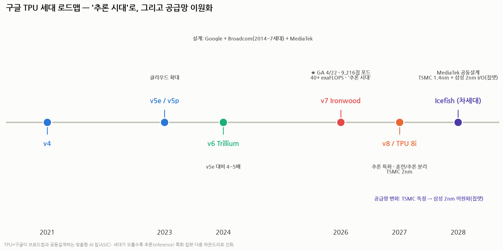
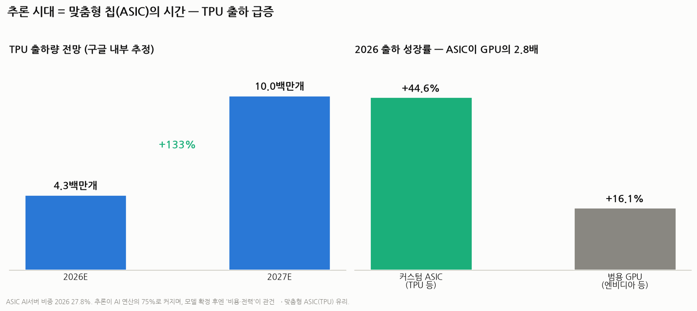
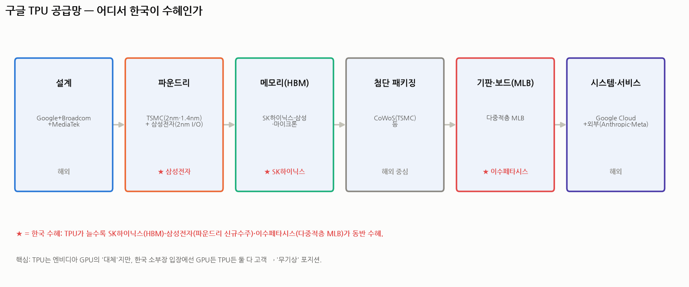

# 구글 TPU 향후 전망 — 다각도 심층 분석

> 작성일: 2026-07-30 · 카테고리: AI 인프라(AI 반도체·커스텀 실리콘)
> 성격: 구글 텐서처리장치(TPU, Tensor Processing Unit)의 미래를 **로드맵·수요·외부판매·경쟁(엔비디아)·소프트웨어·브로드컴·공급망·리스크** 8개 각도로 본다. 이수페타시스(TPU용 MLB)·삼성·SK하이닉스 수혜와도 직결.
> **검증 메모**: 수치는 구글/브로드컴 IR·SemiAnalysis·Tom's Hardware·언론으로 교차검증. 출하 전망 등 추정치는 표기.

---

## 🔴 시장 상황 갱신 (2026-08-11) — 반드시 먼저 읽을 것

> **2026년 7월 한국 증시가 사상 최대 월간 낙폭을 기록했다. 이 문서의 산업 구조 분석은 유효하나, 주가·목표가·밸류에이션 수치는 전부 재확인이 필요하다.**

### 지수 경과

| 시점 | 코스피 | 코스닥 |
|---|---|---|
| 2026년 6월 고점 | 약 **9,385** (사상 최고) | — |
| 2026-06-30 | 8,476.48 | 916.18 |
| **2026-07-30** | **5,593** (6/30 대비 약 −34%) | — |
| **2026-07-31** | 6,595.45 — **하루 +17.91%(+1,001.89p) 사상 최대 반등** | 719.76 |
| **2026년 7월 월간** | **−22.19% (코스피 사상 최대 월간 낙폭)** | **−21.44%** |
| 2026-08-07 | 6,258.77 (주간 −5.11%) | 798.81 (주간 **+10.98%**) |
| 2026-08-10 | **6,306.33** | **807.66** |

**1997년 외환위기와 글로벌 금융위기 당시의 월간 낙폭을 넘어섰다.** 7월 7일과 7월 28–29일 서킷브레이커가 발동했다.

### 원인 (검증됨)

1. **메타 네오클라우드 발표** — 남는 AI 연산 자원을 외부 판매하겠다는 발표가 **"AI 연산이 남아돈다 → 메모리 수요 종료 → 반도체 사이클 끝"**으로 해석. 직접 방아쇠
2. **CXMT(창신메모리) 상장** — 중국 메모리 추격 가시화
3. **미 국채금리 급등** — 10년물 7월 말 4.75%, 30년물 5.19%
4. **레버리지 청산** — 상반기 누적된 레버리지 투자가 낙폭을 증폭

### 🔑 핵심 역설 — 실적은 사상 최대였다

| 회사 | 2026년 2분기 |
|---|---|
| **삼성전자** | 매출 171.5조 · **영업이익 89.5조원**(전년 대비 **+1,813.8%**) · OPM 52.2% · **DS 부문이 영업이익의 99.7%** |
| **SK하이닉스** | 매출 79.3조 · **영업이익 60.5조원**(OPM 76%) · 순이익 93.9조 · **반기 누적 매출 첫 100조 돌파** |

**이익이 아니라 "이익의 지속성"에 매겨진 멀티플이 무너졌다.**

### 시장 구조 변화

- **2026-06-22 SK하이닉스가 삼성전자를 제치고 코스피 시가총액 1위** — 2000년 11월 이후 **25년 7개월 만의 대장주 교체**
- **8월 첫주 대순환매**: SK하이닉스 −17.2%·삼성전자 −12.0% vs **KAI +21.1%·한화에어로 +19.6%·효성중공업 +17.2%·HD현대일렉 +11.4%**
- **미국은 사상 최고**(S&P500 8/7 7,757.64). 하이일드 스프레드 2.70%·VIX 15.46으로 **글로벌 시스템 위기가 아닌 한국 고유의 쏠림 해소**
- **원/달러 1,548.8(6/30) → 1,409.9(8/7)** — 원화 약 9% 절상
- 공매도는 **2025-03-31 전면 재개** 상태. MSCI는 **2026-06-23 한국을 신흥시장으로 유지**(관찰대상국 미등재)

*출처: 같은 저장소 `90_정기발간/2026-W32·W33 주간시장브리핑`(2출처 이상 교차검증), FRED 실측*

### 📌 반도체 섹터 추가

- **엔비디아가 차세대 HBM 사양을 재검토한다는 보도**(8월 첫주)로 SK하이닉스가 이틀 연속 하락
- **미국 반도체는 강세**(NVDA +11.6%, MRVL +16.6%, ASML +6.9%, TSMC +3.9%)인데 **한국 메모리만 약세** — 같은 AI 테마 안에서 밸류체인 위치에 따라 갈렸다
- 이 폴더에는 이미 급락을 다룬 문서가 있다: `메모리반도체_급락_다각도해석_2026-07`, `메모리수요_구조적인가_사이클인가_PERvsPBR_2026-07`, `반도체_실적좋은데급락_역대케이스스터디_반등했나`. **함께 볼 것**

---

## 0. 한 문장 요약

> **TPU는 '추론(inference) 시대'를 맞아 (1) 성능·효율로 엔비디아 대안이 되고, (2) 사상 처음 외부 고객(앤스로픽·메타)에게 대량 판매·리스되며 순수 내부용에서 '상용 칩'으로 전환 중이다.** 최대 변수는 성능이 아니라 **소프트웨어 생태계(쿠다 해자)** 와 **외부 상업화 실행력**, 그리고 **AI 투자 사이클**이다.

---

## 1. 배경 — TPU가 뭔가 (30초)

- **TPU = 구글이 만든 맞춤형 AI 칩(ASIC).** ASIC(Application-Specific Integrated Circuit) = '특정 작업에 특화해 설계한 칩'. 엔비디아 GPU가 '무엇이든 하는 만능 칩'이라면, TPU는 **AI 계산(행렬 곱셈)만 극도로 잘하게 깎아낸 전용 칩**이다.
- **2014년부터 브로드컴(Broadcom)과 공동설계** — 브로드컴이 칩 구현·생산을, 구글이 아키텍처를 맡는다. 현재 7세대까지 왔다.
- 장점: 특정 AI 작업에서 **총소유비용(TCO)이 GPU 대비 30–50% 낮음**. 단점: GPU만큼 범용적이지 않음(작업이 바뀌면 불리).

---

## 2. [각도 ①] 로드맵 — '추론 시대'로, 그리고 공급망 이원화

- **v6 Trillium(2024)**: v5e 대비 4–5배 성능.
- **v7 Ironwood(2026년 4월 22일 정식 출시)**: **9,216칩을 하나로 묶은 포드(pod)**, 40 엑사플롭스(초당 4경 번 연산) 이상. **명시적으로 '추론 시대(age of inference)'용**으로 설계. 고대역폭메모리(HBM) 대량 탑재.
- **v8 / TPU 8i(2027년 말 예상)**: **훈련용과 추론용 칩을 분리**, TSMC 2나노 공정.
- **Icefish(차세대, 2028 양산 목표)**: **미디어텍(MediaTek)과 공동설계**, 메인 연산 다이는 **TSMC 1.4나노**, 메모리 입출력(I/O) 다이는 **삼성전자 2나노**로 나눠 만드는 **칩렛(chiplet, 여러 조각을 이어 붙인 칩)** 구조.

> 두 가지 큰 흐름: **① 추론 특화**(모델을 '쓰는' 단계에 최적화)로 이동, **② 파운드리(제조)를 TSMC 독점에서 삼성전자로 이원화** — 후자는 삼성 파운드리엔 큰 기회, TSMC 독점엔 균열 신호.

---

## 3. [각도 ②] 수요 — 추론 시대는 '맞춤형 칩(ASIC)'의 시간

- **TPU 출하량(구글 내부 추정): 2026년 430만 개 → 2027년 1,000만 개(+133%).**
- **커스텀 ASIC의 성장이 범용 GPU를 압도**: 2026년 출하 성장률이 ASIC +44.6% vs GPU +16.1%(약 2.8배). ASIC이 AI 서버 시장의 27.8%까지.
- **왜?** AI 연산의 무게중심이 **훈련(training)에서 추론(inference)으로** 이동 중이다. 이미 **추론이 AI 연산의 약 75%**. 모델이 한 번 완성(freeze)되면 그다음은 **'얼마나 싸고 빠르게 많이 돌리느냐(비용·전력)'** 싸움이고, 이건 **정해진 작업을 반복하는 데 특화된 ASIC(TPU)의 앞마당**이다.

---

## 4. [각도 ③] 게임체인저 — TPU가 '외부'로 나온다 (내부용 → 상용)

지금 TPU 스토리의 핵심 반전. **역사적으로 TPU는 구글 내부·구글 클라우드 임대용이었는데, 처음으로 외부 고객에게 대량 판매·리스**된다.

- **앤스로픽(Anthropic, 클로드 개발사)**: **최대 100만 개 TPU, 1기가와트 이상 규모, 수백억 달러**(2025년 발표). AI 최전선 기업이 엔비디아 대신 TPU를 대량 채택한 상징적 사건.
- **메타(Meta)**: 다년·수십억 달러 규모 협상 보도 — **2026년부터 TPU를 리스, 2027년부터는 직접 구매**하는 방안.
- **제3자 데이터센터**에도 TPU를 공급하는 방향.

> 의미: TPU가 '구글 전용'에서 **엔비디아와 직접 경쟁하는 상용 AI 칩**으로 바뀐다 → 잠재 시장(TAM)이 폭발적으로 커진다. **왜 지금인가?** ① 엔비디아 GPU가 공급난·고가, ② 추론 수요 폭증, ③ 소프트웨어 장벽이 낮아지는 중(5장).

---

## 5. [각도 ④] vs 엔비디아 & 소프트웨어 해자 (진짜 승부처)

- **엔비디아는 여전히 AI 칩의 약 70%**를 쥐고 있으나, 구글·아마존·메타·MS·오픈AI의 맞춤 칩 투자로 **점유율이 침식되는 국면.**
- **엔비디아의 진짜 해자는 칩이 아니라 소프트웨어 '쿠다(CUDA)'** — 20년간 쌓인 개발자 생태계. TPU는 구글 내부 프레임워크 **JAX/XLA**에 최적화돼 있어, **파이토치(PyTorch) 기반의 외부 개발자에겐 진입장벽**이었다.
- **그런데 이 장벽이 낮아지고 있다**:
  - **파이토치·JAX가 'great equalizer(평준화 도구)'** 로 떠오르며, 하드웨어 차이를 추상화해 **전환 비용을 '컴파일러 옵션 하나' 수준으로** 낮추는 방향.
  - **2025년 10월, TPU용 네이티브 파이토치 백엔드(TorchTPU)** 가 공개되기 시작 — 외부 채택의 근본 장벽을 정면으로 겨냥.
  - **추론 국면에선 쿠다의 중요성이 더 약해진다**(모델 확정 후엔 비용·지연이 관건).
- **비용**: TPU(및 브로드컴 XPU)는 특정 워크로드에서 **TCO 30–50% 저렴**. 단 **범용성·유연성은 GPU가 우위**(새 모델·새 기법엔 GPU가 안전).

> 요약: **성능은 이미 충분, 승부는 소프트웨어.** 쿠다 해자는 여전히 크지만 '추론 시대 + 파이토치 평준화 + TorchTPU'가 그 벽을 갉아먹는다.

---

## 6. [각도 ⑤] 브로드컴 축 — TPU의 '숨은 몸통'

TPU 전망은 사실상 **브로드컴(Broadcom) 전망과 한 몸**이다.
- 브로드컴 **AI 수주잔고 730억 달러**, **2027년 AI 칩 매출 1,000억 달러 목표**. 2026 회계연도 1분기 AI 반도체 매출 84억 달러(+106% YoY), 2분기 107억 달러 가이드.
- **맞춤 칩(XPU) 고객 6곳** 확보, 그중 **구글이 가장 오래된 파트너(2014년부터 7세대)**. **2026년 4월 구글과 2031년까지 장기계약**(약 460억 달러 규모로 보도).
- 의미: TPU 물량 확대는 곧 브로드컴 매출. **브로드컴의 스케일·설계 역량이 TPU 공급을 뒷받침**한다(엔비디아 대항의 '숨은 무기고').

---

## 7. [각도 ⑥] 공급망 — 어디서 한국이 수혜인가

| 단계 | 주체 | 한국 수혜 |
|---|---|---|
| 설계 | Google + Broadcom + MediaTek | - |
| **파운드리** | TSMC(2·1.4nm) + **삼성전자(2nm I/O 다이)** | ★ **삼성 파운드리 신규 수주**(TSMC 독점 균열) |
| **메모리(HBM)** | **SK하이닉스**·삼성·마이크론 | ★ SK하이닉스 |
| 첨단 패키징 | CoWoS(TSMC) 등 | 해외 중심 |
| **기판·보드(MLB)** | 다중적층 MLB | ★ **이수페타시스**(구글 TPU 8세대 다중적층 확정) |
| 시스템·서비스 | Google Cloud + 외부(앤스로픽·메타) | - |

> **핵심**: TPU는 엔비디아 GPU의 '대체재'지만, **한국 소부장 입장에선 GPU든 TPU든 둘 다 고객** — 즉 **'무기상(arms dealer)' 포지션**이라 어느 쪽이 이겨도 HBM·MLB·(신규)파운드리는 수혜다. 특히 **삼성 파운드리의 TPU I/O 다이 수주는 전략적으로 큰 사건**(TSMC 독점 구조에 균열).

---

## 8. 불 케이스 vs 베어 케이스

| 🟢 Bull (TPU 미래 밝다) | 🔴 Bear (과대평가) |
|---|---|
| 추론 시대 = ASIC 스위트스팟(비용·전력) | 쿠다 생태계 여전히 우위, 외부 채택 마찰 |
| 외부 판매 개방(앤스로픽·메타)로 TAM 폭발 | TPU 상업화 미검증(역사적 내부 전용, 판매·지원 역량 의문) |
| 소프트웨어 장벽 해소 중(TorchTPU·PyTorch 평준화) | **'무기상 딜레마'**: 경쟁사(메타·앤스로픽) 무장 = 제미나이 자기잠식 위험 |
| **제미나이 3의 최상위권 성과** = TPU로 최전선 모델 훈련 가능함을 입증 | 엔비디아 반격(루빈·NVLink·가격·쿠다 락인) |
| 브로드컴 스케일 + 파운드리 이원화 = 공급 확보 | 칩렛·이원화·2nm 신공정의 실행·수율 리스크 |
| GPU 공급난·고가에 따른 반사 수요 | AI capex 사이클(2027–28 피크아웃 시 동반 둔화) |
| 풀스택 수직통합(모델 제미나이 + 칩 TPU + 클라우드) | 범용성 부족 — 모델·기법 급변 시 ASIC이 불리 |

---

## 9. 종합 판단

- **방향은 분명히 우상향**이다. 추론 시대의 구조적 순풍(ASIC +44.6% vs GPU +16.1%), 외부 판매 개방(앤스로픽 100만·메타), 소프트웨어 장벽 완화, 제미나이 3의 성공, 브로드컴의 몸집이 모두 TPU 편이다. **엔비디아 독점(70%)이 처음으로 실질적으로 흔들리는 국면.**
- **단, 'TPU가 엔비디아를 대체한다'는 과장.** 현실적 결론은 **"엔비디아 독점 → 엔비디아 + TPU(+아마존·MS ASIC)의 과점"으로의 재편**이다. 쿠다 해자·상업화 실행·무기상 딜레마가 상단을 누른다.
- **한국 투자 함의(무기상 포지션)**: GPU든 TPU든 이기는 쪽이 누구든 **SK하이닉스(HBM)·삼성전자(파운드리 신규 수주)·이수페타시스(다중적층 MLB)·두산(CCL)** 은 동반 수혜. **믹스가 GPU 일변도에서 TPU로 다변화**되는 것 자체가 한국 공급망엔 기회(단일 고객 집중 완화). 다만 최종 하방은 **AI capex 사이클**이라는 공통 변수에 묶인다.

---

## 참고 출처 (검증)

- [Ironwood(v7) 정식 출시·9,216칩·추론시대 (Google Blog)](https://blog.google/innovation-and-ai/infrastructure-and-cloud/google-cloud/ironwood-tpu-age-of-inference/)
- [TPU 로드맵·8세대 훈련/추론 분리·TSMC 2nm (The Next Web)](https://thenextweb.com/news/google-ironwood-tpu-inference-cloud-next)
- [출하 4.3M(2026)→10M(2027)·앤스로픽 100만·메타 리스 (Data Center Frontier)](https://www.datacenterfrontier.com/machine-learning/article/55336429/googles-tpu-roadmap-challenging-nvidias-dominance-in-ai-infrastructure)
- [브로드컴 AI 백로그 $73B·구글 2031 계약·XPU 6고객·ASIC +44.6% (Tom's Hardware)](https://www.tomshardware.com/tech-industry/semiconductors/custom-ai-asics-examined-from-broadcom-to-mtia)
- [엔비디아 70% 침식·커스텀 TCO 30–50%↓ (TechTimes/24-7 Wall St)](https://247wallst.com/investing/2026/04/07/broadcoms-long-term-google-tpu-deal-is-bigger-than-it-looks-for-ai-infrastructure/)
- [Icefish: MediaTek 공동설계·TSMC 1.4nm+삼성 2nm I/O·2028 (글로벌이코노믹/서울경제)](https://www.sedaily.com/article/20055336)
- [소프트웨어 해자·PyTorch 평준화·TorchTPU·추론 75% (Hyperframe/BusinessWorld)](https://hyperframeresearch.com/2025/12/24/can-googles-torchtpu-eventually-bridge-nvidias-cuda-moat/)
- [SemiAnalysis: TPUv7 "900lb Gorilla"](https://newsletter.semianalysis.com/p/tpuv7-google-takes-a-swing-at-the)

**저장소 연계**: `IT부품및소재/이수페타시스_*`(TPU용 다중적층 MLB), `반도체/*`(HBM), `시장브리핑/메모리수요_*`(추론·ASIC)

> 유의: 출하·매출·계약 규모·점유율은 기업·언론 추정이며 시점에 따라 달라진다. 외부판매 계약(메타 등)은 협상 단계 보도 포함. 확정치는 각 사 공시·실적으로 재확인 권장.
