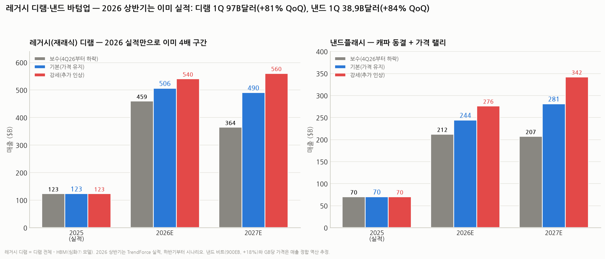
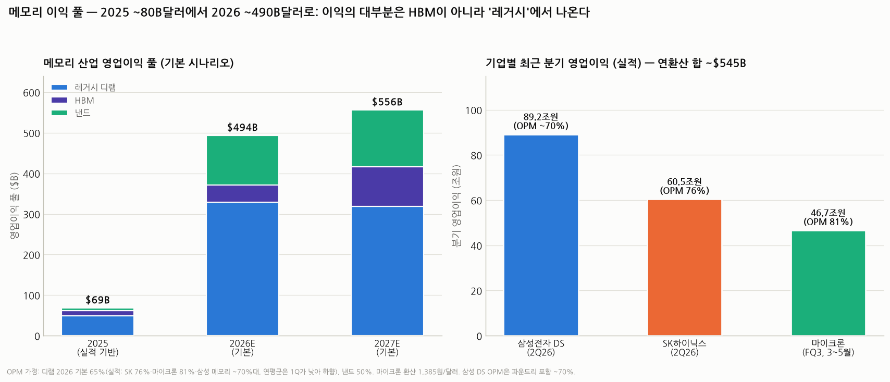

# 레거시 디램·낸드 바텀업 모델 — 메모리 기업들의 이익은 얼마가 되나 (HBM 심화⑦의 확장)

> 작성일: 2026-08-05 · 카테고리: 반도체/산업·테마분석 · `HBM_바텀업_가격매출이익모델`(심화⑦)의 자매편
> 질문: "HBM처럼 레거시 디램·낸드도 바텀업으로 매출을 추정해줘. 메모리 기업들의 이익을 추정해야 할 것 같아서."
> **검증 메모**: 이 모델의 최대 강점은 **2026년 상반기가 이미 '실적'이라는 것.** 1Q26 디램 산업 매출 $97B(+81% QoQ), 낸드 top5 $38.9B(+83.7% QoQ), 그리고 2Q26 기업 실적(삼성 메모리 120.8조·SK 79.3조·마이크론 $41.5B)까지 발표돼 있어, 시나리오가 갈리는 건 사실상 **2H26부터**다. 모든 실적 수치는 TrendForce·회사 공시 기준으로 검증했고, 가정(2027 물량·가격, OPM)은 가정으로 명시했다.

---

## 0. 아주 쉬운 버전 (여기만 읽어도 됨)

HBM 리포트(심화⑦)에서 "HBM 이익 풀이 2027년 $82B"라고 했는데, 이번에 레거시(재래식) 디램과 낸드까지 계산해 보니 **진짜 몸통은 HBM이 아니라 레거시**였다.

비유: 메모리 3사는 쌀장수다. HBM은 "프리미엄 선물세트"(비싸고 화려함), 레거시 디램은 "일반 쌀"(전 국민이 먹음), 낸드는 "창고 저장고"다. 그런데 지금 흉년(공급 부족)이 나서 **일반 쌀값이 1분기에만 2배**로 뛰었다. 선물세트 매출보다 일반 쌀 매출이 원래 7배 크니까, 쌀값 2배의 이익 임팩트가 선물세트를 압도한다.

숫자 요약 (산업 전체, 기본 시나리오):

| | 2025 (실적) | 2026E | 2027E |
|---|---|---|---|
| 레거시 디램 매출 | $123B | **$506B (4.1배)** | $490B |
| HBM 매출 (심화⑦) | $31B | $66B | $150B |
| 낸드 매출 | $70B | **$244B (3.5배)** | $281B |
| **합계 매출** | $224B | **$816B** | $921B |
| **합계 영업이익** | **~$69B** | **~$494B (7배!)** | **~$556B** |

이게 과장이 아니라는 증거가 **이미 나온 실적**이다: 2Q26 한 분기에만 삼성 DS 영업익 **89.2조원**, SK하이닉스 **60.5조원(이익률 76%)**, 마이크론 **$33.7B(이익률 81%)** — 셋이 합쳐 분기당 약 $135B, 연환산 **$545B**를 벌고 있다.

**단, 딱 하나 기억할 것**: 이런 이익률(76~81%)은 역사상 처음 보는 수치다. 사이클이 꺾이면(공급 증가 or 수요 둔화) 가장 크게 오른 것(레거시 가격)이 가장 크게 떨어진다. 이 리포트의 보수 시나리오조차 "4Q26부터 하락"을 가정할 뿐, 진짜 다운사이클(가격 반토막)은 별도 리스크다.

---

## 1. 계산 구조 — HBM 모델과의 관계

```
메모리 산업 이익 = [레거시 디램 + HBM](디램 풀) × 디램 OPM + [낸드] × 낸드 OPM
레거시 디램 매출 = 디램 전체 매출 - HBM 매출(심화⑦ 모델)
```

레거시 디램과 낸드는 HBM과 달리 **분기 실적이 촘촘히 공개**되므로, "비트×가격"보다 **실적 분기를 그대로 쌓고 미래 분기만 시나리오**로 두는 방식이 더 정확하다. 비트·가격 분해는 검산용으로만 썼다.

---

## 2. 검증된 앵커 (전부 실적·날짜 병기)

### 디램 (분기 실적 — TrendForce)

| 분기 | 산업 매출 | 비고 |
|---|---|---|
| 1Q25 | $27.0B | |
| 2Q25 | ~$31.6B | |
| 3Q25 | ~$41.4B | 4Q25 역산 |
| 4Q25 | **$53.58B** (+29.4% QoQ) | 삼성 1위 탈환 (2026.2.26 발표) |
| **1Q26** | **$97.0B (+81% QoQ)** | 재래식 계약가 +93~98% QoQ (2026.6.1 발표). 삼성 $37.3B(38.5%)·SK $28.0B(28.8%)·마이크론 $21.8B(22.4%) |
| 2Q26 | ~$150B (추정) | 기업 실적 역산: 삼성 메모리 +62%·마이크론 +74% QoQ |

→ **2025년 디램 전체 = ~$154B (실적)**, 이 중 HBM ~$31B → **레거시 ~$123B**

### 낸드 (분기 실적 — TrendForce)

| 분기 | top5 매출 | 비고 |
|---|---|---|
| 4Q25 | ~$21.2B | 1Q26 역산 |
| **1Q26** | **$38.9B (+83.7% QoQ)** | 공급부족發 가격 인상 (2026.5.25 발표) |
| 2Q26 계약가 | **+70~75% QoQ** | TrendForce 전망. SK 실적에선 낸드 ASP +50%대 중반 확인 |

→ **2025년 낸드 ≈ $70B** (복수 기관 $70~74B 범위)

### 기업 실적 (2Q26 — 마진의 실측)

| 기업 | 분기 매출 | 영업이익 | OPM | 출처(날짜) |
|---|---|---|---|---|
| 삼성전자 DS | 127.5조원 (+56% QoQ), 메모리 120.8조 (+471% YoY) | **89.2조원** | ~70% | 공시 (2026.7.30). 디램 ASP +50%↑, 낸드 +60%↑ QoQ |
| SK하이닉스 | 79.3조원 | **60.5조원** | **76%** | 공시 (2026.7.29). 사상 최대. LTA 고객 10곳 |
| 마이크론 (FQ3, 3~5월) | $41.5B (전분기 $23.9B) | **$33.7B** | **81.2%** | 공시 (2026.6.24). GM 84.9% 신기록 |

### 물량 가이던스

- 2026 비트 수요: 디램 **+20%대 중반**, 낸드 **+높은 10%대** YoY (SK하이닉스 실적 콜, 2026.7.29)
- 낸드 2026 신규 캐파 "사실상 0" — 공급부족 연중 지속 (TrendForce)
- 삼성 경영진: "메모리 부족이 2027~2028년까지 심화" (2Q26 콜)

---

## 3. 모델 — 가정 공개

**시나리오 축은 "2H26 이후 가격"** (상반기는 실적으로 고정):

| | 보수 | 기본 | 강세 |
|---|---|---|---|
| 2H26 | 3Q 정점 후 4Q부터 하락 | 3Q 추가 인상 후 유지 | 연말까지 인상 지속 |
| 디램 2026 합계 | $517B | $572B | $612B |
| → 레거시(-HBM) | $459B | $506B | $540B |
| 2027 레거시 | 가격 -25% → $364B | 유지 → $490B | +15% → $560B |
| 낸드 2026 | $212B | $244B | $276B |
| 2027 낸드 | -25% → $207B | 유지 → $281B | +20% → $342B |
| 디램 OPM 26/27 | 55% / 50% | **65% / 65%** | 70% / 72% |
| 낸드 OPM 26/27 | 40% / 35% | **50% / 50%** | 55% / 55% |

> OPM 가정 근거: 2Q26 실측이 SK 76%·마이크론 81%·삼성 ~70%지만, 1Q26이 그보다 낮았고 연평균은 분기 정점보다 낮다. 기본 65%는 "2Q 수준이 유지되되 연평균으로 희석"되는 그림. (2025년은 실적 역산: 디램 ~40%, 낸드 ~10%.)
> 2027 물량: 디램 비트 +15%, 낸드 +15% — **가정** (캐파 증설 제한적 + 삼성 "부족 지속" 발언 반영).

---

## 4. 결과 — 매출과 이익



**산업 매출($B):**

| | 2025 | 2026E (보/기/강) | 2027E (보/기/강) |
|---|---|---|---|
| 레거시 디램 | 123 | 459 / **506** / 540 | 364 / **490** / 560 |
| 낸드 | 70 | 212 / **244** / 276 | 207 / **281** / 342 |
| (참고) HBM | 31 | 58 / 66 / 72 | 113 / 150 / 186 |
| **메모리 합계** | **224** | 729 / **816** / 888 | 684 / **921** / 1,088 |

**산업 영업이익($B):**

| | 2025 | 2026E (보/기/강) | 2027E (보/기/강) |
|---|---|---|---|
| **메모리 합계** | **~69** | 369 / **494** / 580 | 311 / **556** / 725 |



**읽는 법:**
- **이익 폭발의 주범은 레거시다.** 2026 기본 이익 풀 $494B 중 레거시 디램이 ~$329B(67%), HBM은 ~$43B(9%), 낸드 ~$122B(25%). HBM은 '성장 스토리'고, **레거시는 '현금 프린터'**다.
- **2026년은 절반이 이미 확정**: 상반기 실적만으로 디램 ~$247B + 낸드 ~$105B가 쌓였고, 보수 시나리오조차 하락은 4Q에나 시작된다.
- **2027년 격차가 큰 이유**: 보수($311B)와 강세($725B)의 차이는 "사이클이 언제 꺾이느냐" 하나다. 증설된 캐파가 2027~28년 도달하는 순간이 변곡점.

---

## 5. 기업별 이익 추정 (요청의 핵심)

**방법**: 산업 이익 풀(기본) × 매출 점유율. 점유율은 1Q26 디램 실측(삼성 38.5%·SK 28.8%·마이크론 22.4%) + 낸드 점유 추정(삼성 ~35%·SK+솔리다임 ~20%·마이크론 ~13%·키옥시아/샌디스크 ~27%).

| 기업 | 2Q26 실적 (분기) | **2026E 영업이익 (기본, 연간)** | 2027E (기본) | 비고 |
|---|---|---|---|---|
| **삼성전자 DS** | 89.2조원 | **~$180B (≈250조원)** | ~$200B | 디램 1위+낸드 1위. 파운드리 적자 축소는 별도 상방 |
| **SK하이닉스** | 60.5조원 (OPM 76%) | **~$135B (≈187조원)** | ~$160B | HBM 1위 프리미엄으로 점유율 대비 이익 몫이 큼 |
| **마이크론** | $33.7B (OPM 81%) | **~$100B** | ~$115B | 현재 OPM 최고 (미국 리쇼어링 수혜 포함) |
| 기타 (키옥시아·샌디스크 등) | — | ~$60B | ~$70B | 낸드 전업 — 사이클 하강 시 가장 취약 |

> ⚠️ **이 표는 '산업 풀 × 점유율'의 기계적 배분**이다. 실제로는 제품 믹스(서버 비중·HBM 비중)에 따라 기업별 OPM이 다르므로 ±20% 오차 범위로 볼 것. 그래도 방향은 명확하다: **기본 시나리오에서 삼성 DS 연 영업익 250조원, SK하이닉스 187조원** — 2025년(삼성 DS ~30조 추정, SK ~40조대)의 5~6배 스케일이다.

**밸류에이션 함의 (☞ 메모리수요 PER vs PBR 리포트 연결)**: SK하이닉스 시총이 ~400조원대라면 2026E 이익 187조 기준 **PER ~2배대**라는 계산이 나온다. 시장이 이 이익을 "지속 불가능한 사이클 정점"으로 보고 있다는 뜻이다(그래서 PBR로 바닥을 재는 것). 투자 판단의 본질은 "2027년에 보수(-40%)로 가느냐, 기본(유지)으로 가느냐"다.

---

## 6. 크로스체크

1. **2Q26 실측 역산**: 빅3 분기 영업익 합 ~$135B × 4 = 연환산 $545B. 모델의 2026 기본 $494B는 "1Q가 낮았던 것"을 반영한 값으로 정합 ✅
2. **매출 검산**: 2Q26 디램($150B)+낸드($65B) ≈ $215B/분기 vs 빅3+기타 매출 합 ~$210~220B ✅
3. **비트×가격 검산**: 레거시 디램 2026 $506B ÷ ~26.5EB = **$19/GB** — DDR5 64GB 모듈 ~$1,200 함의. 서버 RDIMM 실거래 $900~1,300 범위와 정합 ✅. 낸드 $244B ÷ 1,060EB = $0.23/GB — 2025년($0.078)의 3배로, 분기 인상률 누적(+10%, +38%, +75%…)과 정합 ✅
4. **역사 대조**: 직전 슈퍼사이클 정점(2018년) 메모리 산업 매출 ~$165B → 이번 2026E $816B은 그 5배. 전례 없는 수치라는 것 자체가 **"AI 수요가 진짜 구조적이냐"에 모든 것이 걸려 있다**는 뜻 ⚠️

---

## 7. 리스크 — 이 모델이 틀리는 경우

| 리스크 | 타격 | 비고 |
|---|---|---|
| **사이클 피크아웃** (증설 도달·수요 둔화) | 레거시 가격은 오른 만큼 빠진다. 2027 보수(-25%)보다 깊은 -50%도 역사적으론 흔함 | 2018→2019 디램 가격 -60% 전례 |
| 수요 파괴 | PC·폰 제조사가 이미 "메모리 못 구해 생산 조정"(SK 콜) — 가격이 수요를 죽이는 단계 진입 | B2C 침체가 서버로 전이되면 위험 |
| 빅테크 AI 캐펙스 축소 | 레거시 서버 디램·낸드(스토리지)까지 동반 타격 | 전 카테고리 동시 하락 |
| 중국 CXMT·YMTC 증산 | 레거시 하단부터 가격 붕괴 | 제재로 선단 공정 제한적이나 레거시엔 위협 |
| OPM 가정 | 인건비·소재비 인상, 환율 | 마진 5%p 오차 = 이익 $40B± |

**결론 한 줄**: 바텀업으로 보면 2026년 메모리 산업은 이익 $500B 규모의 "역사상 최대 현금 프린터"가 이미 켜져 있고(상반기 실적으로 확정), 관건은 이것이 **2027년에도 돌아가느냐(기본, 이익 $556B)** vs **꺼지기 시작하느냐(보수, $311B)**다. 기업 밸류에이션은 후자를 가격에 반영 중이다.

---

## 참고 출처 (검증·날짜순)

- [TrendForce — 4Q25 디램 매출 $53.58B, +29.4% QoQ (2026.2.26)](https://www.trendforce.com/presscenter/news/20260226-12937.html)
- [TrendForce — 1Q26 디램 $97B, +81% QoQ, 점유율 삼성 38.5%·SK 28.8%·마이크론 22.4% (2026.6.1)](https://www.trendforce.com/presscenter/news/20260601-13070.html)
- [TrendForce — 1Q26 낸드 top5 $38.9B, +83.7% QoQ (2026.5.25)](https://www.trendforce.com/presscenter/news/20260525-13058.html)
- [TrendForce — 1Q26 전 카테고리 가격 사상 최대 인상 (2026.2.2)](https://www.trendforce.com/presscenter/news/20260202-12911.html)
- [SK하이닉스 — 2Q26 실적: 매출 79.3조, 영업익 60.5조, OPM 76% (2026.7.29)](https://news.skhynix.com/en/q2-2026-business-results/)
- [마이크론 — FQ3 2026: 매출 $41.46B, OPM 81.2%, GM 84.9% (2026.6.24)](https://www.globenewswire.com/news-release/2026/06/24/3317151/14450/en/micron-technology-inc-reports-record-results-for-the-third-quarter-of-fiscal-2026.html)
- [Digitimes — 삼성 2Q26 메모리 매출 120.8조 +471% YoY (2026.7.30)](https://www.digitimes.com/news/a20260730VL208/samsung-hbm-demand-revenue-sales-growth.html)
- [TrendForce — 삼성 2Q26 영업익 89.4조 전망 보도 (2026.7.7)](https://www.trendforce.com/news/2026/07/07/news-samsungs-2q-operating-profit-soars-1810-to-record-krw-89-4t-reportedly-surpassing-nvidia-and-apple/)
- 낸드 2025 연간 ~$70B (복수 시장조사기관 $69.9~74.4B)

**저장소 연계**: `HBM_바텀업_가격매출이익모델`(심화⑦ — HBM 파트) · `메모리수요_구조적인가_사이클인가_PERvsPBR`(밸류에이션 프레임) · `메모리반도체_급락_다각도해석`(베어 논리) · `커스텀HBM_메모리의ASIC화`(웨이퍼당 마진 역전)

> 유의: 2026 하반기부터는 시나리오이며, 분기 실적·계약가 발표 때마다 갱신 필요. 기업별 배분은 점유율 기반 기계적 추정(±20%)이다. 이 리포트는 산업 이익 규모 추정이지 매수 추천이 아니다.
