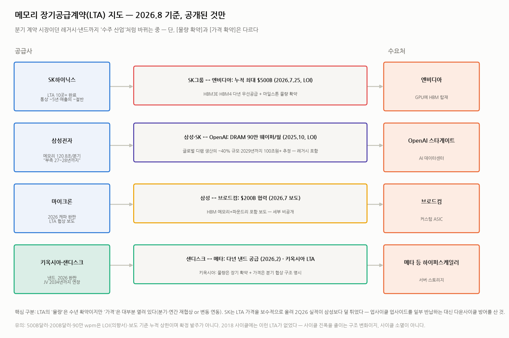

# 메모리 장기공급계약(LTA) 현황 — 레거시·낸드까지 '수주 산업'이 되고 있나

> 작성일: 2026-08-06 · 카테고리: 반도체/산업·테마분석 · `메모리_바텀업_레거시디램낸드_이익모델`·`HBM_바텀업_가격매출이익모델`(심화⑦)의 보론
> 질문: "레거시 메모리와 낸드도 장기공급계약을 맺지 않았어? 현황을 이야기해줘."
> **검증 메모**: 계약별로 출처·날짜를 병기했다. 핵심 주의점: 공개된 대형 딜 다수가 **LOI(의향서)·보도 기준**이며 확정 발주가 아니다. 또 "LTA를 맺었다"는 말에서 **물량 확약과 가격 확약은 별개**임이 실적 콜에서 확인된다(SK·키옥시아 발언). 이 구분이 이 리포트의 핵심이다.

---

## 0. 아주 쉬운 버전 (여기만 읽어도 됨)

맞다 — **원래 메모리는 "분기마다 가격 흥정하는 쌀시장"이었는데, 이번 사이클에서 "몇 년치 입도선매 계약"으로 바뀌고 있다.** 흉년(공급부족)이 2~3년 갈 것 같으니 큰손들(엔비디아·OpenAI·메타)이 "우리 몫 먼저 찜"을 걸어둔 것이다.

공개된 것만 요약:

| 계약 | 규모 | 성격 |
|---|---|---|
| SK그룹 ↔ 엔비디아 (2026.7) | 누적 최대 **$500B** | HBM 다년 우선공급 (LOI) |
| 삼성·SK ↔ OpenAI 스타게이트 (2025.10) | **디램 90만 웨이퍼/월** = 전세계 생산의 ~40% | **레거시 디램 포함** (LOI) |
| 삼성 ↔ 브로드컴 (2026.7) | $200B 협력 보도 | 세부 비공개 |
| 샌디스크 ↔ 메타 (2026.2) | 다년 낸드 공급 | AI 인프라용 |
| SK하이닉스 자체 공시 | **LTA 10곳+ 완료, 통상 ~5년, 매출의 ~절반** | 2Q26 실적 콜 |
| 키옥시아 | 2026 낸드 완판, 하이퍼스케일러가 27~28년치 계약 요청 | 실적 콜 |

**그런데 함정이 하나 있다**: "5년 계약"이라고 해서 **가격까지 5년 고정이 아니다.** 대부분 "물량은 확약 + 가격은 분기/연간 재협상" 구조다. 즉 LTA는 ① 다운사이클에서 "출하량 절벽"을 막아주는 보험이지, ② 가격 하락까지 막아주는 보험이 아니다. 실제로 SK는 LTA 고객에게 가격을 보수적으로 올려서 2Q26 이익이 삼성보다 덜 튀었다 — **호황의 업사이드를 일부 반납하고, 불황의 방어를 산 셈**이다.

투자 관점 한 줄: LTA 확산은 **사이클의 진폭을 줄이는 구조 변화**(내 모델의 '2027 보수 시나리오' 확률을 낮춤)이지만, **사이클 소멸은 아니다** — 특히 가격은 여전히 열려 있다.

---

## 1. 팩트 — 공개된 LTA 전수 정리

### ① SK하이닉스 — 가장 구체적으로 공시한 회사

2Q26 실적 콜(2026.7.29, 송현종 사장 발언)에서 확인된 내용:
- **"주요 고객 포함 10곳 이상과 LTA 협상을 완료**했고, 다른 대형 고객과 추가 논의 중"
- 기간은 고객·제품별로 다르나 **통상 ~5년**
- 가격 구조는 "고객·제품 특성별로 다르지만 **가격 변동에 대응하도록 설계**" → 완전 고정가 아님
- **LTA가 전체 매출의 약 절반**을 커버
- 별도로 엔비디아와 **누적 최대 $500B** 규모 파트너십(2026.7.25 LOI): HBM3E·HBM4 다년 우선공급 + 마일스톤 물량 (☞ 심화⑦에서 검증)

흥미로운 실전 사례: 2Q26에서 SK 매출이 컨센서스를 하회한 이유가 **"LTA 고객에 대한 보수적 가격 인상"** 때문으로 보도됐다(TrendForce, 2026.7.29). 같은 분기 삼성은 디램 ASP +50%↑를 다 받았는데 SK는 +~30%에 그쳤다. LTA의 양면성이 실적으로 드러난 첫 사례다.

### ② 삼성전자·SK ↔ OpenAI 스타게이트 — 레거시가 포함된 초대형 딜

- 2025.10 서울에서 LOI 체결 (알트먼·이재용·최태원 회동)
- 목표 물량 **디램 90만 웨이퍼 스타트/월** — TrendForce·Tom's Hardware 추산 **글로벌 디램 생산능력의 ~40%**
- 분석가 추정 2029년까지 **100조원($70B)+** 규모
- **중요**: 이 딜은 HBM만이 아니라 **범용(레거시) 디램을 포함한 웨이퍼 기준** 물량이다 — "레거시도 장기계약 시대"의 대표 증거
- 부속: 한국 내 AI 데이터센터 2곳 건설 계획 포함

### ③ 낸드 진영 — "2026년치는 이미 완판"

- **키옥시아**: "2026년 낸드 생산분 전량 커밋 완료. 일부 하이퍼스케일러가 **2027~2028년까지 포함하는 LTA를 제안**해왔다"(2026.1 실적 콜). 구조를 명시한 점이 귀중하다: **"물량은 장기 확약, 가격은 분기 협상"**
- **샌디스크 ↔ 메타**: 다년 낸드 공급계약(2026.2) — 메타 AI 인프라의 핵심 공급사로 지정. 샌디스크는 "데이터센터가 2026 낸드 수요를 지배하며 **LTA가 공급·가격 체계를 재편 중**"이라고 공식화
- **키옥시아·샌디스크 JV**: 요카이치 합작을 **2034년까지 연장**(2026.1.29) — 샌디스크가 2026~29년에 걸쳐 $1.165B 지급. 공급망 자체를 장기 고정하는 움직임
- **마이크론**: 2026년 캐파 완판 + LTA 협상 보도 (HBM은 이미 연단위 선계약 관행)

### ④ 수요자 쪽 방증

SK 콜에서 나온 발언: **"스마트폰·PC 업체들이 메모리 물량을 못 구해 생산을 일시 조정"** — LTA를 못 맺은(안 맺은) 쪽이 물량에서 밀리는 시대가 실제로 시작됐다. TrendForce도 "미계약 소비자가전 업체들이 심각한 공급 부족에 노출될 것"이라 경고(2026.6.2).

---

## 2. 구조 분석 — LTA가 실제로 보장하는 것과 아닌 것

| | 물량(Volume) | 가격(Price) |
|---|---|---|
| 전통 분기계약 (2018 사이클까지) | 분기 단위 | 분기 협상 |
| **현재 LTA (레거시·낸드)** | **수년 확약** ✅ | **대부분 열려 있음** (분기·연간 재협상 or 변동 연동) ⚠️ |
| HBM 선계약 (연단위 관행) | 연간 완판 + 마일스톤 | 연간 협상 (2027년분 지금 협상 중) |
| 극단 사례 (take-or-pay) | 안 가져가도 돈 냄 | 일부 고정 | 

세 가지 함의:

1. **다운사이클의 모양이 바뀐다**: 과거 다운사이클 = "출하량과 가격이 동시에 붕괴". LTA 시대 = 출하량은 방어되고 **가격만 조정**된다. 내 레거시·낸드 모델(보수 시나리오: 물량 유지 + 가격 -25%)이 바로 이 구조를 반영한 것 — 과거처럼 -50~60% 가격 붕괴가 나려면 LTA 재협상·파기까지 가야 한다.
2. **공급사 간 전략 분화**: 삼성은 스팟 업사이드를 최대한 받는 쪽(2Q26 ASP +50%↑), SK는 LTA로 안정성을 사는 쪽(+30%, 매출 절반 커버). 업사이클 후반~다운사이클에서 이 선택의 성적표가 뒤집힐 수 있다 — **사이클이 꺾일 때는 SK 구조가 유리**하다.
3. **수요자 신용 리스크가 새 변수**: 90만 wpm(OpenAI)·$500B(엔비디아) 같은 숫자는 **LOI 기준 누적 상한**이다. OpenAI는 적자 기업이고, 이 물량 확약의 이행은 스타게이트 자금조달에 달려 있다. "AI 캐펙스 순환거래" 논란(엔비디아→OpenAI 투자→OpenAI가 그 돈으로 칩 구매)이 메모리 LTA에도 그대로 적용된다 — **계약 장부가 아니라 상대방의 현금흐름을 봐야 한다.**

---

## 3. 내 모델들에 대한 함의 (업데이트 노트)

- **레거시·낸드 모델의 2027 시나리오 확률**: LTA 커버리지(SK 매출 절반, 키옥시아 완판+27~28 제안)를 감안하면 2027년 "물량 붕괴" 가능성은 낮아졌다. 보수 시나리오도 물량 유지+가격 조정으로 짠 것이 적절했다. 단, **가격 -25%보다 깊은 조정은 여전히 가능**(가격은 열려 있으므로).
- **HBM 모델(심화⑦)**: 2027 가격 협상(Gb당 $4~5)은 LTA 우선공급 틀 **안에서** 벌어지는 연간 가격 협상이다. 물량 우선권($500B 딜)과 가격은 별개 트랙.
- **PER vs PBR 논쟁(기존 리포트)**: LTA 확산은 이익의 변동성을 줄여 **"PER로 봐도 되는 산업" 쪽으로 한 걸음** 이동시키는 구조 변화다. 다만 가격이 열려 있는 한 완전한 체질 전환은 아니다 — "PBR 바닥 + PER 상단" 하이브리드 프레임 유지가 합리적.

---

## 4. 체크리스트 — 앞으로 추적할 것

1. **LTA 가격 조항의 공개 여부** — 고정가 비중이 확인되면 이익 가시성 재평가 (상향 요인)
2. **OpenAI 스타게이트 자금조달 진행** — LOI → 확정 발주 전환율이 레거시 수요의 핵심 변수
3. **미계약 수요자(폰·PC·차·게임기)의 이탈** — 가격 부담으로 수요 파괴가 진행되면 LTA 밖 물량부터 붕괴
4. **다운사이클 첫 테스트** — 가격이 꺾이기 시작할 때 LTA 재협상 뉴스가 나오는지 (2019년 태양광 폴리실리콘 LTA 줄파기 전례 참고)
5. **삼성의 LTA 참여 수위** — 스팟 전략 유지 vs LTA 전환, 다운사이클 직전 신호로 활용 가능

---

## 참고 출처 (검증·날짜순)

- [OpenAI 공식 — 삼성·SK 스타게이트 합류 (2025.10.1)](https://openai.com/index/samsung-and-sk-join-stargate/)
- [TrendForce — 스타게이트 90만 wpm = 글로벌 디램의 ~40% (2025.10.2)](https://www.trendforce.com/news/2025/10/02/news-openais-stargate-900k-dram-wafers-could-hit-40-of-global-output-led-by-samsung-sk-hynix/)
- [Tom's Hardware — 스타게이트 디램 딜 상세 (2025.10)](https://www.tomshardware.com/pc-components/dram/openais-stargate-project-to-consume-up-to-40-percent-of-global-dram-output-inks-deal-with-samsung-and-sk-hynix-to-the-tune-of-up-to-900-000-wafers-per-month)
- [키옥시아·샌디스크 — 요카이치 JV 2034년까지 연장 (2026.1.29)](https://investor.sandisk.com/news-releases/news-release-details/kioxia-and-sandisk-extend-yokkaichi-joint-venture-agreement)
- [키옥시아 — 2026 낸드 완판, 하이퍼스케일러 27~28년 LTA 제안 (2026.1)](https://finance.yahoo.com/news/nand-flash-supply-2026-already-130253516.html)
- [샌디스크 ↔ 메타 다년 낸드 공급계약 (2026.2)](https://finance.yahoo.com/technology/ai/articles/sandisk-sndk-secures-meta-nand-171417598.html)
- [TrendForce — 공급사 가격결정력·미계약 수요자 경고 (2026.6.2)](https://www.trendforce.com/presscenter/news/20260602-13074.html)
- [CNBC — 엔비디아×SK $500B 딜 (2026.7.25)](https://www.cnbc.com/2026/07/25/nvidia-locks-down-memory-from-sk-hynix-as-part-of-500-billion-ai-deal.html)
- [TrendForce — SK 2Q26 실적: LTA 10곳 완료, 보수적 LTA 가격이 미스 요인 (2026.7.29)](https://www.trendforce.com/news/2026/07/29/news-sk-hynix-posts-record-2q-results-but-misses-estimates-reportedly-due-to-conservative-pricing-completes-10-ltas/)
- [The Elec — SK, 빅테크 전방위 5년 물량 확보 (2026.7)](https://www.thelec.net/news/articleView.html?idxno=12631)

**저장소 연계**: `메모리_바텀업_레거시디램낸드_이익모델`(시나리오 확률에 반영) · `HBM_바텀업_가격매출이익모델`(심화⑦ — $500B 딜) · `메모리수요_구조적인가_사이클인가_PERvsPBR`(밸류에이션 프레임) · `커스텀HBM_메모리의ASIC화`(수주산업화 논리)

> 유의: LTA 세부 조항(가격 연동식·위약 조건)은 대부분 비공개다. 이 리포트는 공개 정보 기준이며, "LOI·보도 기준"과 "공시·실적 콜 기준"을 구분해 표기했다.
