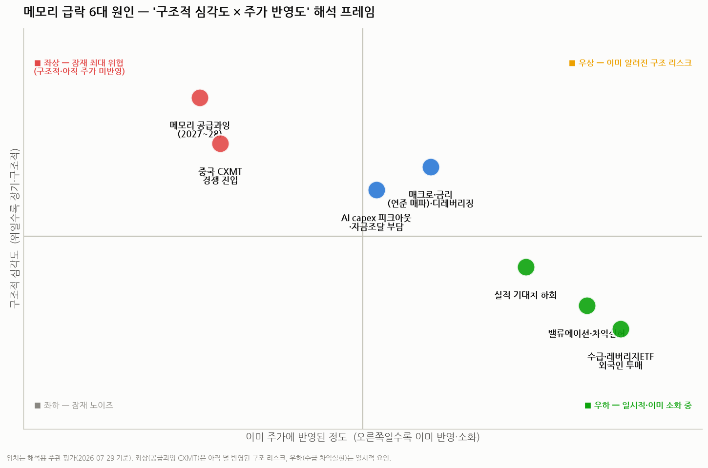
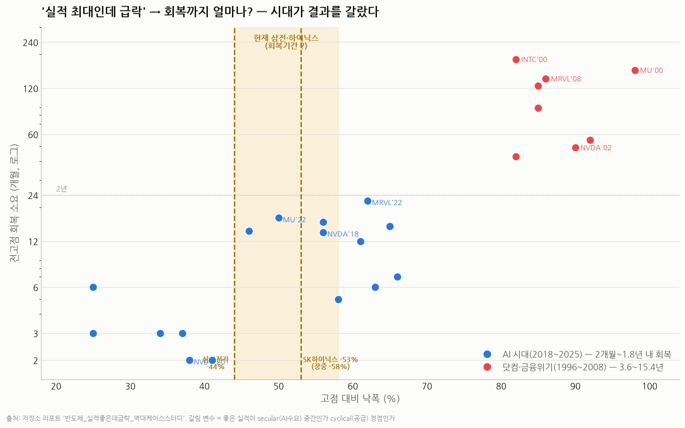

# 메모리 반도체 급락, 왜? — 2026년 7월 다각도 해석 리포트

> 작성일: 2026-07-29 · 카테고리: 시장브리핑(반도체·메모리)
> 대상: 삼성전자(005930)·SK하이닉스(000660) 및 글로벌 메모리 밸류체인
> 성격: "실적은 사상 최대인데 왜 이렇게 빠지나"를 **하나의 원인으로 단정하지 않고 8개 렌즈로 다각도 해석**. 최신 시세·뉴스 + 저장소의 역사 사례 리포트(3종)를 결합.

---

## 0. 무슨 일이 벌어졌나 (2026-07-29 기준)

**단발 급락이 아니라 약 2개월에 걸친 대폭락이다.** 사상 최고가 대비 낙폭이 이미 반 토막 안팎:

| 종목 | 사상 최고가 | 현재가(7/29~30) | **고점 대비 낙폭** |
|---|---|---|---|
| SK하이닉스(000660) | 298.7만원 (상반기 장중) | 140.1만원 종가 (장중 124.6만) | **−53% (장중 −58%)** |
| 삼성전자(005930) | 374,500원 (6/19 장중) | 211,000원 | **−44%** |

- **SK하이닉스 시총 1,000조원 하회**(959.8조, 4월 말 이후 3개월 만), 코스피 시총 비중 21.4%로 축소. 증권사 목표주가도 420만→280만원으로 하향.
- **7/2 하루 −14.57%**(2008년 금융위기 이후 17년 만의 최대 낙폭), 7/28 코스피 −10.84%, 7/29 SK하이닉스 −9.61% — **투매가 2개월째 누적**된 것이지 며칠 사이 일이 아니다.
- **SK하이닉스 2분기 매출 79.3조·영업이익 60.3조로 분기 사상 최대**인데도 주가는 무반응/하락 → 전형적 "실적 최대인데 급락".
- **외국인 약 2.6조원 투매**(삼성 −8,588억, SK −8,673억). SOX도 6월 고점 대비 −24.5%로 미국발 조정이 선행.
- 삼성전자는 급락으로 **예상 배당수익률 5.3%**까지 올라 배당 매력 부각.

> 핵심: "펀더가 무너져서"가 아니라 **급등분을 대부분 반납한 복합 조정**이다. 낙폭이 이미 −44~58%로 깊다는 점 — 즉 **밸류 리셋이 상당 부분 진행됐다**는 점이 해석의 출발점이다. 아래에서 8개 각도로 분해한다.

---

## 1. 다각도 해석 — 8개 렌즈

각 렌즈에 성격(🔴구조적 / 🟡혼재 / 🟢일시적)과 "이미 주가에 반영된 정도"를 함께 표기.

**① 밸류에이션·차익실현 🟢 (반영 높음)**
HBM 기대로 상반기 폭등(삼성 37.5만·하이닉스 298.7만 고점)한 뒤의 되돌림. 단기 급등 종목일수록 차익실현 매물이 크게 출회. "가장 먼저·가장 크게" 반영되는 일시적 요인이며, **이미 −44~58% 반납으로 상당 부분 소화**됐다.

**② AI capex 피크아웃 & 거품론 🟡 (반영 진행 중)**
조정의 미국발 핵심. 알파벳이 capex를 대폭 늘리며 잉여현금흐름(FCF)이 악화되자, 시장이 **AI 성장성보다 "투자비용·자금조달 부담"에 주목**하기 시작. 바클레이스: "자금조달 불확실성·capex 증가·빅테크 FCF 우려가 핵심 쟁점." 여기에 **메타가 잉여 컴퓨팅 파워로 클라우드 사업 진출을 검토**한다는 보도가 "AI 인프라 수요가 생각보다 약한 것 아니냐"는 해석을 촉발. 월가는 "거품론 vs 저가매수"로 양분.

**③ 메모리 사이클 정점 논쟁 🟡 (핵심 변수)**
저장소 리포트의 프레임: **주가는 실적보다 6~14개월 먼저 꺾인다.** 사이클 고점에선 EPS가 사상 최대라 후행 PER이 가장 싸 보이는 `peak earnings, trough PER` 함정이 생긴다. **진짜 방아쇠는 실적도 셀사이드 하향도 아닌 "메모리 가격(현물→고정)의 하락 전환"** 이다. 최근 **"D램·낸드 ASP가 2026년 중반 정점을 찍을 수 있다"**는 우려가 제기되기 시작 — 아직 실제 가격 하락 전환은 아니지만, 시장이 '정점 임박'을 선반영하려는 조짐(2절 정당화 근거와 대조).

**④ "실적 최대 = 최저 PER" 함정 🟡**
마이크론 2018 원형: 주가 고점(2018.5.30 $64.66) → 영업이익 사상 최대(2018.8 분기 $4,377M)는 **한 분기 뒤**. 그 해 사상 최대 실적을 내고도 주가는 −22.8%. 지금 SK하이닉스의 "사상 최대 실적 + 주가 무반응"이 이 패턴과 겹쳐 보이는 게 시장의 공포.

**⑤ 중국 CXMT 경쟁 진입 🔴 (반영 낮음·장기)**
창신메모리 7/27 상하이 상장, 첫날 +466%, 약 12.5조원 조달(2026 아시아 최대 IPO). 2025 글로벌 DRAM 점유 7.7%로 4위, **DDR4 반값 공급**으로 압박. 저장소 "경쟁자 등장" 프레임으로 보면 **멀티플 충격 = 경쟁 실현 × 방어 실패 여부**. 아직은 레거시(DDR4) 중심이라 하이엔드(HBM4) 해자는 유효 → 한미반도체식 "압축"이지 인텔식 "붕괴"는 아님. 단 장기 구조 변수.

**⑥ 수급·기계적 요인 🟢 (반영 높음)**
외국인 2.6조 투매 + **레버리지 ETF의 기계적 리밸런싱** + 단일종목·지역(삼전닉스) 쏠림. 이틀 연속 두 자릿수 낙폭은 펀더보다 **마진콜·강제 청산성 매물**을 시사.

**⑦ 매크로·시스템 🟡**
연준 신임 의장(케빈 워시) 매파 스탠스, 금리·환율. 특히 **이틀 연속 코스피 두 자릿수 폭락**은 개별 업종 이슈를 넘는 시스템성 디레버리징 신호 — 단기 변동성이 펀더와 무관하게 커질 수 있음.

**⑧ 심리·내러티브 🟢**
스탠다드차타드 "한국 주식 낙관론 정점"(5월), 마이크론 내부자 매도 최고 빈도 등 후기 사이클 행태 신호. 단 내부자 매도는 대부분 사전 자동매도(10b5-1)라 단독 신호로는 약함.

> 프레임 요약: **우하(밸류·수급·차익실현)는 일시적이고 이미 소화 중**, **좌상(2027~28 공급과잉·CXMT)은 아직 덜 반영된 구조 리스크**. 지금 급락의 방아쇠는 우하지만, 진짜 추적해야 할 건 좌상이다.

---

## 2. 그럼에도 현재 밸류에이션·가격을 "정당화"할 수 있는 근거 (Bull Case)

급락 서사만큼 중요한 반대편. 지금 가격이 과대평가가 아니라고 볼 근거들:

1. **HBM 슈퍼사이클은 secular(구조적 성장)의 중간이지 정점이 아니다.** HBM이 전체 DRAM 생산에서 차지하는 비중이 5% 미만 → 2026년 30%로 급등. SemiAnalysis("Memory Mania"): "정점 근처도 아니다, 2027년까지 가격 다시 두 배." 공급부족은 2026 내내 지속 전망.

2. **사상 최대 실적은 실재한다 → 이익이 밸류를 정당화.** SK하이닉스 2분기 매출·영업이익 모두 기록 경신. 마이크론 EPS는 올해 약 $61(약 7배 증가)→내년 $118 전망. **이익 급증으로 forward PER이 오히려 낮아져**, 보수적 할인을 반영해도 저평가 영역이라는 진단(마이크론 상승여력 80% 진단 사례).

3. **가격 지표가 아직 실제로 꺾이지는 않았다(가장 결정적).** TrendForce 2Q26 전망 D램 고정가 +58~63%, 낸드 +70~75% QoQ. 현물가도 (+) 유지, 하락 롤오버는 아직 없음. 저장소 프레임상 **사이클 정점의 진짜 방아쇠(현물→고정가 하락 전환)가 아직 확인되지 않았다** → 지금 급락은 "가격 하락"이 아니라 "밸류·수급 리셋"에 가깝다. (단, "ASP 2026 중반 정점" 우려가 나오기 시작한 만큼 이 지표는 최우선 관찰 대상.)

8. **밸류에이션 리셋이 이미 깊다.** −44~58% 하락으로 급등분을 대부분 반납. 하향 조정된 SK하이닉스 목표주가(280만)조차 현재가(140만) 대비 +100% 괴리(후행 지표지만), 삼성전자 배당수익률 5.3% 등 **하방을 받쳐주는 지지선이 형성**됐다. 상방/하방 비대칭이 급락 전보다 개선됐다.

4. **수요(빅테크 capex)는 오히려 상향.** 알파벳 올해 capex 전망 1,900억→**2,050억달러 상향**. 'SF AI 서밋'에서 국내 기업–글로벌 빅테크 **총 9,500억달러 규모 협력** 발표. "AI 투자 피크아웃"의 직접 반증.

5. **LTA(장기공급계약) 확대 = 사이클주 디레이팅 논리 약화.** 메모리가 장기계약으로 실적 변동성을 낮추면, "사이클 정점엔 낮은 PER" 함정 논리가 약해지고 **기업가치 재평가(리레이팅)**로 이어질 수 있음.

6. **CXMT는 아직 "소문/초기 실현"이지 "해자 붕괴"가 아니다.** 점유 7.7%·DDR4 중심으로 하이엔드(HBM3E/4)와 세대 격차가 크다. 저장소 경쟁 사례상 이런 국면은 **"압축"(한미반도체: 경쟁 실현에도 71% 1위·고마진 유지)**에 해당하지, 인텔식 "붕괴"가 아니다.

7. **역사적으로 AI 시대의 급락은 세일이었다.** (3절 참조) 좋은 실적이 secular의 중간이면, 낮아 보이는 PER은 함정이 아니라 진짜 싼 것.

> 요컨대 정당화 근거의 핵심은 **"가격(현물·고정가)이 아직 상승 중 + 수요(capex)가 상향 + 이익이 실재"** 라는 세 가지다. 이 셋이 유지되는 한 현재 밸류는 버블이라기보다 "급등 후 리셋"으로 해석할 여지가 크다.

---

## 3. 역사적 렌즈 — "실적 최대인데 급락", 그 다음엔 반등했나?

저장소 케이스 스터디 결론: **결과를 가른 건 낙폭이 아니라 "시대(=좋은 실적의 성격)"였다.**

- **🟢 AI 시대(2018~2025)의 −25%↑ 급락 17건은 예외 없이 2개월~1.8년 내 전고점 회복.** (NVDA'20 2개월, SOXX'22 14개월, MRVL'22 22개월 등) → secular 성장의 되돌림 = 세일.
- **🔴 닷컴·금융위기(1996~2008)는 회복에 3.6~15.4년.** (인텔'00 15.4년, 마이크론'00 13.1년, TSMC'00 10.3년) → 진짜 순환 정점 + 공급과잉 + 버블 밸류.
- **갈림 변수 = ⓐ secular(AI 수요) 중간인가 ⓑ cyclical(메모리 공급) 정점인가 + 메모리 가격의 하락 전환 여부.**

> **현재 위치**: 삼성전자 −44%, SK하이닉스 −53%(장중 −58%)는 **AI 시대의 회복 사례군과 정확히 같은 낙폭대**에 있다 — 마이크론'25 −58%(→5개월 회복), AMD'25 −63%(→6개월), 엔비디아'22 −66%(→7개월), 마이크론'22 −50%(→17개월). 즉 **낙폭의 크기만으로는 "그룹 A(세일)"와 전혀 모순되지 않는다.** 반대로 닷컴·금융위기 그룹은 −82~98%로 지금보다 훨씬 깊었다. 결국 관건은 낙폭이 아니라 secular냐 cyclical이냐(=가격 전환 여부)다.

---

## 4. 지금 어느 쪽인가 — 판별 5대 지표 현재값

| 지표 | 현재 상태(2026-07) | 신호 |
|---|---|---|
| ① HBM·DRAM 현물/고정가 | 아직 상승(+), 하락 롤오버 없음 | 🟢 정점 아님 |
| ② 빅테크 AI capex 가이던스 | 알파벳 상향(2,050억$), 9,500억$ 협력 | 🟢 수요 견조 |
| ③ 메모리 3사 증설·가동률 | HBM4 증설 지연·DDR5 전환 이슈 | 🟡 공급규율 vs 차질 |
| ④ AI ROI 증거 | 회의론 부상하나 capex는 지속 | 🟡 논쟁 중 |
| ⑤ 밸류에이션 리셋 정도 | SOX −24.5%·메모리 −25~30% 조정 | 🟡 일부 리셋 |
| (+) 중국 CXMT 실현도 | 레거시(DDR4)·점유 7.7%, HBM4 격차 | 🟢 단기 / 🔴 장기 |

**펀더(①②)는 아직 secular, 행태·수급(⑤ + 외국인 투매)은 후기 사이클 신호** — "행태는 후기, 펀더는 아직"의 혼재 국면.

---

## 5. 종합 해석 (판단)

- **이번 급락은 단일 악재가 아니라 복합 조정**이다. 방아쇠는 우하(밸류·수급·매크로 디레버리징)이고, 이 부분은 일시적·이미 소화 중이다. 낙폭이 이미 −44~58%로 **밸류 리셋이 상당 부분 진행**됐다.
- **아직은 "그룹 A(세일)" 성격에 가깝다는 게 base case** — 현물·고정가가 아직 안 꺾였고 capex가 상향됐기 때문. 역사적으로 이 조건에서 −44~58% 낙폭은 AI 시대에 5~17개월 내 회복됐다.
- **단, 진짜 리스크는 좌상(2027~28 공급과잉 + CXMT)** 이다. 이건 아직 주가에 덜 반영된 구조 변수로, 여기서 균열이 확인되면 "그룹 B(순환 정점)"로 재분류해야 한다.
- **이틀 연속 두 자릿수 폭락은 펀더보다 강제 청산성** — 단기 변동성은 펀더와 무관하게 극심할 수 있으니 방향 단정은 금물.
- ⚠️ **caveat**: 삼성·SK하이닉스의 "주가 고점 vs 실적 고점 시차"는 저장소 리포트도 **미검증(🔍)**으로 명시했다. 마이크론만큼 확신하지 말 것.

> 한 줄 결론: **"현물·고정 메모리 가격이 하락 전환하기 전까지는 사이클 정점이 확정된 게 아니다."** 그 전까지의 급락은 밸류 리셋·수급·매크로 성격일 가능성이 크고, 정당화 근거(2절)도 여전히 유효하다. 다만 CXMT·2027 공급과잉은 새로 추적해야 할 구조 변수다.

---

## 6. 트래킹 체크리스트 (매주/매월)

- [ ] DRAM·NAND **현물가** 주간 방향 (하락 전환 = 최우선 경고)
- [ ] 분기 **고정거래가(contract)** 상승폭 둔화/하락
- [ ] 빅테크 **capex 가이던스** (알파벳·MS·메타·아마존) 상·하향
- [ ] SK하이닉스·삼성 **HBM4 양산·수율·LTA** 진행
- [ ] **CXMT** HBM/DDR5 진입 속도·실제 점유율·가격 언더컷
- [ ] 재고일수 / book-to-bill < 1 전환 여부
- [ ] 외국인 수급·레버리지 ETF 자금 흐름 정상화 여부

---

## 리스크 · 유의사항

1. 본 문서는 투자 조언이 아니라 **해석 프레임**이다. "원인 프레임" 차트의 위치는 주관적 평가다.
2. 시세·실적 수치는 급변 중이며(7/29 장중 기준), 최종 종가·확정 실적과 다를 수 있다.
3. 삼성·SK의 주가-실적 시차, CXMT의 실제 위협 강도는 미확정 변수다.
4. 방향(반등/추가하락) 단정보다 **가격 지표(현물·고정가) 전환 여부**를 데이터로 추적할 것.

---

## 참고 출처

- [SK하이닉스 고점 298만→124만, 고점 대비 −58% (헤럴드경제)](https://biz.heraldcorp.com/article/10824681)
- [SK하이닉스 시총 1,000조 하회·삼성도 위태 (SBS)](https://news.sbs.co.kr/news/endPage.do?news_id=N1008680669)
- [SK하이닉스 목표주가 420만→280만 하향·삼성 배당매력 5.3% (파이낸셜뉴스)](https://www.fnnews.com/news/202607290929317152)
- [메타 클라우드 진출 검토·ASP 2026 중반 정점 우려 (뉴스핌)](https://www.newspim.com/news/view/20260604001299)
- [삼전·하이닉스 급락 원인 복합 분석 (아주경제)](https://www.ajunews.com/view/20260728100214649)
- [외국인 2.6조 투매 (한스경제)](https://www.hansbiz.co.kr/news/articleView.html?idxno=852381)
- [AI 반도체 급락…거품론 vs 저가매수 (파이낸셜뉴스)](https://www.fnnews.com/news/202607291006183352)
- [AI 피크아웃 우려·9500억달러 반론·SOX −24.5% (파이낸셜뉴스)](https://www.fnnews.com/news/202607270723069592)
- [빅테크 capex 상향 (머니투데이)](https://www.mt.co.kr/industry/2026/07/23/2026072315081745421)
- [SK하이닉스 2Q 사상 최대 실적에도 주가 지지부진 (헤럴드경제)](https://biz.heraldcorp.com/article/10824159)
- [CXMT 상장 첫날 +466% (글로벌이코노믹)](https://www.g-enews.com/article/Global-Biz/2026/07/2026072807081349fbbec65dfb_1)
- [CXMT DDR4 반값 공급 압박 (GeekNews)](https://news.hada.io/topic?id=26903)
- [마이크론 상승여력 80% 진단 (글로벌이코노믹)](https://www.g-enews.com/article/Global-Biz/2026/07/202607150554129749fbbec65dfb_1)

**저장소 연계 리포트**
- `반도체/산업·테마분석/반도체_실적좋은데급락_역대케이스스터디_반등했나.md`
- `반도체/산업·테마분석/메모리슈퍼사이클_주가고점_트리거_역사분석.md`
- `반도체/산업·테마분석/독점기업_경쟁자등장_밸류에이션_역사사례연구.md`

> 유의: 시세·실적·점유율·전망치는 언론·기관 추정이며 시점에 따라 달라진다. 역사 사례 수치는 저장소 리포트 기준이다. 확정치는 각 사 공시·원문으로 교차확인을 권한다.
