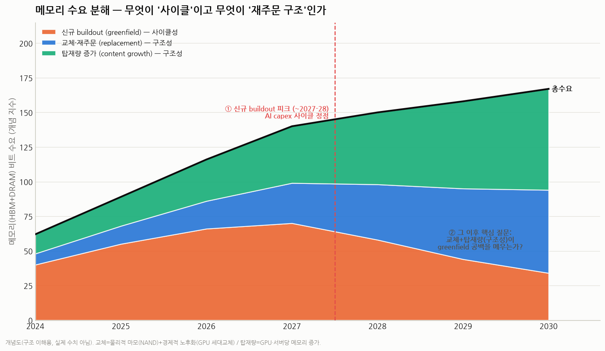
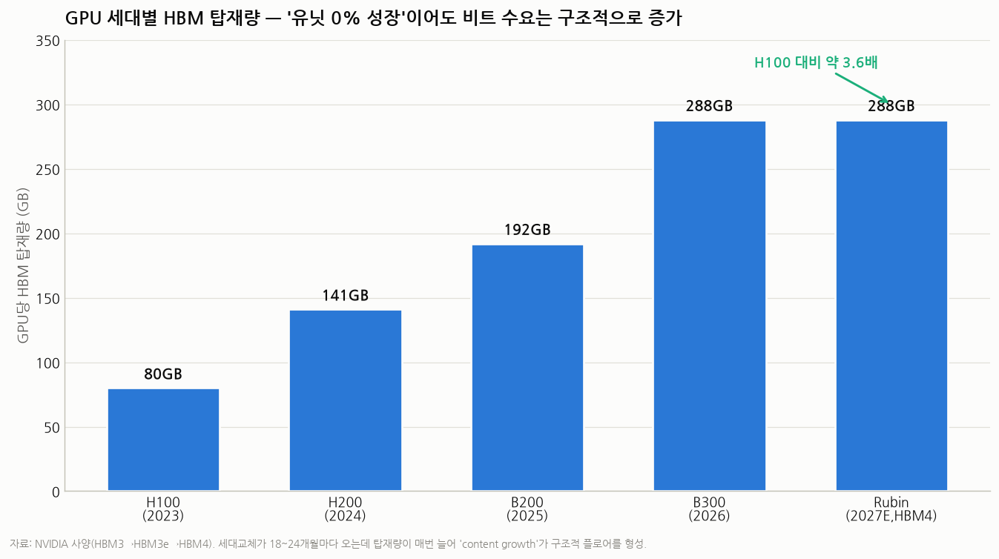
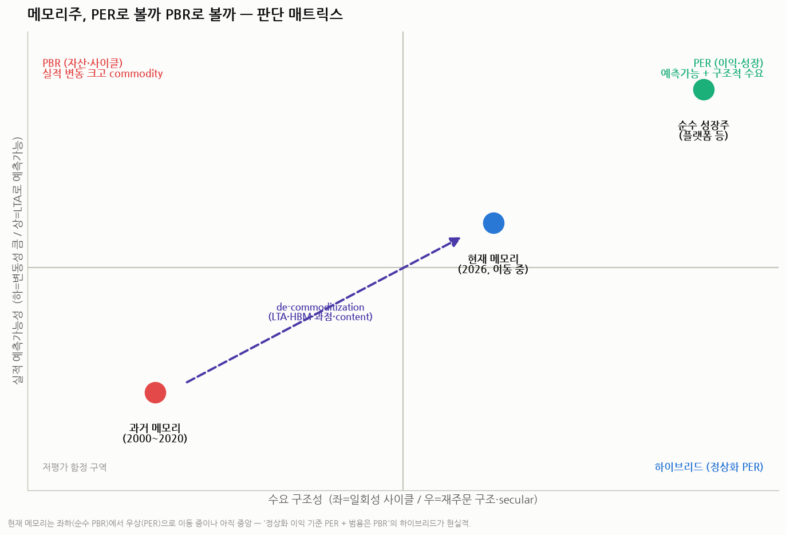

# 메모리 수요는 '재주문 구조'인가 '일회성 buildout'인가 — PER vs PBR 판단 프레임

> 작성일: 2026-07-29 · 카테고리: 시장브리핑(반도체·메모리 밸류에이션)
> 질문: HBM·레거시 메모리 수요가 **시간이 지나면 재주문이 들어올 수밖에 없는 구조**여서 꾸준한가, 아니면 **이번 AI 인프라 확충 사이클이 끝나면 재주문이 끊겨** 2~3년 뒤 약해지는가. 이 판단이 곧 **메모리주를 PER로 볼지 PBR로 볼지**를 가른다.
> 근거: 저장소 반도체·메모리 리포트(공급병목·메모리사이클·HBM밸류체인·선행밸류에이션 등) + 최신 시장자료.

---

## 0. 왜 이 질문이 밸류에이션을 가르나

- **일회성 buildout(사이클)이면** → 지금의 사상 최대 이익은 지속 불가 → 정점엔 EPS가 최대라 후행 PER이 가장 싸 보이는 **`peak earnings, trough PER` 함정** → **PBR(자산·사이클 밴드)로 봐야** 함(밴드 하단 매수·상단 매도).
- **재주문 구조(secular)이면** → 이익이 반복·예측 가능 → **PER(이익 멀티플)로 재평가** 가능.
- 실제로 시장은 지금 **"PBR→PER 패러다임 전환"을 논쟁** 중이다(SK증권 *New paradigm, New multiple*). 핵심 논거가 **LTA(장기공급계약)로 실적 예측가능성이 올라갔다**는 것.

그래서 답의 열쇠는 하나다: **AI 인프라가 다 깔린 뒤에도 "재주문"이 들어오는가?**

---

## 1. 수요를 3가지로 분해하면 답이 보인다

메모리 수요 = **① 신규 buildout(greenfield) + ② 교체·재주문(replacement) + ③ 탑재량 증가(content growth)**

- **① 신규 buildout 🟠 = 사이클성.** 새 AI 데이터센터·클러스터 증설. AI capex에 직접 종속. **이번 확충이 끝나면 줄어드는 부분이 바로 여기다.** 2027~28 capex 정점이 이 부분의 피크.
- **② 교체·재주문 🔵 = 구조성(단, 조건부).** 설치 기반이 쌓일수록 커진다. 동인은 두 가지 — 물리적 마모(NAND)와 **경제적 노후화(GPU 세대교체)**.
- **③ 탑재량 증가 🟢 = 가장 확실한 구조성.** GPU·서버당 메모리가 매 세대 늘어난다. **유닛이 0% 성장해도 비트 수요는 증가.**

> 핵심: 사용자의 질문("buildout 끝나면 절벽인가")은 **①만 보면 절벽**이지만, **②+③가 ①의 공백을 얼마나 메우는가**가 진짜 쟁점이다. 아래에서 ②③가 실제로 얼마나 단단한지 따진다.

---

## 2. 메모리 종류별 '수명 × 재주문' 구조 — 여기가 핵심

"수명이 있어서 재주문이 들어오는가"는 **메모리 종류마다 완전히 다르다.**

| 종류 | 물리적 수명 | 경제적 수명(교체 동인) | 재주문 성격 | 마진 |
|---|---|---|---|---|
| **범용 DRAM** | 사실상 반영구(서버 수명에 종속, 마모 미미) | 서버 리프레시 **3~5년** | 서버 교체 + 탑재량 | 중 |
| **HBM** | 반영구(GPU에 종속) | **GPU 세대 18~24개월** vs 감가상각 5~6년 → **경제적 노후화가 조기 교체 유발** | 세대교체 + 탑재량 + greenfield **(AI ROI 조건부)** | 최고 |
| **NAND** | **유한 — P/E 사이클 한계, DWPD로 마모** | write 워크로드 마모 | **물리적으로 닳아 무조건 재주문(진짜 소모품)** | 저~중 |

**해석 — "재주문이 들어올 수밖에 없는 구조"는 종류마다 참/거짓이 다르다:**

- **NAND는 물리적으로 참.** P/E 사이클이 유한하고(데이터센터 SSD 0.3~10 DWPD 보증), write가 많으면 닳아서 교체된다. 진짜 소모품 = 재주문 구조. **단, 마진이 낮고 진폭이 커 "하락장의 카나리아"**(6社 난립·QLC 즉효증량).
- **HBM은 물리적으론 안 닳지만, 경제적으로 조기 노후화된다.** 엔비디아가 18~24개월마다 신세대를 내놓고(H100→H200→B200→B300→Rubin), 신세대가 압도적 perf/watt를 주니 구세대 가속기(+거기 붙은 HBM)가 경제적으로 폐기된다. 실제로 하이퍼스케일러가 서버 수명을 다시 단축 중(아마존 6→5년, "AI 기술 발전 속도" 명시; Nadella "한 세대에 4~5년 감가상각으로 묶이기 싫다"). → **세대교체가 HBM 재주문을 만든다. 단 이건 "AI가 돈이 돼서 계속 교체·증설한다"는 전제**(=AI ROI 조건부).
- **범용 DRAM은 서버 리프레시(3~5년) 사이클 + 탑재량 증가.** 마모는 미미하나 content growth가 확실한 플로어.

> **결론(2절):** 재주문 구조의 강도는 **NAND(물리적·확실·저마진) > content growth(구조적·확실·전방위) > HBM 경제적 노후화 교체(강하나 AI ROI 조건부) > 범용 DRAM 서버교체(사이클)** 순. **가장 확실한 secular 플로어는 "탑재량 증가"다.**

---

## 3. 탑재량 증가(content growth) — 가장 단단한 구조적 플로어

GPU당 HBM: **H100 80GB → H200 141 → B200 192 → B300 288 → Rubin 288(HBM4), AMD MI400은 432GB.** 3년 만에 **약 3.6배.** 세대교체가 18~24개월마다 오는데 **매번 탑재량이 늘어**, 설령 GPU 출하 대수가 정체돼도 비트 수요는 구조적으로 증가한다.

**HBM만이 아니다 — "5중 수요 중첩"(저장소 공급병목 리포트):**
- AI HBM + 커스텀 ASIC(TPU v7 192GB, Trainium3 144, Maia200 216) + 서버 DDR5 + **AI PC(8→16~32GB, ×2~4)** + **AI 스마트폰(iPhone 8→12GB +50%)**
- **차량 DRAM 2022 385M GB → 2026 2.1B GB(+445%)**, 레벨4 자율주행·휴머노이드는 차량당 **300GB(현 16GB의 ×20)**

→ content growth는 **AI 데이터센터 buildout과 무관하게도 도는** 전방위 구조적 수요다. 이 부분이 "재주문 구조" 주장의 가장 단단한 근거.

---

## 4. 공급 측이 구조를 강화한다 — HBM 웨이퍼 3배 잠식

수요만이 아니라 **공급이 비탄력적**이라 사이클 진폭이 과거보다 줄어든다.

- **HBM 1GB = 표준 DDR5 1GB 대비 웨이퍼 면적 3배**(TSV·다층 stack·KGD 선별손실). 전체 DRAM wafer start의 **40%+가 이미 HBM으로 재배치(영구적)** → 범용 DRAM 공급 잠식 → DDR4 몸값 폭등.
- 캐파 증설 리드타임 **12~18개월**(계단식·비탄력), 클린룸 본격 확보 분기점 **2027 상반기**.
- 그 결과 **DRAM은 2030년까지 구조적 공급부족** 전망(2026 −10% → 2028 −29% 부족, 딥뱅크 인용). 2026 DRAM 비트공급 +10~15% vs 수요 +30%.
- **LTA로 물량이 이미 묶임**: SK **2028년까지 매진**, 마이크론 take-or-pay **약정 $22B+(선수금 ~$18B)**, MS 122TB QLC 대규모 LTA.

→ 공급이 비탄력적 + LTA로 선판매되면 **가격·실적 변동성이 과거 순수 commodity 사이클보다 작아진다.** 이게 "PER 재평가"의 공급 측 근거.

---

## 5. 구조적 근거 vs 사이클 근거 — 대차대조표

| 구조적(재주문 지속·PER 지지) | 사이클(일회성 buildout·PBR 지지) |
|---|---|
| HBM 비중 5%미만→2026 30%, TAM $35bn(’25)→$100bn(’28) | **2027~28 공급과잉 시나리오**(사상 최대 capex 완공분) |
| content growth 3.6배 + 5중 수요 중첩(전방위) | **AI capex 피크아웃**(2027 Q1 가이던스 컷이 트리거, Meta FCF −90%) |
| HBM 웨이퍼 3배 잠식(영구적)·DRAM 2030까지 부족 | **GPU 감가상각 압력 2027 본격화** → 교체 대신 폐기·중단 위험 |
| LTA 매진(SK 2028·마이크론 $22B) → 변동성↓·리레이팅 | `peak earnings, trough PER`(SK 후행 20.6배 vs 선행 5.4배) |
| NAND 물리적 마모 = 확실한 재주문(저마진) | CXMT·중국 레거시 진입, ASIC 다변화, DeepSeek류 효율화 |

**두 진영의 공통 판정 열쇠(모든 저장소 리포트 일치):** **현물·고정 메모리 ASP의 하락 전환 여부.** 2026-07 현재 계약가는 **3Q26 +13~18% QoQ 상승 중(아직 미전환)** → "경계하되 정점 미확정".

---

## 6. 그래서 PER인가 PBR인가 — 판단

**이분법이 아니라 "이동 중"이다.** 메모리는 과거 순수 commodity(좌하·PBR)에서 **de-commoditization**(LTA·HBM 커스텀·3사 과점·content growth)으로 **우상(PER)을 향해 이동**하고 있으나, 아직 **중앙**에 있다(greenfield 사이클성·2027~28 공급과잉 리스크가 남아서).

**실무적 결론 — 하이브리드로 봐라:**

1. **후행 PER은 쓰지 마라.** 지금은 이익이 사상 최대라 후행 PER이 가장 싸 보이는 **함정 구간**(SK 후행 20.6배 vs 선행 5.4배). "PER 6배니까 싸다"는 정점의 착시일 수 있다.
2. **옛날식 순수 PBR도 과소평가다.** HBM 리레이팅을 못 담는다. HBM 매출 50%+인 SK하이닉스는 **"AI 인프라 play로 재분류" 중**이라 P/B가 옛 메모리 밴드(0.8~1.5배)를 넘어 **AI 인프라(2.0~2.5배)로 상향**됐다(실제 SK P/B 역사 상단 돌파).
3. **→ 3중 렌즈 하이브리드가 현실적:**
   - **정상화(mid-cycle) 이익 기준 PER** — peak EPS에 peak PER 곱하지 말고, 사이클 평균 이익에 정상 멀티플.
   - **상향된 P/B 밴드** — 사이클 앵커는 유지하되 밴드 자체를 AI 인프라 쪽으로 올려서.
   - **EV/EBITDA** — 메모리는 감가상각이 거대(capex가 매출 30%+)해 EBITDA가 PER보다 정직.
   - **부분별로: HBM/선단 = 성장(PER) 멀티플, 범용/레거시 = P/B 밴드.** (삼성은 파운드리 적자로 연결 PER이 희석 → **SOTP로 봐야** 메모리 저평가가 보임.)

> **한 줄 답:** 메모리는 이제 **"완전한 사이클(PBR)"도 "완전한 성장(PER)"도 아닌, 진폭이 줄어드는 준(準)구조 자산**이다. **정상화 이익 기준 PER + 상향된 P/B 밴드의 하이브리드**로 보되, **PER 쪽으로 완전히 넘어갈지는 "greenfield 둔화 후에도 교체+탑재량이 플로어를 지키는가 + LTA가 갱신되는가 + ASP가 안 꺾이는가"** 세 가지가 확인돼야 한다.

---

## 7. 시간축 — 2~3년 후는 어떻게 되나 (사용자 가설에 대한 답)

- **2026~2028 (향후 2~3년): 강하다 — 논쟁 거의 없음.** LTA 매진 + greenfield + content + 공급 타이트(웨이퍼 3배 잠식, 캐파 2027 상반기). 사용자가 말한 "2~3년은 성과 잘 난다"가 맞다.
- **2027~2028 변곡점: 여기가 진짜 리스크.** 사상 최대 capex의 완공분이 공급으로 쏟아지고(공급과잉 시나리오), 동시에 greenfield가 둔화. **결정적 신호는 2027년 1~2월 빅테크 4Q 어닝(2027 가이던스)** — 여기서 capex 컷이 나오면 "Burst 시나리오(확률 ~20%)"에서 메모리 −50%.
- **2028 이후: 절벽이냐 완만한 둔화냐 = ②+③에 달림.**
  - **완만(구조 우위)**: 설치 기반이 충분히 커져 **경제적 노후화 교체 + content growth + NAND 마모**가 greenfield 공백을 상당 부분 메움 → 사이클 진폭이 과거보다 얕아짐 → PER 재평가 지속. (차트1의 base 궤적)
  - **절벽(사이클 우위)**: AI ROI 실망으로 하이퍼스케일러가 **구세대를 교체 안 하고 방치·중단** → HBM 재주문 끊김 + greenfield 급감 + 2027~28 증설 완공 겹침 → 전형적 공급과잉 → PBR 회귀.

> 즉 **"buildout 끝나면 무조건 절벽"은 과장**이다(content growth·NAND 마모라는 확실한 플로어가 있음). 하지만 **"영원한 재주문 구조"도 과장**이다(가장 큰 스윙 요인인 greenfield+HBM 교체가 AI ROI에 조건부). **답은 2027 가이던스와 ASP 방향에서 나온다.**

---

## 8. 트래킹 지표 (PER↔PBR 전환 판단용)

- [ ] **현물·고정 ASP 방향** — 하락 전환 시 즉시 PBR 모드(최우선)
- [ ] **2027년 1~2월 빅테크 4Q 어닝 = capex 가이던스** — 확충 지속 vs 컷
- [ ] **LTA 갱신·기간·비중** — 2028 이후로 연장되는가(예측가능성 유지)
- [ ] **HBM 설치기반 실제 교체율 / GPU 감가상각 수명 추이**(아마존·MS·메타)
- [ ] **DRAM 비트 수급률**(2028 −29% 부족 전망이 유지되나)
- [ ] **NAND eSSD 침투율**(NAND 사이클 반등 열쇠)
- [ ] **CXMT의 HBM/DDR5 진입 속도**(장기 구조 변수)

---

## 리스크 · 유의사항

1. 본 문서는 투자 조언이 아니라 **분석 프레임**이다. 차트 1·3은 개념도(주관)이며 실제 수치가 아니다.
2. 공급과잉·감가상각·CXMT의 실제 강도는 미확정 변수다. 특히 **2028 이후 replacement 플로어의 크기는 AI ROI에 조건부**다.
3. LTA "3년치 예약"은 계약 문구 해석차가 있어 분기 가이던스로 재검증이 필요하다.
4. 밸류에이션 결론(하이브리드)은 방향 제시이며, 개별 종목 목표주가는 최신 실적·ASP로 별도 산출해야 한다.

---

## 참고 출처

**최신 시장자료**
- [PBR→PER 패러다임 전환·LTA (비즈니스포스트)](https://www.businesspost.co.kr/BP?command=article_view&num=438692)
- [SK증권 "New paradigm, New multiple"](https://www.sks.co.kr/data1/research/qna_file/20251102145154208_0_ko.pdf)
- [삼전닉스 PER로 보면 아직 싸다·HBM 공식 (딜사이트)](https://dealsite.co.kr/articles/161902)
- [메모리 사이클과 PBR 재평가 (이코노미트리뷴)](https://www.economytribune.co.kr/news/articleView.html?idxno=3901749)
- [GPU 감가상각·서버 수명 단축 논쟁 (Tom's Hardware)](https://www.tomshardware.com/tech-industry/gpu-depreciation-could-be-the-next-big-crisis-coming-for-ai-hyperscalers-after-spending-billions-on-buildouts-next-gen-upgrades-may-amplify-cashflow-quirks)
- [HBM 웨이퍼 3배 잠식·캐파 병목 (The Economy Korea)](https://kr.economy.ac/news/2026/01/202601286384)
- [HBM 2027까지 공급확보·구조적 수요 (대한경제)](https://m.dnews.co.kr/uhtml/view.jsp?idxno=202604301308447950294)

**저장소 연계 리포트**
- `반도체/산업·테마분석/메모리반도체_공급병목분석리포트.md` (웨이퍼 3배·5중 수요·content 수치·P/B 밴드)
- `반도체/산업·테마분석/메모리3사_선행밸류에이션_비교_2026-07-10.md` (LTA·forward P/E·리레이팅)
- `일일공부/2026-07-24_D01_반도체_메모리사이클의구조.md` / `2026-07-25_D02_DRAM과NAND사이클의차이.md`
- `일일공부/2026-07-26_D03_반도체_HBM밸류체인.md` · `AI인프라/산업·테마분석/AI_Capex_피크시그널.md`
- `시장브리핑/메모리반도체_급락_다각도해석_2026-07.md`

> 유의: 수치·전망은 기관·언론 추정이며 시점에 따라 달라진다. GPU 탑재량은 NVIDIA 사양 기준. 확정치는 각 사 공시·원문으로 교차확인을 권한다.
