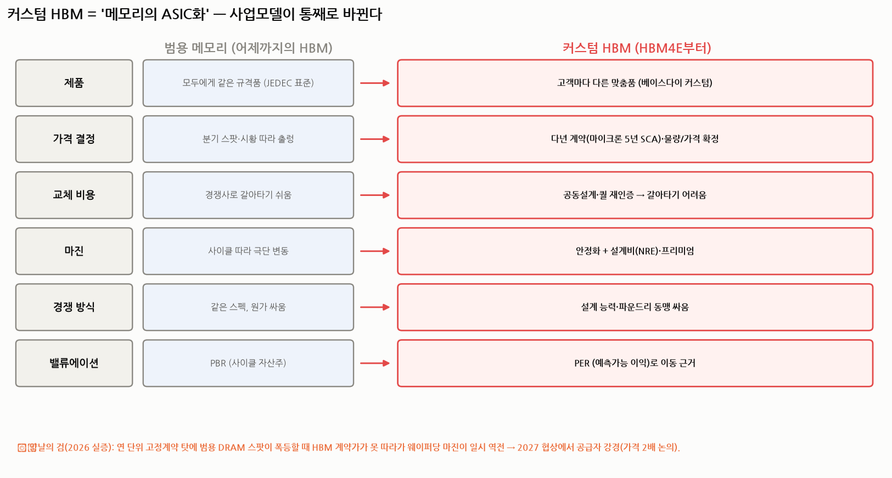
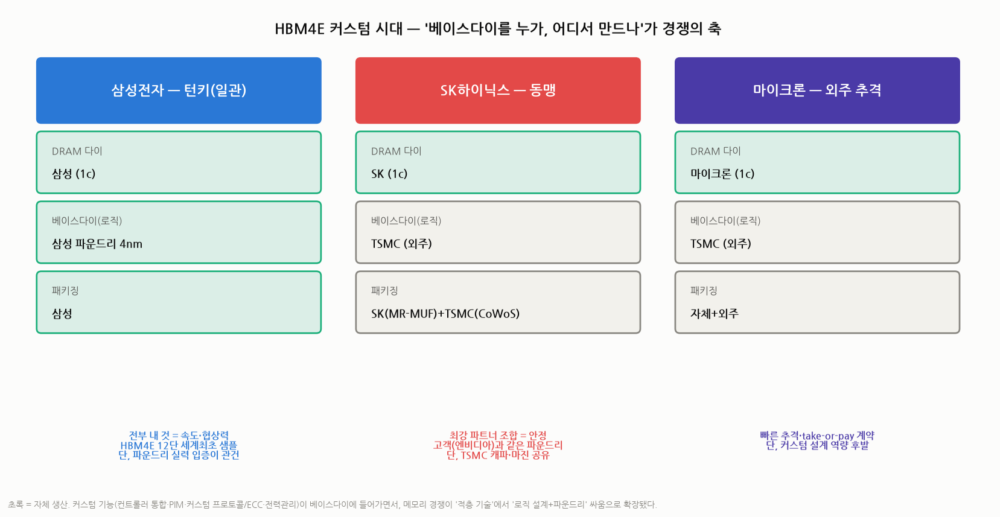

# 커스텀 HBM — '메모리의 ASIC화'가 바꾸는 산업 구조 (HBM 심화 ②)

> 작성일: 2026-07-30 · 카테고리: 반도체/산업·테마분석 · `배경지식/HBM_완전정복`의 후속 심화
> 질문: HBM4부터 베이스다이가 파운드리 공정으로 넘어가고 고객 맞춤(커스텀)이 된다는데, **이게 왜 단순 기술 변화가 아니라 '산업 구조의 변화'인가?** 가격 결정력·마진·경쟁 방식·밸류에이션이 어떻게 바뀌나.
> **검증 메모**: 삼성 HBM4E(GTC 2026)·SK×TSMC·마이크론 전략, 커스텀 기능(Rambus C-HBM4E 등), TrendForce 가격 동학으로 교차검증.

---

## 🔴 시장 상황 갱신 (2026-08-11) — 반드시 먼저 읽을 것

> **2026년 7월 한국 증시가 사상 최대 월간 낙폭을 기록했다. 이 문서의 산업 구조 분석은 유효하나, 주가·목표가·밸류에이션 수치는 전부 재확인이 필요하다.**

### 지수 경과

| 시점 | 코스피 | 코스닥 |
|---|---|---|
| 2026년 6월 고점 | 약 **9,385** (사상 최고) | — |
| 2026-06-30 | 8,476.48 | 916.18 |
| **2026-07-30** | **5,593** (6/30 대비 약 −34%) | — |
| **2026-07-31** | 6,595.45 — **하루 +17.91%(+1,001.89p) 사상 최대 반등** | 719.76 |
| **2026년 7월 월간** | **−22.19% (코스피 사상 최대 월간 낙폭)** | **−21.44%** |
| 2026-08-07 | 6,258.77 (주간 −5.11%) | 798.81 (주간 **+10.98%**) |
| 2026-08-10 | **6,306.33** | **807.66** |

**1997년 외환위기와 글로벌 금융위기 당시의 월간 낙폭을 넘어섰다.** 7월 7일과 7월 28–29일 서킷브레이커가 발동했다.

### 원인 (검증됨)

1. **메타 네오클라우드 발표** — 남는 AI 연산 자원을 외부 판매하겠다는 발표가 **"AI 연산이 남아돈다 → 메모리 수요 종료 → 반도체 사이클 끝"**으로 해석. 직접 방아쇠
2. **CXMT(창신메모리) 상장** — 중국 메모리 추격 가시화
3. **미 국채금리 급등** — 10년물 7월 말 4.75%, 30년물 5.19%
4. **레버리지 청산** — 상반기 누적된 레버리지 투자가 낙폭을 증폭

### 🔑 핵심 역설 — 실적은 사상 최대였다

| 회사 | 2026년 2분기 |
|---|---|
| **삼성전자** | 매출 171.5조 · **영업이익 89.5조원**(전년 대비 **+1,813.8%**) · OPM 52.2% · **DS 부문이 영업이익의 99.7%** |
| **SK하이닉스** | 매출 79.3조 · **영업이익 60.5조원**(OPM 76%) · 순이익 93.9조 · **반기 누적 매출 첫 100조 돌파** |

**이익이 아니라 "이익의 지속성"에 매겨진 멀티플이 무너졌다.**

### 시장 구조 변화

- **2026-06-22 SK하이닉스가 삼성전자를 제치고 코스피 시가총액 1위** — 2000년 11월 이후 **25년 7개월 만의 대장주 교체**
- **8월 첫주 대순환매**: SK하이닉스 −17.2%·삼성전자 −12.0% vs **KAI +21.1%·한화에어로 +19.6%·효성중공업 +17.2%·HD현대일렉 +11.4%**
- **미국은 사상 최고**(S&P500 8/7 7,757.64). 하이일드 스프레드 2.70%·VIX 15.46으로 **글로벌 시스템 위기가 아닌 한국 고유의 쏠림 해소**
- **원/달러 1,548.8(6/30) → 1,409.9(8/7)** — 원화 약 9% 절상
- 공매도는 **2025-03-31 전면 재개** 상태. MSCI는 **2026-06-23 한국을 신흥시장으로 유지**(관찰대상국 미등재)

*출처: 같은 저장소 `90_정기발간/2026-W32·W33 주간시장브리핑`(2출처 이상 교차검증), FRED 실측*

### 📌 반도체 섹터 추가

- **엔비디아가 차세대 HBM 사양을 재검토한다는 보도**(8월 첫주)로 SK하이닉스가 이틀 연속 하락
- **미국 반도체는 강세**(NVDA +11.6%, MRVL +16.6%, ASML +6.9%, TSMC +3.9%)인데 **한국 메모리만 약세** — 같은 AI 테마 안에서 밸류체인 위치에 따라 갈렸다
- 이 폴더에는 이미 급락을 다룬 문서가 있다: `메모리반도체_급락_다각도해석_2026-07`, `메모리수요_구조적인가_사이클인가_PERvsPBR_2026-07`, `반도체_실적좋은데급락_역대케이스스터디_반등했나`. **함께 볼 것**

---

## 0. 한 문장 요약

> **커스텀 HBM = 메모리가 '규격품(commodity)'에서 '고객별 맞춤품(ASIC)'으로 바뀌는 사건.** 판매 방식(스팟→다년계약), 교체 비용(쉬움→어려움), 경쟁 축(적층 기술→로직 설계+파운드리 동맹), 밸류에이션(PBR→PER)까지 **메모리 산업의 규칙 자체가 바뀐다.** 다만 2026년의 실증처럼 **고정계약은 양날의 검**(스팟 급등을 못 따라감)이다.

---

## 1. 무엇이 바뀌나 — '커스텀'의 실체

### 1.1 어디를 커스텀하나: 베이스 다이

HBM 스택의 DRAM 다이(위층들)는 여전히 표준에 가깝다. **커스텀되는 곳은 맨 아래 '베이스 다이(로직 다이)'** 다(☞ 배경지식편 3.2). HBM4부터 이게 메모리 공정이 아닌 **파운드리 로직 공정**으로 만들어지면서, 단순 '교통정리 칩'이 아니라 **고객이 원하는 기능을 심는 캔버스**가 됐다.

### 1.2 뭘 심나 (검증된 커스텀 메뉴)

| 커스텀 기능 | 쉬운 설명 | 고객이 얻는 것 |
|---|---|---|
| **컨트롤러 통합** (C-HBM) | GPU 쪽에 있던 메모리 컨트롤러를 HBM 베이스다이로 이사 | GPU 다이의 해안선(shoreline·입출력 자리) 절약 → 그 자리에 연산기 더 넣음, 전력↓ |
| **커스텀 프로토콜·가변 폭** | 그 고객 칩에만 맞는 통신 규칙·배선 폭 | 물리·프로토콜 레벨 공동 최적화 |
| **강화 캐시·메모리 간 전송** | 베이스다이에 임시 저장소·직통로 | 지연시간↓ |
| **전력 관리** | 적응형 전압조절·파워게이팅·동적 리프레시 | 전성비(성능/전력)↑ — 전력병목 시대의 핵심 |
| **커스텀 ECC·보안** | 고객만의 오류정정·암호화 | 신뢰성·보안 차별화 |
| **PIM(Processing-In-Memory)** | 메모리 안에서 일부 연산 수행 | 데이터 이동 자체를 줄임 — 성능 2배·에너지 −70% 급 잠재력 |

> 요컨대 **"GPU와 HBM의 경계가 허물어진다."** 엔비디아·AMD·구글의 칩 설계에 메모리사가 개발 단계부터 들어가 함께 그린다 — 이수페타시스가 고객 보드를 공동설계하듯, 이제 메모리도 그렇게 된다.

---

## 2. 왜 '산업 구조'가 바뀌나 — 규격품 → 맞춤품의 경제학

**범용 메모리의 저주**: 모두에게 같은 규격품(JEDEC 표준)을 파니, 경쟁은 원가 싸움이고 가격은 분기 스팟으로 출렁이며(사이클), 고객은 언제든 경쟁사로 갈아탄다. → 그래서 메모리는 전통적으로 **PBR(자산가치) 밴드**로 평가받는 사이클 산업이었다.

**커스텀이 깨는 것 4가지:**
1. **가격 결정 방식** — 스팟 → **다년 확정 계약**. 마이크론은 하이퍼스케일러와 **5년 전략고객계약(SCA)**, take-or-pay(안 가져가도 돈 내는) 조건까지. 매출 가시성이 분기→수년 단위로.
2. **교체 비용** — 표준품은 갈아타기 쉽지만, **공동설계한 커스텀 HBM은 재설계·재퀄 없이 못 바꾼다.** 고객 락인(lock-in).
3. **마진 구조** — 원가 경쟁 → **설계비(NRE)+프리미엄**. 잘 만든 커스텀은 경쟁 입찰이 아니라 수의계약에 가까워진다.
4. **경쟁의 축** — '누가 잘 쌓나(적층·수율)' → **'누가 로직을 잘 설계하고 어떤 파운드리와 동맹인가'**. 메모리 3사의 싸움에 TSMC·삼성 파운드리가 끌려 들어온다.

→ 이 넷이 곧 **"메모리를 PER로 볼 근거"**다(☞ `시장브리핑/메모리수요_PERvsPBR`). 실적이 예측 가능해지고 고객이 못 떠나면, 그건 사이클 상품이 아니라 준(準)성장 산업이다.

### ⚠️ 2026년의 실증 — 고정계약은 '양날의 검'

교과서적 반전이 실제로 일어났다. **2026년 범용 DRAM 스팟 가격이 폭등하자, 연 단위로 가격을 미리 묶어둔 HBM은 오히려 그 급등을 못 따라가 웨이퍼당 산출 가치·마진이 일시적으로 범용 DRAM보다 낮아지는 역전**이 발생(TrendForce). 안정성의 대가는 상방 포기다. 그 결과 공급 3사는 2027년 계약 협상에서 강경해졌고, **HBM 계약가 2배 인상** 논의까지 나온다(HBM이 2027년 DRAM 웨이퍼 스타트의 30%를 잠식하는 협상력 배경).

> 교훈: 커스텀·장기계약은 **변동성을 줄이는 것이지 가격을 항상 높게 만드는 게 아니다.** 리레이팅 논리는 "높은 마진"이 아니라 **"예측 가능한 마진"**에서 나온다.

---

## 3. 3사 전략 — 베이스다이를 누가, 어디서 만드나

| | **삼성전자 — 턴키** | **SK하이닉스 — 동맹** | **마이크론 — 외주 추격** |
|---|---|---|---|
| DRAM 다이 | 자체(1c) | 자체(1c) | 자체(1c) |
| **베이스다이** | **자체 파운드리 4nm** | **TSMC 외주** | **TSMC 외주** |
| 패키징 | 자체 | 자체(MR-MUF)+TSMC(CoWoS) | 자체+외주 |
| 상징 이벤트 | **HBM4E 12단 세계 최초 샘플, GTC 2026서 엔비디아 파트너십 공개** | HBM4 선행 양산, 엔비디아 물량 약 2/3 | HBM3E 완판·take-or-pay $22B+ |

**각 전략의 논리와 급소:**
- **삼성(턴키)**: 메모리+4nm 파운드리+패키징을 한 지붕에서 — 이론상 **속도·비용·기밀 유지 최강.** HBM3E 열세를 커스텀 시대의 구조로 뒤집으려는 승부수. 급소는 **파운드리 로직 공정의 실력·수율을 고객에게 입증**하는 것(과거 퀄 지연 전력).
- **SK(동맹)**: 최강 파트너 TSMC와 조합 — 고객(엔비디아)이 이미 쓰는 파운드리라 **호환·신뢰가 자연스럽다.** 급소는 **TSMC 캐파 경쟁(자사 물량이 엔비디아·애플과 줄서기)과 마진 공유**, 그리고 턴키 대비 조율 비용.
- **마이크론(외주)**: 설계 부담을 낮추고 빠르게 추격. 급소는 **커스텀 설계 역량의 후발성** — 커스텀 시대엔 '만드는 것'보다 '설계·공동개발'이 관건인데 여기가 얇다.

**관전 포인트**: 커스텀 시대엔 **고객이 3사를 '가격'이 아니라 '설계 파트너 적합성'으로 고른다.** 엔비디아가 요구한 커스텀 스펙을 누가 맞추느냐가 점유율을 재편한다 — "엔비디아 요구를 맞춘 곳" 경쟁이 이미 HBM4E에서 시작됐다.

---

## 4. 파급 효과 — 누가 웃고 누가 긴장하나

**🟢 수혜**
- **TSMC**: 메모리 3사 중 2곳의 베이스다이가 자기 팹으로 — 메모리 시장까지 고객화.
- **삼성 파운드리**: 턴키가 먹히면 만년 2위 파운드리의 돌파구(자사 메모리가 앵커 고객).
- **컨트롤러/IP 업체(Rambus 등)**: C-HBM용 컨트롤러 IP 신시장.
- **후공정·장비**: 커스텀화 = 세대·고객별 다품종 → 테스트·본딩 복잡도↑(한미반도체 등 장비 다변화).
- **메모리 3사 공통**: 락인·다년계약으로 **사이클 진폭 축소** → 리레이팅 근거.

**🔴 긴장**
- **엔비디아**: 메모리가 컨트롤러·연산(PIM)까지 흡수하면 **플랫폼 주도권 일부가 메모리사로** 넘어간다. (그래서 커스텀 요구를 자기가 주도하려 함.)
- **범용 DRAM 수요자**: HBM이 웨이퍼 30%를 잠식하며 범용 가격 급등의 구조화.
- **후발 진입자(중국 CXMT 등)**: 표준품이면 추격 가능하지만, **커스텀+동맹 구조는 복제 불가** — 진입장벽이 한 단계 더 올라간다.

---

## 5. 투자 관점 정리

1. **리레이팅의 본질**: 커스텀+장기계약이 만드는 건 '더 높은 마진'이 아니라 **'예측 가능한 마진'** — 이것이 PBR→PER 전환 논거의 핵심. 단 2026년 마진 역전 사례처럼 **계약 구조(연동 조항 유무)를 반드시 확인**해야 한다.
2. **3사 중 구조적 승자 후보**: 단기(HBM4)는 SK 우위 지속이 컨센서스이나, **커스텀 시대의 구조(턴키 vs 동맹)는 아직 승부가 안 났다** — 삼성 HBM4E 12단 세계최초 샘플·엔비디아 파트너십은 "구조가 바뀌면 순위도 바뀔 수 있다"는 신호.
3. **트래킹 지표**: ① 엔비디아/구글 커스텀 스펙의 3사 배분(퀄 통과), ② 2027 HBM 계약가 협상 결과(2배 실현 여부), ③ 삼성 4nm 베이스다이 수율, ④ TSMC CoWoS·베이스다이 캐파 배분, ⑤ PIM 등 고부가 기능의 실제 채택.
4. **연계**: 이 구조 변화는 `메모리수요_PERvsPBR`(밸류에이션), `HBM_완전정복`(기술), `구글TPU_전망`(고객 다변화), `메모리반도체_공급병목`(웨이퍼 잠식)과 한 세트다.

---

## 참고 출처 (검증)

- [삼성 HBM4E 공개·엔비디아 파트너십 (Samsung Newsroom, GTC 2026)](https://news.samsung.com/global/samsung-unveils-hbm4e-showcasing-comprehensive-ai-solutions-nvidia-partnership-and-vision-at-nvidia-gtc-2026)
- [삼성 커스텀 HBM4E 베이스다이 백엔드 진입 (디일렉)](https://www.thelec.kr/news/articleView.html?idxno=51194)
- [3사 전략: 삼성 턴키 vs SK×TSMC vs 마이크론 TSMC 외주 (헤럴드경제 외)](https://biz.heraldcorp.com/article/10773467)
- [마이크론 HBM4E 커스텀 시대·베이스다이 TSMC (Tom's Hardware)](https://www.tomshardware.com/pc-components/gpus/microns-hbm4e-heralds-a-new-era-of-customized-memory-for-ai-gpus-and-beyond)
- [Rambus C-HBM4E 컨트롤러(16GT/s·2048bit) (EE Times)](https://www.eetimes.com/rambus-unveils-hbm4e-controller-16-gt-s-2048-bit-interface-enabling-c-hbm4e/)
- [커스텀 기능 메뉴: 캐시·프로토콜·전력·ECC·PIM (Wevolver/삼성)](https://www.wevolver.com/article/what-is-hbm-high-bandwidth-memory-deep-dive-into-architecture-packaging-and-applications)
- [2026 HBM 계약가 역전·2027 2배 논의·웨이퍼 30% (TrendForce)](https://www.trendforce.com/research/download/RP260527UC)
- [마이크론 다년계약·commodity 탈피 (TradingKey/Marvin Labs)](https://www.tradingkey.com/analysis/stocks/us-stocks/261930650-micron-mu-hbm-ai-datacenter-sold-out-margin-expansion-fibonacci-breakout-memory-scarcity-guidance-raise-tradingkey)

**저장소 연계**: `반도체/배경지식/HBM_완전정복_개념구조작동원리세대.md` · `시장브리핑/메모리수요_구조적인가_사이클인가_PERvsPBR_2026-07.md` · `AI인프라/산업·테마분석/구글TPU_향후전망_다각도분석.md`

> 유의: 3사 전략·커스텀 기능·가격 전망은 언론·기관 보도 기준이며 계약 세부는 비공개가 많다. PIM 성능 수치는 개념 실증 기준. 확정치는 각 사 발표·실적으로 재확인 권장.
