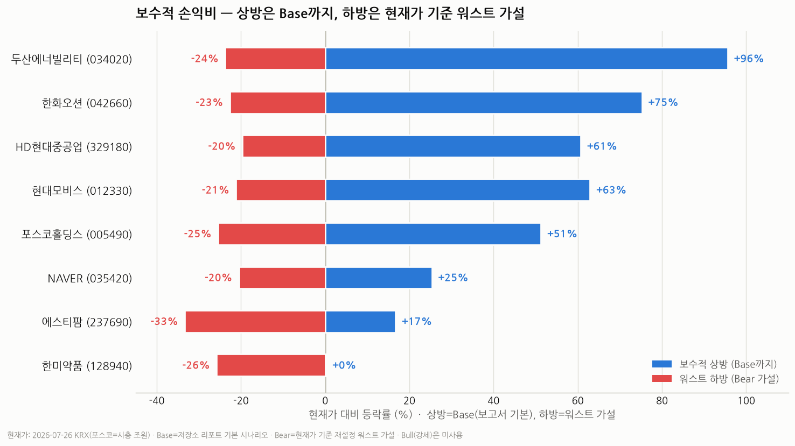
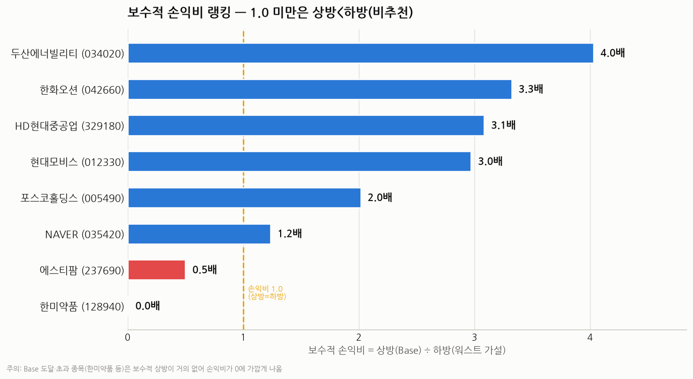

# 국내주식 손익비(Risk/Reward) 스크리닝 — 2026년 7월 (보수 기준)

> 작성일: 2026-07-27 · 카테고리: 시장브리핑(멀티섹터 스크리닝)
> 기준 시세: **2026-07-26 KRX 종가**(대형주) / 에스티팜·한미약품은 리포트·컨센서스 기준 추정
> 성격: 저장소 종목 리포트의 시나리오를 **보수적으로** 재적용 — 상방은 Bull(강세)이 아닌 **Base(기본)까지만** 인정하고, 하방은 **현재가 기준으로 다시 세운 워스트 가설(Bear)** 을 적용해 손익비를 계산.

> ⚠️ **[2026-07-30 검증·갱신 경고] 이 표의 현재가는 2026-07-26 KRX 종가 기준이다.** 이후 **2026-07-28~29 코스피·코스닥 급락(양대 시장 서킷브레이커 발동)** 으로 실제 주가가 크게 낮아져, **아래 절대 손익비 수치는 재계산이 필요하며 참고용으로만 볼 것.**
> - 검증된 갱신 예시: **두산에너빌리티 72,100원(7/26) → 60,800원(7/29 종가, −16%)**. 이 경우 워스트 가설(55,000)까지 하방이 −9.5%로 줄고 Base(141,000)까지 상방이 +132%로 커져 손익비는 오히려 상승(약 4.0 → 약 14). 즉 **급락은 손익비를 개선**시키는 방향이나, 급락 국면에선 워스트(Bear) 가설도 더 낮춰 잡아야 하므로 종목별 현재가 확정 후 재계산 예정.
> - 목표주가(키움 HD현대중공업 88만·한화오션 14.4만 등)는 실제 증권사 리포트로 교차검증됨(날조 아님). 그러나 **7/26 이후 현재가는 조선·자동차·소재·플랫폼 전반이 하락**했으므로, 두산 외 종목도 실제 현재가는 표기치보다 낮다.

---

## 한 문장 요약

강세장 후반에 이미 오른 종목(반도체 대형주·은행·삼성전기)은 제외하고, **구조적 스토리는 유효하나 조정으로 싸진 종목**을 보수 기준으로 추렸다. 상방을 Base로만 제한하고 워스트 하방을 현실적으로 재설정했을 때, 손익비 상위는 **두산에너빌리티(4.0) · 한화오션(3.3) · HD현대중공업(3.1) · 현대모비스(3.0)** 이며, 한미약품·에스티팜은 이미 Base에 근접/도달해 보수 기준으로는 매력이 낮다.

---

## 방법론 (보수 기준으로 어떻게 바꿨나)

세 가지 원칙으로 "가장 보수적인 가격"을 적용했다.

1. **상방 = Base(기본 시나리오)까지만.** 저장소 리포트의 낙관(Bull) 목표와 증권사 최고 목표주가는 **쓰지 않았다.** (조선주 등은 Bull이 최신 애널 목표보다 높아 상방을 부풀리기 때문.)
2. **하방 = 현재가 기준 "워스트 가설"로 재설정.** 리포트의 5월 Bear는 이후 주가 하락으로 이미 하회된 경우가 많아 "워스트 −0%"라는 비현실적 결과가 나왔다. 그래서 **각 종목의 밸류에이션 하단 + 악재 트리거를 근거로 워스트 케이스를 새로 가정**했다(아래 표).
3. **손익비 = 상방(Base) ÷ 하방(워스트 가설).** 모두 오늘 시세 기준.

> ⚠️ **숫자 출처 구분**: 현재가·PER/PBR·증권사 목표주가는 실제 데이터/애널리스트 기반이다. 그러나 **Base는 저장소 리포트의 기본 시나리오, 워스트(Bear)는 내가 세운 가설**이다. 즉 손익비는 "애널리스트 컨센서스"가 아니라 **보수적 시나리오 판단값**이다.

### 워스트 케이스(Bear) 가설과 근거

| 종목 | 워스트 가설 | 근거(밸류에이션 하단 + 트리거) |
|---|---|---|
| 두산에너빌리티 | 55,000 (−24%) | 원전 수주 지연·SMR 상용화 지연·AI전력 테마 냉각 → 직전 지지선 |
| 한화오션 | 68,000 (−23%) | 사이클 피크아웃·수주 추가 부진·후판가 급등 → PER 12배 디레이팅 |
| HD현대중공업 | 390,000 (−20%) | 수주 모멘텀 둔화·고PER(29배) 디레이팅 → PER 20배 |
| 현대모비스 | 380,000 (−21%) | 관세 재부과·전기차 캐즘·완성차 둔화 → PBR 0.55배(역사 하단) |
| 포스코홀딩스 | 18.5조 (−25%) | 중국 공급과잉·리튬 적자 지속·경기침체 → PBR 0.28배 |
| NAVER | 165,000 (−20%) | AI 검색 점유 잠식·광고 둔화·AI capex 부담 → PER 11배 |
| 에스티팜 | 100,000 (−33%) | 고객사 발주 축소·임상 지연 |
| 한미약품 | 400,000 (−26%) | 지배구조 분쟁 재점화·후속 기술수출 부재 |

---

## 보수적 손익비 랭킹

| 순위 | 종목(코드) | 현재가 | 워스트(Bear·가설) | Base(상방) | 하방 | 상방 | **손익비** |
|---|---|---|---|---|---|---|---|
| 1 | **두산에너빌리티(034020)** | 72,100 | 55,000 | 141,000 | −24% | +96% | **4.0** |
| 2 | **한화오션(042660)** | 87,900 | 68,000 | 154,000 | −23% | +75% | **3.3** |
| 3 | **HD현대중공업(329180)** | 485,500 | 390,000 | 780,000 | −20% | +61% | **3.1** |
| 4 | **현대모비스(012330)** | 482,000 | 380,000 | 785,000 | −21% | +63% | **3.0** |
| 5 | **포스코홀딩스(005490)** | 24.8조 | 18.5조 | 37.5조 | −25% | +51% | **2.0** |
| 6 | NAVER(035420) | 207,500 | 165,000 | 260,000 | −20% | +25% | 1.2 |
| 7 | 에스티팜(237690) | ~150,000 | 100,000 | 175,000 | −33% | +17% | 0.5 |
| 8 | 한미약품(128940) | ~539,000 | 400,000 | 540,000 | −26% | +0% | 0.0 |

손익비 1.0 미만(에스티팜·한미약품)은 **보수 기준으로 상방보다 하방이 커** 추천하지 않는다.

---

## 베스트/워스트 케이스 트리거 & 현재 해소 여부

각 종목의 상방/하방을 여는 실제 촉매와, 그것이 지금 **해소됐는지**를 정리했다.

### 1. 두산에너빌리티 (034020) — 손익비 4.0
- **베스트 트리거**: 체코·중동 대형원전 추가 수주, SMR 상용 발주, 가스터빈·AI 데이터센터 전력 수요
- **워스트 트리거**: 원전 수주 지연/무산, SMR 상용화 지연, AI전력 테마 냉각
- **해소 여부**: 🟡 **부분 해소** — 2025 역대급 수주로 이익 사이클 진입은 확정. 그러나 **SMR 상용화·추가 대형수주는 미해소(대기)**. ATH(14.2만) 대비 −49% 조정은 테마 기대 되돌림 반영.

### 2. 한화오션 (042660) — 손익비 3.3
- **베스트 트리거**: LNG선 대량 수주, 미국 필리조선소(MRO·군함 정비) 본격 매출, 카타르/모잠비크 발주
- **워스트 트리거**: 대형 수주 불발, 후판가 급등 마진 훼손, 사이클 피크아웃
- **해소 여부**: 🟡 **악재 노출·소화 중** — 특정 대형 수주 불발이 이미 발생해 주가·목표주가(키움 14.4만 하향)에 반영. 상선 21척(34억달러) 확보로 잔고는 방어. **미국 조선 협력·군함 MRO는 미해소 상방 옵션**.

### 3. HD현대중공업 (329180) — 손익비 3.1
- **베스트 트리거**: 선가 상승 지속, 친환경선(LNG·암모니아·메탄올) 교체 수요, 함정(방산) 수출
- **워스트 트리거**: 신규 수주 모멘텀 둔화, 후판가 상승, 고 PER(29배) 디레이팅
- **해소 여부**: 🟡 **진행 중** — 신규수주 목표 5월말 62% 달성. 수주 기대 되돌림은 주가 조정으로 일부 반영. **밸류 부담(PER 29배)은 미해소** — 사이클 이익 레벨업 확인 필요.

### 4. 현대모비스 (012330) — 손익비 3.0 (트리거 해소도 가장 높음)
- **베스트 트리거**: 전동화·자율주행 부품(전장) 매출 확대, 미국 관세율 인하, 자사주 소각
- **워스트 트리거**: 미국 관세 재부과, 전기차 캐즘 심화, 완성차(현대차·기아) 판매 둔화
- **해소 여부**: 🟢 **상당 부분 해소** — **2Q26 영업이익 9,752억(+12% YoY, 컨센 +7.5% 상회)로 실적 우려 해소**, 관세율 인하 효과 반영, **5,000억 자사주 8/3 전량 소각 예정**. PER 7.7·PBR 0.7배 저점. → 8종목 중 워스트 트리거가 가장 많이 해소된 종목.

### 5. 포스코홀딩스 (005490) — 손익비 2.0
- **베스트 트리거**: 중국 감산·철강 업황 반등, 리튬 등 2차전지 소재 흑자 전환, 밸류업 재평가
- **워스트 트리거**: 중국 공급과잉·저가 수출 지속, 리튬 가격 약세, 글로벌 경기침체
- **해소 여부**: 🔴 **대부분 미해소** — 업황 반등·리튬 회복은 진행 안 됨. 밸류업(저PBR)만 부분 진행. Base 도달까지 시간 필요.

### 6. NAVER (035420) — 손익비 1.2
- **베스트 트리거**: AI팩토리/소버린 AI 계약·클라우드 성과 가시화, 커머스·광고 회복
- **워스트 트리거**: AI 검색 경쟁(챗GPT 등)에 검색 점유 잠식, 광고 둔화, AI capex 부담
- **해소 여부**: 🔴 **핵심 상방 트리거 미해소** — AI 성과 가시화가 아직 안 나온 것이 저평가(PER 14.7배)의 이유이자 리레이팅 열쇠. 검색 잠식 우려도 미해소.

### 7. 에스티팜 (237690) — 손익비 0.5
- **베스트 트리거**: 올리고 CDMO 수주 확대(비만·고지혈 신약 원료), 신규 캐파 가동
- **워스트 트리거**: 고객사 임상 지연/발주 축소, 올리고 경쟁 심화
- **해소 여부**: 🟡 올리고 구조적 수요는 진행, 개별 발주 변동성은 상존. 보수 기준 상방 협소.

### 8. 한미약품 (128940) — 손익비 0.0
- **베스트 트리거**: 릴리 GLP-2 기술수출, 후속 파이프라인 기술수출, 마일스톤·로열티 유입
- **워스트 트리거**: 오너 지배구조 분쟁 재점화, 임상 실패/기술 반환
- **해소 여부**: 🟢/🔴 혼재 — **릴리 기술수출은 이미 실현(Bull 트리거 소화, 주가 반영)** → 보수적 상방(Base)이 거의 남지 않음. 지배구조 리스크는 미해소. 보수 기준으로는 진입 매력 낮음.

---

## 종합 판단 (보수 기준)

- **A티어 (손익비 3.0+)**: 두산에너빌리티·한화오션·HD현대중공업·현대모비스. 상방(Base) +61~96% vs 하방 −20~24%. 이 중 **현대모비스는 워스트 트리거가 가장 많이 해소**(실적·관세·주주환원)돼 "싼데 악재는 빠진" 조합이 가장 깔끔하다.
- **B티어 (손익비 2.0)**: 포스코홀딩스. 상방은 크나 **트리거가 대부분 미해소** → 시간이 필요한 가치주.
- **관망 (손익비 1.2 이하)**: NAVER(촉매 대기), 에스티팜·한미약품(보수 상방 소진).

---

## 리스크 · 유의사항 (반드시 읽을 것)

1. **이 문서는 투자 조언이 아니다.** 특히 **워스트(Bear)는 애널리스트 예측이 아니라 내가 세운 가설**이고, Base도 저장소 리포트의 시나리오다. 실제와 다를 수 있다.
2. **"트리거 미해소"가 나쁜 것만은 아니다.** 미해소 = 아직 주가에 반영 안 됨 = 해소 시 상방 여지. 반대로 **해소된 종목(현대모비스)** 은 이미 좋아진 만큼 추가 촉매가 필요하다.
3. **A티어는 대부분 "왜 빠졌나"가 실적이 아닌 수급/업황**이지만, 조선·모비스의 하락 원인이 구조적 훼손으로 바뀌면 워스트 가설을 더 낮춰야 한다.
4. 에스티팜·한미약품 현재가는 리포트/컨센 추정이며 실시세와 차이가 있을 수 있다.
5. 손익비만 보고 집중투자하기보다 **분산·비중 조절**을 권한다.

---

## 참고 출처

- [조선 3사 목표주가·수주 현황 (한경TV 와우넷)](https://www.wownet.co.kr/wowlog/84294)
- [현대중공업·한화오션 목표주가 하향 (다음/연합)](https://v.daum.net/v/uGHRvbztCT)
- [현대모비스 2Q26 프리뷰·목표주가 (하나증권)](https://www.hanaw.com/main/research/research/download.cmd?bbsSeq=1287909)
- [현대모비스 주가전망·목표주가 (KB증권)](https://kbthink.com/securities-view.html?docId=20260723103318160K)
- [두산에너빌리티 컨센서스 (한경 유레카)](https://eureka.hankyung.com/insight/detail/16299)
- [NAVER 저평가·목표주가 (이투데이/KB증권)](https://www.etoday.co.kr/news/view/2598947)
- [에스티팜 목표주가 (KB증권)](https://kbthink.com/securities-view.html?docId=20260720135135713K)
- [한미약품 기술수출·목표주가 (헬로티)](https://www.hellot.net/news/article.html?no=112970)

> 유의: Base·워스트 가설·트리거 해소 판단은 시점에 따라 달라진다. 확정 수치·공시는 각 사 사업보고서·분기보고서 및 최신 증권사 리포트로 교차확인을 권한다.
